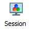
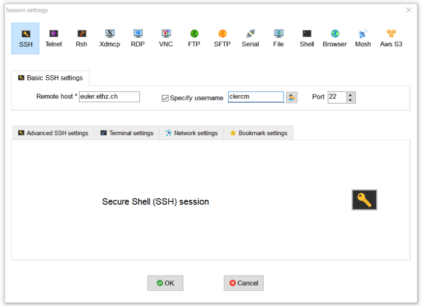
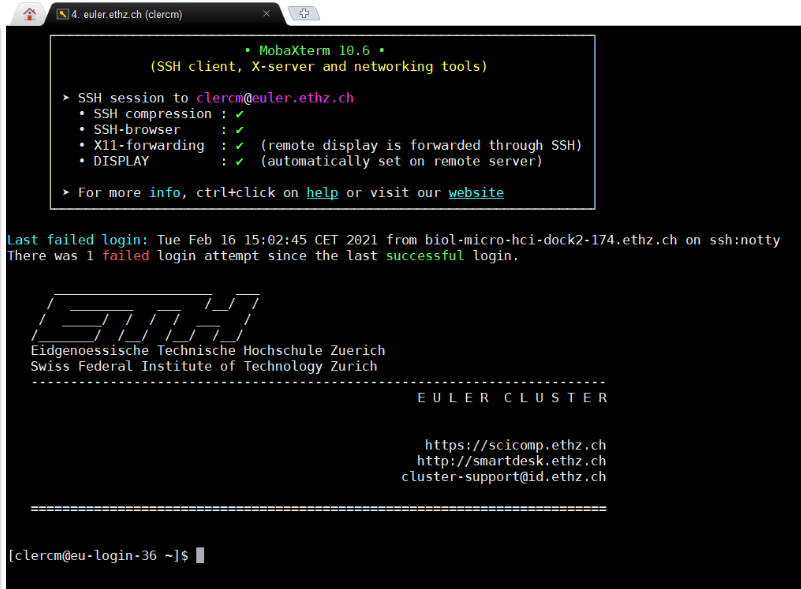
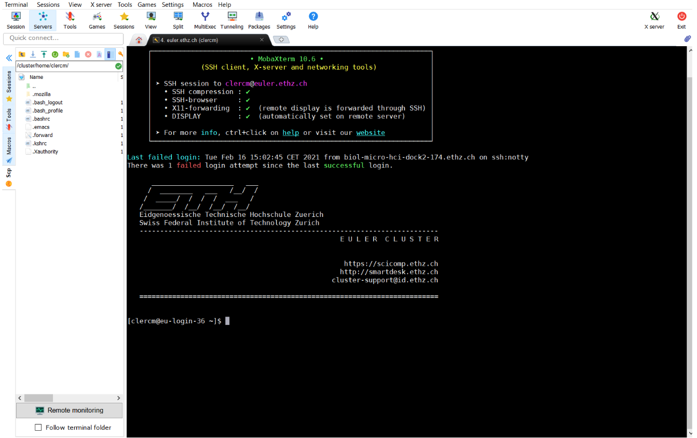
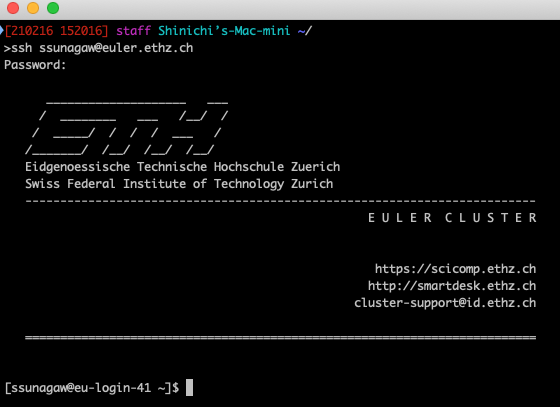
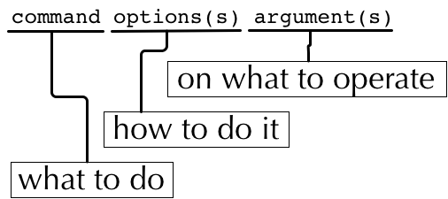

Command Line Interface
======================

The command line interface (CLI) offers a powerful way to use a computer. Many bioinformatics tools are written for and can be used more effectively (or only) with the CLI. The CLI also allows you to connect your computer to a different server. 

The following section will introduce you how to connect to ETH's high performance compute environment Euler (`https://scicomp.ethz.ch/wiki/Euler <https://scicomp.ethz.ch/wiki/Euler>`_) and how to execute commands on the CLI.

Connecting to Euler
-------------------

The ETH provides to its members access to a server named **Euler**, which can be accessed at the address: **euler.ethz.ch**. 

In order to work on the server, we will connect to it using a protocol called **S**\ ecure **Sh**\ ell or **ssh**. 

Windows
-------
In *MobaXterm*, you should start with the **Session** button:

Then select SSH and enter the server address (remote host) and your ETH ID as the username:

**NOTE:** The first time you log on to the server Euler, you will need to read and accept the terms of use and enter an access code, which will be sent by email.

When prompted, enter your password and you will connect to the server.

**NOTE:** Sometime *MobaXterm* changes the layout of your keyboard. For example, the character `@` might be replaced with another character. Note that if this happens when you are typing your password, you will not be able to see the wrong character.

The main window is your interactive session with the server through the CLI. On the left is a convenient file browser that you can use to transfer files between the server and your local computer (more on that later).

    
Mac OS X
--------
In *Terminal* you can connect to a server using the command ssh and the server address you want to connect to. You can do this by typing:

ssh <ETH_username>@<server_address> (for example: ssh lamessi@euler.ethz.ch).

When prompted, enter your password and you will connect to the server.

**NOTE:** The first time you log on to the server Euler, you will need to read and accept the terms of use and enter an access code, which will be sent by email.

The structure of a command
--------------------------

Most commands have *options* and *arguments*. Arguments are often essential for a command to operate properly; they are the pieces of information required by a command, such as a file name. Options are, of course, optional, and offer ways to modify the way the command works.

For instance, **echo** will take any text you give it as an argument and then send it back to you as output:

.. code-block:: bash

    # My first command
    echo 'Hello World!'

If you use the option *-n*, then it will not add a 'new line' to the end of the output:

.. code-block:: bash

    # My second command
    echo -n 'Hello World!'

Some commands end up with very complex structures, because they can have many options and arguments. In general, options will be of the format '-a' where a is a single letter or '--word' where word is a string (a series of letters, in computer terms).

* Note: the command line is case-sensitive!

Useful tricks
-------------

* You can use the **up and down arrow keys** to navigate through previously used commands and repeat or modify them.

* Copy/Paste: Windows - by default in MobaXterm, you have to right-click the mouse to use the copy and paste commands. However this can be changed to the more common 'highlight-to-copy' method employed on most Linux systems, where right-click will paste whatever is in the clipboard. On a Mac - **cmd + c**, **cmd + v**. 

* When typing a command or file name, you can press the 'tab' key to **auto complete** what you are typing. If there are multiple commands or files with similar names, auto completion will fill in as far as the first ambiguous character before you have to give it some more input. This method makes it *much* less likely that you make a spelling error.

* Pressing **ctrl + c** will send an interrupt signal that cancels the command and brings you back to the command line.

* Pressing **ctrl + r** will allow you to search through your command history.

* Pressing **ctrl + w** will delete the last word.

* Pressing **ctrl + l** will clear the screen.

* Pressing **ctrl + h** allows you to backspace.

* See previuos commands by typing **history** and pressing enter.

* Double click to select a word, triple click to select a line

* Using a **#** character allows you to make comments.

Exercises
---------

* Try the *echo* command for yourself.
* Try using the *echo* command and pressing **ctr + c**.
* Try typing *e* then pressing tab twice, what do you see?
* Try adding *c* to make *ec* and pressing tab twice again.
* How many characters do you have to type before pressing tab auto-completes *echo*?

.. container:: nextlink

    `Next: The File System <1.3_filesystemstructure.html>`_

