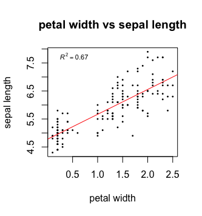
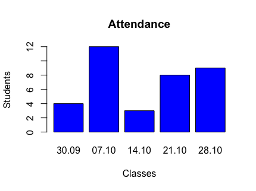
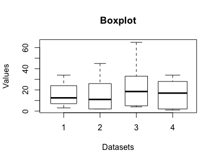

Basic plotting
==============

Linear regression
-----------------

R also has inbuilt functions that allow you to *fit your data to a defined model*. For example, **lm** fits a linear model determined by a formula provided. Check out the documentation to find out what arguments you need.  

.. code-block:: r

    #get documentation 
    ?lm 
    #linear model of the form y = m*x +c
    fit <- lm(Sepal.Length ~ Petal.Width, data = iris)
    
To get the output of the fit use the **summary** command.

.. code-block:: r

    summary(fit)
    
    
Scatter plot
------------

Frequently, you will want to visualise your results. For example, we would now like to plot the linear regression fit we calculated before.The most basic plotting function in R is **plot**. It has many adjustable parameters which makes it a great tool to construct your plot just as you like it. 
First, have a look at all the possible arguments for **plot**. 

.. code-block:: r

    #get documentation
    ?plot    

Then, we plot the petal width on the x axis against the sepal length on the y axis. **Plot** will automatically name the axis according to the input data but you can easily change the names of the axis. We will also give our plot a title to keep things nice and tidy. 

.. code-block:: r

    #plotting
    plot(iris$Petal.Width, iris$Sepal.Length,                   #define data to be plotted
         xlab = "petal width", ylab = "sepal length",           #change name of axis 
         main = "petal width vs sepal length")                  #add plot title 
    

Next, you can change the point shape, colour and size to your taste. Here's an overview of the different shapes:

.. image:: ../images/r-plot-pch-symbols-points-in-r.png
    :width: 50%
    :align: center
 
 
.. code-block:: r

    plot(iris$Petal.Width, iris$Sepal.Length,                  
    xlab = "petal width", ylab = "sepal length",           
    main = "petal width vs sepal length",
    pch = 16,                                                 #change shape of data points
    cex = 0.4,                                                #change size of data points
    col = "black")                                            #change colour of data points
    
    
Now, we want to add our fit to the data. For this we will use the command *abline*. *Abline(a,b)* draws a straight line with intercept *a* and slope *b*. You can also change the colour, width and line type of abline. Here's an overview of the different line types available:

.. image:: ../images/linetypes-in-r-line-types.png
    :width: 50%
    :align: center
  
  
.. code-block:: r

    plot(iris$Petal.Width, iris$Sepal.Length,                  
    xlab = "petal width", ylab = "sepal length",           
    main = "petal width vs sepal length",
    pch = 16,                                                
    cex = 0.4,                                                
    col = "black") 
    abline(fit,                                               #drawing a line with the coefficients of fit
           col = "red",                                       #change colour of line
           lty = "solid",                                     #change line type  
           lwd = 1)                                           #change line width 
 
 
Now, last but not least, we would like to add a legend showing the adjusted r squared value of the fit. We can extract this information from the fit summary. 

.. code-block:: r

    #summary of lm fit
    summary_fit <- summary(fit)
    #get adjusted R^2 value
    r2 <- summary_fit$adj.r.squared
    #create a legend text
    mylabel = bquote(italic(R)^2 == .(format(r2, digits = 3)))   #bquote enables us to use mathematical expressions, digits = 3 rounds the                                                                  #result to 3 decimal places. 
    legend('topleft',                                            #defines position of legend
           legend = mylabel,                                     #define text for legend
           cex = 0.7,                                            #define size of legend
           bty = "n")                                            #"n" = no boxline for legend, "o" = boxline for legend

That's it, your scatter plot in R!

In some cases, it can be helpful to manipulate the x and y axis. For examples, you can set boundaries or log transform the axis.

.. code-block:: r

    #changing axis 
    plot(iris$Petal.Width, iris$Sepal.Length,
        xlim = c(0,12),                                        # xlim = c(boundry_left, boundry_right)
        ylim = c(0,12))                                        # ylim = c(boundry_down, boundry_up)
        
    #log transformation
    plot(iris$Petal.Width, iris$Sepal.Length,
        log = "x")                                             #transforming x axis. use log = "xy" to transform both

Exercises
---------

* Go back to the *swiss* data set and use the functions you have learned to find the highest correlation between all possible variable combinations (hint: use the *cor* function)
* Use linear regression to model the relationship between the two variables you identified and determine its significance
* Present your result with a suitable plot

.. hidden-code-block:: r

    # Load the data and look for the best correlation
    data(swiss)

    # Could do one pair at a time
    cor(swiss$Fertility,swiss$Agriculture)

    # But give the whole data frame and it works
    cor(swiss)

    # Can find the highest value manually but various tricks exist to get around that, for instance:
    swiss_cors <- cor(swiss)
    as.dist(swiss_cors)
    # We pretend we have a distance matrix, which R reduces to just the lower triangle
    # Best correlation is 0.698 between Education and Examination

    # Use linear regression, lm
    model <- lm(Examination~Education,data=swiss)
    summary(model)
    # Clearly significant

    # Make a nice plot
    plot(swiss$Education,swiss$Examination,xlab="Education",ylab="Examination",pch=20,col=2,panel.first=grid(),panel.last=abline(model),main="Swiss Examination Scores vs. Education")
    
    
Bar Plot
========
A bar chart consists of different bars displaying the values they are representing in their height. It is possible to do horizontal and vertical bar charts using the *barplot()* function in R.

.. code-block:: r

    #Bar plot
    barplot(height = c(4,12,3,8,9),                                     # height is a vector/matrix displaying the different heights
        xlab = "Classes",                                               # xlab is the label for the x-axis
        ylab = "Students",                                              # ylab is the label for the y-axis
        main = "Attendance",                                            # main is the plot label
        names.arg = c("30.09","07.10","14.10","21.10","28.10"),         # names.arg is a vector containing labels for each bar
        col = "blue")                                                   # col is used to define the colour of the bars

Box Plot
========
Box plots are often used to display the data distribution of samples. It shows a five-number summary using the maximum, minimum, median, first quantile and third quantile values. By making multiple boxes, one can compare data sets. In R boxplots can easily be created using the *boxplot()* function.

.. code-block:: r
    
    #Data frame for box plot
    data1 <- data.frame("Groups" = c(1,2,2,1,1,2,1,2,1,1,1,2,1,3,3,3,3,3,3,4,4,4,4,4,4,4,4,4,4,2), 
    "Data" = c(14,2,13,25,6,9,34,2,8,23,11,26,3,4,13,24,33,5,65,7,34,2,12,23,1,28,22,34,1,45))

    #Box plot
    boxplot(Data~Groups,                                        # x is a vector or formula
        data = data1,                                           # data is a data frame
        notch = FALSE,                                          # notch is a logical value, true displays a notch
        varwidth = TRUE,                                        # varwidth is a logical value, true displays the width of the boxes proportional to the data sizes
        xlab = "Datasets",                                      # xlab is the label for the x-axis
        ylab = "Values",                                        # ylab is the label for the y-axis
        main = "Boxplot")                                       # main is the plot label
     
     

    
    
Exercises
---------

* Using the *airquality* dataset try to create a box plot showing temperature distribution each month.
* Using the *Loblolly* dataset try to create a bar plot displaying the distribution in height of the different seeds
* Experiment around with *barplot()*

.. hidden-code-block:: r

    # Load the data
    data(airquality)

    # Make nice boxplot
    boxplot(airquality$Temp~airquality$Month,data = airquality, xlab = "Months", ylab = "Temperature")

    # Load the data
    data(Loblolly)
    
    # Make a nice box plot
    boxplot(Loblolly$height~Loblolly$Seed, Loblolly, xlab = "Seeds", ylab = "Height", main = "Loblolly")

    
.. container:: nextlink

    `Next: Load and install libraries to access additional functionality <2.7_libraries.html>`_

