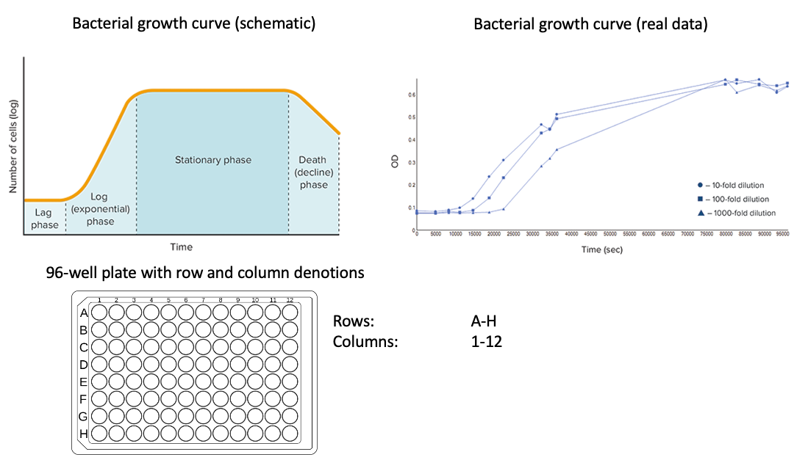

Bacterial Growth Curves
=======================

The aim of this exercise is to analyse the growth curves of bacteria growing in liquid culture in a 96-well plate. 

Source: https://www.moleculardevices.com/sites/default/files/en/assets/app-note/br/measure-long-term-cell-growth-using-a-discontinuous-kinetic-reading.pdf

The optical density (OD) of a metabolically-produced dye in each well of the plate has been measured at regular timepoints by a plate reader and the output has been put directly into a file named "201116_EcoliHS_PM2-1_goodFormat.txt". You will need to use the commands you have learned in UNIX and R to:

* find the file on Euler in the home directory of the user ssunagaw
* import it into R
* produce suitable visual representations of the data
* analyse the growth of the bacteria in each well

Find and load the file
---------------

The file is located on Euler under the home directory of the user ssunagaw.

First, you need to ssh into Euler and find the file "201116_EcoliHS_PM2-1_goodFormat.txt".

.. hidden-code-block:: r

    # move to the home of ssunagaw
    cd /cluster/home/ssunagaw/
    # find the file
    find -name "201116_EcoliHS_PM2-1_goodFormat.txt"
    # the file is in "./teaching/growth_curves/201116_EcoliHS_PM2-1_goodFormat.txt"

Once you located the file, go to the R console and load the file. Note that you need to copy the file in the file system of R studio.

Reminder for the connection to R studio:
Once your VPN connection is active, open a new web browser window and visit: https://rstudio-teaching.ethz.ch/

.. hidden-code-block:: r

    # copy the file
    # in the terminal tab of Rstudio:
    rsync -av USERNAME@euler:/cluster/home/ssunagaw/teaching/growth_curves/201116_EcoliHS_PM2-1_goodFormat.txt .
    # replace USERNAME !!
    
    # load the file
    # in the Console tab:
    df_formatted = read.table("201116_EcoliHS_PM2-1_goodFormat.txt", sep = "\t",header = T,row.names = 1)
    # Now look at the file
    View(df_formatted)

Plotting the data
-----------------

Now we have 96 sets of growth curve data to plot. There are many possibilities here but some useful things to know in R follow. Think about how you can present the data clearly and consistently, so that growth curves can be visually inspected and compared with ease.

.. code-block:: r

    # Produce a pdf of a figure
    pdf("filename.pdf", width=6, height=6)
    plot(...)
    dev.off()

    par(mfrow=c(x,y))                   # This par() option allows you to place plots in a grid x rows by y columns
    par(mar=c(1,1,1,1))                 # This par() option allows you to change the size of the margin of a plot
    plot(..., log="y")                  # Plot y axis on a log-scale
    plot(..., panel.first=grid())       # Allows you to put a function ahead of the plot, i.e.: behind it visually

    # Plot one set of data over another in base R
    plot(...)       # first plot
    par(new=T)      # don't start a new plot (counter-intuitively), but plot onto first plot
    plot(...)       # second plot

Example solutions follow.

For instance, you can plot the four individual measurements per well:

.. hidden-code-block:: r

    par(mfrow=c(8,12), mar=c(1,1,1,1))
    for(well in unique(df_formatted$Well)){
        data = df_formatted[df_formatted$Well==well,]
        plot(as.numeric(data$Value.Time)/3600, data$Value.0.1, xlim=c(0, 24), ylim=c(0.2, 3), xlab="Time (h)", ylab="OD600", log="y", panel.first=grid(), pch=20, type="o", col=1)
        par(new=T)
        plot(as.numeric(data$Value.Time)/3600, data$Value.1.1, xlim=c(0, 24), ylim=c(0.2, 3), xlab="Time (h)", ylab="OD600", log="y", panel.first=grid(), pch=20, type="o", col=2)
        par(new=T)
        plot(as.numeric(data$Value.Time)/3600, data$Value.1.0, xlim=c(0, 24), ylim=c(0.2, 3), xlab="Time (h)", ylab="OD600", log="y", panel.first=grid(), pch=20, type="o", col=3)
        par(new=T)
        plot(as.numeric(data$Value.Time)/3600, data$Value.0.0, xlim=c(0, 24), ylim=c(0.2, 3), xlab="Time (h)", ylab="OD600", log="y", panel.first=grid(), pch=20, type="o", col=4)
    }
    
    
Analysing the data
------------------

Now we will explain a bit about the experiment itself. The bacteria in each well was identical, *Escherichia coli* strain HS, but the carbon source in the media it was growing in was different. A metadata file "metadata.txt" with a list of these carbon sources can be found in the same folder as the data ("201116_EcoliHS_PM2-1_goodFormat.txt"). We are interested in learning about how the bacteria responded to each condition. There are four measurements for each well for each timepoint because the plate reader makes measurements at four different pre-determined points in the well.

Firstly, we would like to understand how accurate the measurements are. With four different measurements at each point, what behaviour can you see? Is this consistent across wells? Do you have any explanation for the behaviour that would make sense in an experimental context?

.. hidden-code-block:: r

    par(mfrow=c(1,1), mar=c(1,1,1,1))
    plot(as.numeric(df_formatted[df_formatted$Wells=="A1","Value.Time"]/3600), df_formatted[df_formatted$Wells=="A1","Value.1.1"], xlim=c(0, 24), ylim=c(0.2, 3),   xlab="Time (h)", ylab="OD600", log="y", panel.first=grid(), pch=20, type="o", col=1) # time in hours
    par(new=T)
    plot(as.numeric(df_formatted[df_formatted$Wells=="A1","Value.Time"]/3600), df_formatted[df_formatted$Wells=="A1","Value.0.1"], xlim=c(0, 24), ylim=c(0.2, 3), xlab="Time (h)", ylab="OD600", log="y", panel.first=grid(), pch=20, type="o", col=2) # time in hours
    par(new=T)
    plot(as.numeric(df_formatted[df_formatted$Wells=="A1","Value.Time"]/3600), df_formatted[df_formatted$Wells=="A1","Value.1.0"], xlim=c(0, 24), ylim=c(0.2, 3),   xlab="Time (h)", ylab="OD600", log="y", panel.first=grid(), pch=20, type="o", col=3) # time in hours
    par(new=T)
    plot(as.numeric(df_formatted[df_formatted$Wells=="A1","Value.Time"]/3600), df_formatted[df_formatted$Wells=="A1","Value.0.0"], xlim=c(0, 24), ylim=c(0.2, 3),   xlab="Time (h)", ylab="OD600", log="y", panel.first=grid(), pch=20, type="o", col=4) # time in hours

For the remainder of the exercise, use the average value of the four measurements "Value.Mean". You may want to replot the averaged curves.

.. hidden-code-block:: r

    par(mfrow=c(1,1), mar=c(1,1,1,1))
    xvals <- split(as.numeric(df_formatted$Value.Time)/3600, df_formatted$Wells) # time in hours
    yvals <- split(as.numeric(df_formatted$Value.Mean), df_formatted$Wells)
    plot(1:max(unlist(xvals)),ylim=(c(0,max(unlist(yvals)))),type="n")
    mapply(lines,xvals,yvals)

How coud you quantify how well the different bacteria grew in each condition?

.. hidden-code-block:: r

    # One could for instance look at the Maximum OD difference, which would tell us about successful growth
    growth_summary <- function(x){
        x = as.numeric(x)
        v = max(x) - min(x)
         return(v)
    }
    df_summary = aggregate(df_formatted[,"Value.Mean"], list(df_formatted$Wells), growth_summary)
    View(df_summary)

Now, to link that information to the carbon sources, you can order the values from largest or smallest and identify the carbon source given in a given well. The information about the carbon sources are available in the following file, located on euler: /cluster/home/ssunagaw/teaching/growth_curves/metadata.txt
