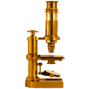
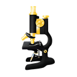
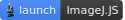

Image analysis 1
================

General information
-------------------

Resources
^^^^^^^^^

This section requires the use of the R Workbench according to your **surname**:

* A-J: `Server 01 <https://rstudio-teaching-01.ethz.ch/>`__
* K-R: `Server 02 <https://rstudio-teaching-02.ethz.ch/>`__
* S-Z: `Server 03 <https://rstudio-teaching-03.ethz.ch/>`__

Introduction to Bioimage Analysis
^^^^^^^^^^^^^^^^^^^^^^^^^^^^^^^^^

This material has been taken from the book *Introduction to Bioimage Analysis* by Pete Bankhead, available in full `here <https://bioimagebook.github.io/README.html>`__. We reproduce it here according to the Creative Commons license CC BY 4.0, explained in full `here <https://creativecommons.org/licenses/by/4.0/>`__. We are reproducing excerpts from the book, and the only changes made have been in formatting. We encourage you to read the entire book if you are interested in learning more about bioimage analysis.

What is ImageJ?
---------------

**ImageJ** is open-source software for image analysis.

Created by **Wayne Rasband** at the National Institutes of Health, ImageJ has become indispensable to the research community over more than 20 years.
It continues to be updated regularly and is by far the most discussed topic on the `Scientific Community Image Forum <https://forum.image.sc>`__ -- with `more than 10,000 topics <https://forum.image.sc/tags>`__ at the time of writing, and more added every day.

ImageJ's success is due not only to the features of the software itself, but to its openness and extensibility.
The source code is in the public domain, meaning that others can adapt it as needed.
But usually this isn't necessary, because users can write (and share) custom macros, plugins or scripts to add new functionality -- without changing ImageJ itself.

I personally have found ImageJ phenomenally useful throughout my career, to the extent that I am convinced that *anyone* working with biomedical images benefits if they know how to use it.
Even if you ultimately use other software for your analysis, or even write your own, the ability to quickly check things in ImageJ is extremely helpful.

These sections are intended to help any interested reader develop a strong working knowledge of ImageJ itself, while simultaneously gaining a deeper understanding of image analysis in general.

Getting ImageJ
--------------

ImageJ is available in multiple forms. Three of the most important ones for our purposes are:

1. ImageJ
^^^^^^^^^^

Download from `<https://imagej.nih.gov/ij/>`__

The 'original' download of ImageJ contains all the core functionality, but no extra user plugins.

The core of the application is a tiny file *ij.jar* (~2.5 MB) that runs on Java.
You can download a platform-specific package that includes both ImageJ and Java for Windows, Mac or Linux.
Including Java makes the download bigger, but makes the application self-contained and easy to run.

2. Fiji
^^^^^^^^

Download from `<https://fiji.sc/>`__

**Fiji**, which stands for **F**\iji **I**\s **J**\ust **I**\mageJ, is a distribution of ImageJ that comes bundled with a plethora of plugins and extra features that are especially useful for life scientists.
It also has a powerful script editor that helps a lot when developing macros or scripts, an updater to help manage all the additions, and even a `'Big Data Viewer' <https://imagej.net/plugins/bdv/>`__ for particularly huge images.

3. ImageJ.JS
^^^^^^^^^^^^

Run at `<https://ij.imjoy.io>`__

ImageJ.JS is a web version of the original ImageJ, capable of running in a browser.
It has a few extra features, but not as many as Fiji.
It was put together and is maintained by the `ImJoy team <https://github.com/imjoy-team>`__ led by Wei Ouyang.

For more information, see https://imagej.net/software/imagej-js

More interactivity with ImageJ.JS!
**********************************

Whenever you see a button like this |happycell|_ it can be used to launch ImageJ.JS directly from this book, often with a relevant image opened.

By default, ImageJ.JS will open in the same browser tab.
If you want it to open in a new tab, then there's probably an easy trick in your browser to do that (on a computer, my guess is that it'll be pressing **Ctrl** or **⌘** when clicking the link).

   .. _happycell: https://ij.imjoy.io?open=https://github.com/bioimagebook/practical-data/blob/main/images/happy_cell.tif

Which ImageJ do I choose?
^^^^^^^^^^^^^^^^^^^^^^^^^

I would say: *all of them*.

I always install both ImageJ and Fiji on any computer I will use regularly.
ImageJ.JS doesn't require any installation: just a modern web browser.

Everything ImageJ can do can also be accomplished in Fiji (because Fiji contains the full ImageJ inside it), but the converse is not true (because Fiji contains many extra bits)
Therefore Fiji is my first choice for more extensive analysis tasks.
Its main disadvantage is that it's a lot bigger: taking longer to start up and run update checks, and containing a lot of commands that I don't always need.

By contrast, the original ImageJ is very small and lightweight.
On my computer, it starts almost instantly.
It remains my first choice for quick, common tasks with images.

*Most* ImageJ-related practicals in this course only use core features, and so can be done using any of ImageJ, Fiji or ImageJ.JS.
Sometimes in this book I will refer to explicitly to Fiji, indicating that the relevant command is *only* available in Fiji.

Remember to cite the software you use!
^^^^^^^^^^^^^^^^^^^^^^^^^^^^^^^^^^^^^^

A lot of open-source software is developed and supported by academics, who invest a huge amount of time into development and support.
They need funding to continue that work\*, and paper citations to help get that funding.

If you use software for research you plan to publish, please spend a few minutes searching for how the developers of the software want it to be cited.

* For ImageJ & Fiji, see https://imagej.net/contribute/citing
* For other software, search for *citing [software name]*

\* Sometimes they also need a kind word or a compliment, because they are human.
Supporting software can be time-consuming, hard and stressful -- and is usually something they do for free, in their limited spare time.

    By default, ImageJ.JS will open in the same browser tab.
    If you want it to open in a new tab, then there's probably an easy trick in your browser to do that (on a computer, my guess is that it'll be pressing **Ctrl** or **⌘** when clicking the link).

.. _happycell: https://ij.imjoy.io?open=https://github.com/bioimagebook/practical-data/blob/main/images/happy_cell.tif

The ImageJ Interface
--------------------

ImageJ's user interface is rather minimalistic.
It's centered around a toolbar.
Everything else (images, histograms, measurement tables, dialogs) appears within separate windows.

.. thumbnail:: images/imagej-gui.png
    :align: center
    :width: 100%

But despite the simple appearance, ImageJ is powerful.
The depth of the software is evident from its abundance of menus and submenus.

Which leads to the **most important tip for using ImageJ**:

Search
^^^^^^

**Don't memorize the menus -- search!**

ImageJ has a lot of options, buried in a lot of menus... and submenus... and sometimes sub-submenus.

Fortunately, there's no reason to memorize where they all are to be found.
Rather, just remember one shortcut key: **L**

Pressing **L** effectively brings up at **list** of all the commands from the menus, ready for each search.

For ImageJ, you see the *Command Finder* window where you can begin to type the name of the command you want.
You can then run it either by double-clicking on the entry, or by using the up or down arrow keys followed by **Enter**.

.. thumbnail:: images/imagej-command-finder.png
    :align: center
    :width: 60%

In Fiji, you might see the *Command Finder* or you can alternatively switch on a *search bar* by selecting it under **Edit** --> **Options** --> **Search Bar..**.
The idea is the same.
The search bar can also be activated using **L** and used to find and run commands.

.. thumbnail:: images/imagej-options-misc.png
    :align: center
    :width: 30%

Shortcuts
*********

In most software, shortcut keys often requires pressing **Ctrl** (on Windows, Linux) or **⌘** (Mac).
Therefore the shortcut to search for a command would be **Ctrl + L** or **⌘ + L**.

This works in ImageJ, but isn't necessary.
Under **Edit** --> **Options** --> **Misc..**, you can specify whether the **Ctrl** or **⌘** key is needed along with the letter for the shortcut.

By default, this option is turned off -- so pressing **L** alone is enough.
You may find this might make it too easy to accidentally run commands, in which case you should select the option to turn it on.

Opening images & viewing pixels
-------------------------------

I am always taken aback when I see someone open an image in ImageJ through the menus, by choosing **File** --> **Open..**.

Although this can work, it's unnecessarily slow and awkward.
The more elegant way to open an image is to simply drag the image file onto ImageJ's toolbar.

As the cursor is then moved over the image, the value for the pixel under the cursor is displayed in ImageJ's status bar.
Images can be navigated as follows:

* **Zoom in**

    1. Select the |zoom| tool, then **left-click** on the image, or
    2. Press the **+** key

* **Zoom out**

    1. Select the |zoom| tool, then **right-click** on the image, or
    2. Press the **-** key

* **Pan**

    1. Select the |hand| tool, then click and drag on the image, or
    2. Press the **spacebar**, then click and drag on the image

When the image is larger than the visible region, a small (purple) overview appears in the top left to indicate which part can currently be seen.

.. thumbnail:: images/interface.gif
    :align: center

.. admonition:: Fig. 6
    :class: caption

    The main ImageJ user interface.

.. admonition:: Exercise 11.1
    :class: exercise

    The status bar also shows the x and y coordinates for the pixel under the cursor.
    However, to interpret these you need to know the *origin*, i.e. the location of the pixel at x=0, y=0.

    Where is the origin of the image in ImageJ?

    * Top left corner
    * Top right corner
    * Bottom left corner
    * Bottom right corner
    * Image center

    **Tip:** You should be able to answer this question by opening an image in ImageJ, and observing the coordinates in the toolbar as you move the cursor over the image.

    |happycell|_

    .. hidden-code-block:: bash
    
        The origin of the image is at the top left, i.e. the top left pixel is identified with the coordinate x=0, y=0.

Changing appearance
-------------------

Adjusting Brightness & Contrast
^^^^^^^^^^^^^^^^^^^^^^^^^^^^^^^

.. thumbnail::  images/imagej-brightness-contrast.png
    :align: center
    :width: 20%

The main command to change the brightness of an image is **Image** --> **Adjust** --> **Brightness/Contrast..**.
Since you're likely to use it a lot, it is worth learning the shortcut: **Shift + C**.

The Brightness/Contrast dialog has four sliders: **Minimum**, **Maximum**, **Brightness** & **Contrast**.
They are linked together: changing either of the first two also results in a change to the last two, and vice versa.

Supposing you have a grayscale LUT, with colors ranging from black to white, you should see that

* All pixels with a value less than or equal to the **Minimum** will be shown as black
* All pixels with a value greater than or equal to the **Maximum** will be shown as white
* All other pixels with a value in between will be shown using a shade of gray

**Use the minimum & maximum sliders:** Despite the name of the command implying **Brightness** and **Contrast** are the star perfomers, I would argue that the **Minimum** and **Maximum** sliders are far more intuitive.

I use **Minimum** and **Maximum** almost exclusively.

.. admonition:: Exercise 11.2
    :class: exercise
    
    Does adjusting any of the sliders in the brightness & contrast dialog change the pixel values or only the LUT?

    What happens if you press **Apply**?

    |couple|_

    .. hidden-code-block:: bash

        Adjusting the sliders changes the LUT -- and *not* the pixel values.

        That is, unless you press **Apply**.
        If you do press **Apply** then the pixel values are changed.

        Recent versions of ImageJ give a warning when pressing **Apply**, but previous versions did not... which made it an extremely dangerous button for new users of the software.
        In most cases, the rule is:

        * When adjusting the brightness & contrast in ImageJ, don't press **Apply**!

        You shouldn't break this rule without a good reason!

.. _couple: https://ij.imjoy.io/?open=https://github.com/bioimagebook/bioimagebook.github.io/blob/main/chapters/1-concepts/1-images_and_pixels/images/couple.png

Switching LUTs
^^^^^^^^^^^^^^

You can change the colors of the LUT by selecting an alternative option from the **Image** --> **Lookup tables** submenu.

**Use the Control Panel to frequently access the same menu:** If you want to explore LUTs quickly, use **Plugins** --> **Utilities** --> **Control Panel**.
This opens a window that allows you to double-click on commands from any menu or submenu to apply that command quickly.

Homework
--------

.. thumbnail:: images/blobs.png
    :align: center
    :width: 33%

.. admonition:: Homework 10
    :class: homework
    
    For the homework you have to work on the image previewed above (download it here: :download:`blobs.tif <images/blobs.tif>`) -- also available as *File > Open Samples > Blobs*, in ImageJ/Fiji

    To complete this week’s homework requirements you need to do two tasks, **One, you need to take a quiz in Moodle and two, you need to  upload a picture to your homework folder**. You should be able to solve the homework based on the lecture (slides `here <https://moodle-app2.let.ethz.ch/pluginfile.php/1200567/course/section/123169/Week_11_Image_analysis_1.pdf>`__) and the question text. The quiz is posted on Moodle (`URL <https://moodle-app2.let.ethz.ch/mod/quiz/view.php?id=755328>`__) under “Quizzes” and has the following questions:

        1.   **Count** the number of blobs and report the number

                * Manually — just count on the screen or use the Multi-point tool in ImageJ/Fiji
                * By segmentation using thresholding (`in Fiji: binarize/threshold the image <https://bioimagebook.github.io/chapters/2-processing/3-thresholding/imagej.html>`__, then configure and run *Analyze > Measure Particles*. Or in `Python read here <https://bioimagebook.github.io/chapters/2-processing/3-thresholding/thresholding.html#>`__ for explanation and code)

        2.   **Measure** some intensity values of the image and report the numbers (in ImageJ/Fiji, use *Analyze > Measure*, after configuring what is measured in *Analyze > Set Measurements…*. Feel free to use Python or other software)

                * Mean intensity of image
                * Median intensity of image
                * Standard deviation of intensities of image

        3.  **Measure** the mean gray-scale value of all segmented blobs---there is no absolute truth here, just report your result and which threshold algorithm you used
    
        4.  **Measure** the average size (number of pixels) of segmented blobs---there is no absolute truth here, just report your result and which threshold algorithm you used

    **Additionally you have to upload a picture to your homework folder** in the R-Workbench. For that modify blobs.tiff by writing your own name on it and save it as a png. Please name your file **blobs_<Your First Name>_<Your Last Name>.png**

    **Optional**: Upload your segmented (binary or with outline/masks overlaid) image to your homework folder, in png format, name it **blobs_segmented_<Your First Name>_<Your Last Name>.png**

    You can download Fiji here: https://fiji.sc/ or just use it in a browser (only tested in Chrome, but don't let that stop you) here: https://ij.imjoy.io/

.. admonition:: Feedback
    :class: homework

    Please consider giving us feedback on this week's lecture and OLM via `Moodle <https://moodle-app2.let.ethz.ch/mod/feedback/view.php?id=753007>`__.

.. container:: nextlink

    `Next: Image analysis 2 <12_Image_analysis_2.html>`__
