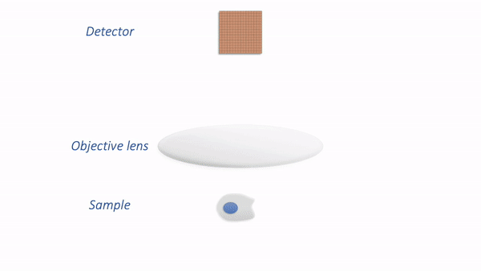
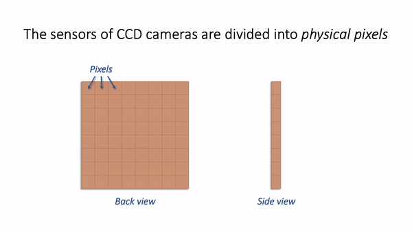
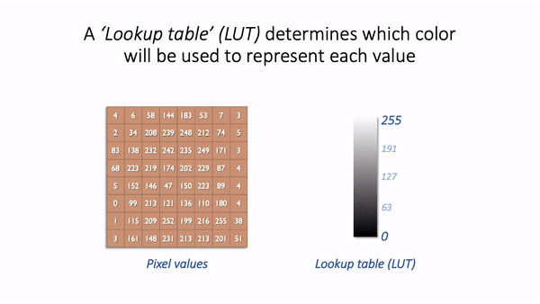
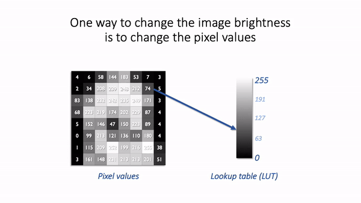

Image analysis 2
================

General information
-------------------

Resources
^^^^^^^^^

This section requires the use of the R Workbench according to your **surname**:

* A-J: `Server 01 <https://rstudio-teaching-01.ethz.ch/>`__
* K-R: `Server 02 <https://rstudio-teaching-02.ethz.ch/>`__
* S-Z: `Server 03 <https://rstudio-teaching-03.ethz.ch/>`__

Introduction to Bioimage Analysis
^^^^^^^^^^^^^^^^^^^^^^^^^^^^^^^^^

This material has been taken from the book *Introduction to Bioimage Analysis* by Pete Bankhead, available in full `here <https://bioimagebook.github.io/README.html>`__. We reproduce it here according to the Creative Commons license CC BY 4.0, explained in full `here <https://creativecommons.org/licenses/by/4.0/>`__. We are reproducing excerpts from the book, and the only changes made have been in formatting. We encourage you to read the entire book if you are interested in learning more about bioimage analysis.

Images & pixels
---------------

Introduction
^^^^^^^^^^^^

Image are composed of **pixels**.

The word 'pixel' is derived from **pic**\ture **el**\ement and, as far as the computer is concerned, each pixel is just a number.

When the image data is displayed, the values of pixels are usually converted into squares of particular colors -- but *this is only for our benefit*.
The colored squares are nothing more than a helpful visualization that enable us to gain a fast impression of the image contents, i.e. the approximate values of pixels and where they are in relation to one another.

When it comes to processing and analysis, we need to get past the display and delve into the real data: the numbers.

.. thumbnail:: images/images_and_pixels_3_0.png
    :align: center

.. admonition:: Fig. 3
    :class: caption
    
    \(A\) & (B) The image is shown using small squares of different shades of gray, where each square corresponds to a single pixel. This is only a convention used for display; the pixels themselves are stored as arrays of numbers (C) – but looking at the numbers directly it’s pretty hard for us to visualize what the image contains.

Image data & its display
^^^^^^^^^^^^^^^^^^^^^^^^

The distinction between a pixel's numeric value and the color used to display it might seem like a minor detail, but it definitely isn't: failing to recognise this difference underlies a *lot* of errors.

If we aren't careful, two related facts can cause us an enormous amount of trouble:

**Warning:**

1.  Images that **look the same** can contain **different** pixel values
2.  Images that **look different** can still contain **the same** pixel values

.. thumbnail:: images/images_and_pixels_6_0.png
    :align: center
   
.. admonition:: Fig. 4
    :class: caption

    Images that look the same, but contain different pixel values. Measuring each of these images would give different results, for reasons we shall see in later chapters.

.. thumbnail:: images/images_and_pixels_8_0.png
    :align: center

.. admonition:: Fig. 5
    :class: caption
    
    Images that look different, but contain the same pixel values. Measuring each of these images would give the same results.

This is crucial because it's entirely possible to analyze two different images that *appear* identical, but to get very different (and very wrong) results.

This is far from a theoretical problem.
It happens a lot in practice whenever someone innocently makes an adjustment to an image (e.g. to make it look brighter, or change the colors for display) without realising that the adjustment has actually changed the pixel values -- and thereby compromised the underlying data.
This can fatally undermine the integrity of any later analysis.

What's worse, these errors can go completely unnoticed, surreptitiously compounding the problem of replicability in science.

Which brings us to the key message of this chapter:

**Don't (just) trust your eyes!:** In science, we need to know what is happening whenever we open, adjust and save our images. If we don't, we risk misinterpreting our data.

Fortunately, knowing just a little bit about imaging and image analysis is enough to avoid making these mistakes.
Knowing more than a little bit can open up new worlds of possibility to extract useful information from scientific images.

The goal of this handbook is to explain these ideas.
We'll start by considering two questions:

1. **Where do the pixel values come from?**
2. **How are pixel values converted into colors for display?**

It's hard to give a detailed-but-general answer to the first question, because the origin and interpretation of the pixel values depends upon how the image was created, and there are many different ways to generate an image.

Nevertheless, the key ideas are similar everywhere.
By way of illustration, we'll consider a very common case in bioimaging where the pixel values relate to detected light -- specifically, using the example of a fluorescence microscope -- before moving how to see how these values are displayed.

A simple microscope
^^^^^^^^^^^^^^^^^^^

When I work with fluorescence images, I have a very simple picture in my head of how the image is formed.
It may not be very exact, but I find it extremely useful as a basis to which we can add detail whenever we need it.
We will revisit this picture later in the book to help organize the interrelating imaging considerations relevant to analysis.

In my simplified model, there are only three components that we need to worry about:

1. **Sample** -- the thing we want to look at
2. **Objective lens** -- the thing that gathers the light and focusses it for detection
3. **Detector** -- the thing that detects the light to form the digital image (here, a CCD camera)

The process is illustrated below:

There are a couple of things to note at this point:

* Not *all* the light emitted from the sample is detected. A lot of it never enters the objective lens.
* Our images aren't perfect. We will explore problems of blur, noise and pixel size later.

For now, we are mostly interested in the detection step and how it generates a digital image.
Zooming in to look at this in more detail, we can imagine what happens as light hits the camera.
The sensor of the camera itself is divided into **physical pixels**, which will correspond to the pixels in the final image.
When a photon strikes the detector, an electron may be released at one of the physical pixels.
During the acquisition of an image, many photons strike the detector, which can cause many electrons to be released at different physical pixels.
These electrons contribute to the value of a pixel in the final image: more electrons &rarr; higher pixel values.

The important point is that **pixel values are only *indirectly* related to whatever it is in our sample that we want to measure**.

In this example, they have been derived by quantifying the charge of electron clouds gathered at each physical pixel.
This should be proportional to the amount of detected light that originated from a particular volume of the sample.
This, in turn, depends upon what is actually present in the sample -- but there are *a lot* of things that can influence the final values in connection with acquisition parameters, conversion factors, and physics.
These are not usually related directly to the thing you might want to quantify.

Some of the factors influencing pixel values:

* **Amount of time spent detecting photons**

  * *More time --> More photons --> More electrons --> Higher pixel values*

* **Numerical aperture of the objective lens**

  * This relates to the **angle** of light accepted by the objective
  * *Higher NA --> Larger angle --> More photons --> More electrons --> Higher pixel values*

* **Sensitivity of the detector (Quantum Efficiency)**

  * Not all photons necessarily produce an electron; I think of this as the photon hitting the detector, but not hard enough to dislodge an electron. A detector with low sensitivity is likely to 'miss' more photons, so that they never contribute to the pixel value.
  * *Higher sensitivity --> More electrons --> Higher pixel values*

Ultimately, this leads to the warning: **Don't over-interpret pixel values!**
Individual pixel values are rarely very meaningful in isolation: we're usually interested in *relative* differences between groups of pixels.

As we shall see, this means that we often need to average values and normalize to something whenever we want to make measurements in an image.
We can't usually untangle the influences well enough to infer anything with confidence from a single pixel value.

But the limitations in what pixel values can tell us don't diminish their importance: on the contrary, pixel values remain our raw data and it's essential that we preserve them as faithfully as possible.
That's a lot harder than you might expect.
It requires knowing when and how pixel values might become changed whenever we are working with our images.
This is so crucial that it will be the focus throughout the entire first part of this book.

Lookup tables
^^^^^^^^^^^^^

**Lookup tables** are sometimes referred to as **colormaps**.

For our purposes, the terms are interchangeable -- you may see either depending upon which software you are using.

So images are really comprised of a lot of numbers -- the pixel values -- even though we normally visualize them as shapes and colors.

It's time then to consider our second question: **How are pixel values converted for display?**

The basic idea is simple: the software displaying the image uses a **lookup table (LUT)** that maps each pixel value to a color.
When it comes to showing the image, each pixel is replaced by a little dot or square on screen that has the corresponding color.

LUTs therefore provide a way to **change the appearance of an image without changing its pixel values**.

This is extremely useful in practice.
Since images in biology often have rather low pixel values (formed from a small amount of detected light), we very often want to change their brightness for display.

One way we *could* make an image brighter is to change the pixel values themselves -- multiply them by 2, for example.
That would indeed usually make the image look brighter, but we risk making a terrible mess of our data if we permit ourselves to make such changes.
As described above, we really don't want to modify our raw data unnecessarily.

A **much** better way to change the brightness of an image is to change the LUT only.

The danger is that **not all software cares so much about preserving pixel values**.
Someone wanting to enhance their holiday photos isn't likely to care about retaining the original pixel values for quantification later; rather, they just want the images to look as nice as possible.

For this reason, a lot of software designed for working with images really *will* rescale the pixel values when you do something as simple as adjusting the brightness.
And so it is entirely possible to open an image, adjust the display slightly to see things more clearly, and in doing so irreparably damage the image -- losing the raw data required for later analysis.

This is why you should **use scientific software for scientific image analysis** -- and not just any general imaging editing software you might find.

But even when using scientific software, it's often possible to change pixel values whenever you'd really rather only be changing lookup tables.
The next chapter will show how to check when this is happening.

Homework
^^^^^^^^

.. thumbnail:: images/blobs.png
    :align: left
    :width: 33%

.. thumbnail:: images/DAPI.png
    :align: right
    :width: 44%

.. admonition:: Homework 11
    :class: homework

    You can get the images here (**do not download the images by clicking on the pictures**):
        * blobs.tif: :download:`blobs.tif <images/blobs.tif>`
        * DAPI.tif: :download:`blobs.tif <images/DAPI.tif>`

    To complete this week’s homework requirements, **you need to take a quiz**. The quiz is posted on Moodle (`URL <https://moodle-app2.let.ethz.ch/mod/quiz/view.php?id=757124>`__) under “Quizzes” and has the following questions:

    1. Lookup tables (LUT)

        Open blobs.tif (File > Open Samples > Blobs) and invert the LUT (if needed) so that the blobs are light on a dark background. Apply Red/Green LUT and answer the following question:

        * What color are the blobs, red or green?

        Apply Union Jack LUT

        * What color is the background?

    2. Bits
    
        Open the DAPI.tif image

        * What is the bit depth (hint: for blobs.tif the answer is 8)?
        * What is maximum intensity in the image?
        * What is maximum possible intensity in the image for this bit-depth?
        * What are the image dimensions (NxM pixels) -- give answer as N,M?

    3. Contrast enhancement
    
        Open the DAPI.tif image

        * What is the mean intensity of the image? Hint: Use Analyze > Measure or Analyze > Histogram

        Perform a histogram *equalization* with 1% saturation (Process > Enhance Contrast ...)

        * What is the mean intensity of this histogram equalized image?

    4. Histograms

        Open the DAPI.tif image. Perform a histogram *normalization* with 10% saturation (Process > Enhance Contrast ...) and calculate the histogram

        * How many counts are there in the last bin?

    5. Segmentation using modern machine learning

        Fire up https://ij.imjoy.io/ and open blobs.tif (File > Open Samples > Blobs). Go to Plugins > Segment with CellPose, accept all default settings, i.e. click Save

        * How many blobs are detected?

    6. Segmentation using old-school machine learning (bonus question)

        Open blobs.tif (File > Open Samples > Blobs). Start the Weka pixel classifier (Plugins › Segmentation › Trainable Weka Segmentation) and afterwards squiggle (draw a line) inside a blob and click *Add to class 1*. Squiggle (draw a line) in the background and click *Add to class 2*. Now Click *Train classifier*. Repeat the last three steps (squiggling and training) until you are happy with the results. If your happy with the training click *Get probability*.

        * What is the mean value of this new image?

        You can now threshold this image and use Analyze Particles to count the number, just like in the first homework. This was a very un-demanding example, feel free to try more demanding images, like DAPI.tif, and add more classes (one for nuclei, one for cytoplasm, one for background)

.. admonition:: Feedback
    :class: homework

    Please consider giving us feedback on this week's lecture and OLM via `Moodle <https://moodle-app2.let.ethz.ch/mod/feedback/view.php?id=757111>`__.

.. container:: nextlink

    `Next: Image analysis 3 <13_Image_analysis_3.html>`__

