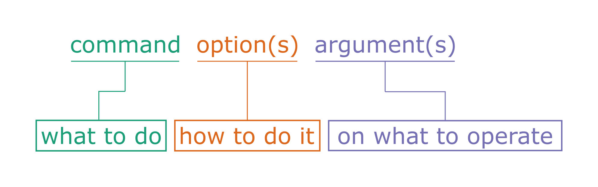
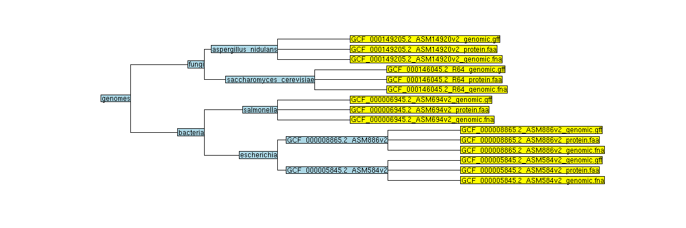

Introduction to Unix 1
======================

General information
-------------------

Main objective
^^^^^^^^^^^^^^

In this lecture we will introduce **Unix**: an operating system that runs on almost all high performance computing (HPC) servers, which we interface with via the **command line**.

Learning objectives
^^^^^^^^^^^^^^^^^^^

* Students can use the command line to issue basic commands with arguments
* Students can navigate the Unix file system and perform basic file operations
* Students can inspect files on the server

Resources
^^^^^^^^^

This section requires the use of the |R_Workbench|.

.. |R_Workbench| raw:: html
 
    <a href="https://rstudio-teaching.ethz.ch/auth-sign-in?appUri=%2F" target="_blank">R Workbench</a>

The command
--------------------------

Commands are our tool to tell the computer what to do. Most commands have *options* and *arguments*. Arguments are often essential for a command to operate properly; they are the pieces of information required by a command, such as a file name. Options are, of course, optional, and offer ways to modify the way the command works.

For instance, **echo** will take any text you give it as an argument and then send it back to you as output:

.. code-block:: bash

    # My first command
    echo 'Hello World!'

If you use the option *-n*, then it will not add a 'new line' to the end of the output:

.. code-block:: bash

    # My second command
    echo -n 'Hello World!'

Some commands end up with very complex structures, because they can have many options and arguments. In general, options will be of the format ``-a`` where a is a single letter or ``--word`` where word is a string (a series of letters, in computer terms).

* Note: the command line is case-sensitive! So it **does** matter if you write *-a* or *-A*.

Getting help
^^^^^^^^^^^^

The **man** command will show a manual for most basic commands, providing the correct syntax to use it and the various options available.

.. code-block:: bash

    # Read the manual
    man ls

Other programs have different ways to provide help on how to use them. An online tutorial is best, or a comprehensive manual, but sometimes you only have the command line to help you.

.. code-block:: bash

    # Help please!
    python3 -h
    python3 --help

Useful command line tricks
^^^^^^^^^^^^^^^^^^^^^^^^^^

* You can use the **up and down arrow keys** to navigate through previously used commands (known as your history) and repeat or modify them.

* Windows: To copy text from the terminal you will have to highlight it and right-click to use the in-browser menu and copy. Similarly you have to use the in-browser menu to paste into the terminal. The reason for this is that *Ctrl + c* and *Ctrl + v* have effects inside the terminal.

* Mac: You can fortunately use *Cmd + c* and *Cmd + v* to copy and paste as normal. You can use *Ctrl* and various keys for in-terminal commands.

* When typing a command or file name, you can press the 'tab' key to **auto complete** what you are typing. If there are multiple commands or files with similar names, auto completion will fill in as far as the first ambiguous character before you have to give it some more input. This method makes it *much* less likely that you make a spelling error.

* Pressing **Ctrl + c** will send an interrupt signal that cancels the currently running command and brings you back to the command line.

* Pressing **Ctrl + r** will allow you to search through your command history.

* Pressing **Ctrl + l** will clear the screen.

* See previous commands by typing **history** and pressing enter.

* Double-click to select a word, triple-click to select a line

* Using a **#** character allows you to make comments that have no effect when run.

.. admonition:: Exercises
    :class: exercise

    * Try to *echo* "My first command"
    * Use the arrow key to execute the same command again
    * Try typing *e* then pressing tab twice, what do you see?
    * Try adding *c* to make *ec* and pressing tab again. What happens?
    * Try to copy/paste your *echo* command "echo 'My first command'"
    * Try to clear the screen, can you still paste your *echo* command?
    * Try to *echo* 'My first command 'once with the *-n* option and once with the *-N* option. What do you notice?

    .. hidden-code-block:: bash
        
        #echoing "My first command"
        echo 'My first command'

        # Press the up arrow once and the last command appears
        echo 'My first command'

        # You see all the possible commands that start with "e" when you press tab twice after entering “e”
        e2freefrag             edquota                era_check              eu-readelf
        e2fsck                 efibootdump            era_dump               eu-size
        e2image                efibootmgr             era_invalidate         eu-stack
        e2label                efikeygen              era_restore            eu-strings
        e2mmpstatus            efisiglist             esac                   eu-strip
        e2undo                 efivar                 escputil               eutp
        e4crypt                egrep                  espdiff                eu-unstrip
        e4defrag               eject                  espeak-ng              eval
        eapol_test             elfedit                ether-wake             evince
        easy_install-2         elif                   ethtool                evince-previewer
        easy_install-2.7       else                   eu-addr2line           evince-thumbnailer
        easy_install-3         enable                 eu-ar                  evmctl
        easy_install-3.6       encguess               eu-elfclassify         ex
        ebtables               enchant-2              eu-elfcmp              exec
        ebtables-restore       enchant-lsmod-2        eu-elfcompress         exempi
        ebtables-save          enscript               eu-elflint             exit
        echo                   env                    eu-findtextrel         exiv2
        ed                     envsubst               eu-make-debug-archive  expand
        edgepaint              eog                    eu-nm                  export
        edid-decode            eps2eps                eu-objdump             exportfs
        editdiff               eqn                    eu-ranlib              expr

        # The command autocompletes after adding the “c” to the “e”
        echo

        # Note that ctrl + c and ctrl + v does not work on windows and you have to right click
        echo 'My first command'

        # To clear the screen use ctrl + l and you can still paste the command
        echo 'My first command'

        # echo -n does not add a new line to the output
        echo -n 'My first command'
        My first command[]$

        # The -N option does not exist therefore “echo” will ill interpret '-N' as characters to display
        echo -N 'My first command'
        -N My first command

The file system
---------------

You may be used to the file system in Windows or Mac OS X, where directories can contain files and more directories. The Unix filesystem is structured in the same way, as a tree, that begins at the 'root' directory '**/**'. Directories are separated by slash characters **/**.

When you work on the command line, you are located in a directory somewhere in this tree. There are two ways to refer to a location: its **absolute path**, starting at the root directory, or its **relative path**.

.. code-block:: bash

    # Absolute path
    /nfs/course/home/<user_name>

    # Relative path
    ../../home/<user_name>

The **..** refers to the directory above a location, so the relative path here goes up twic, then back down to your home directory. If a path starts with **~/** then it refers to your home directory. If a path starts with **./** then it refers to the current directory.

.. code-block:: bash

    # References the level above
    ../

    # References the home directory
    ~/

    # References the current directory
    ./

Navigation
^^^^^^^^^^

**pwd** will tell you exactly where you are in the file system. If you imagine the tree structure, **pwd** tells you on which branch of the tree you are sitting. You will start off in your home folder.

.. code-block:: bash

    # Where am I?
    pwd

**ls** will list all of the files and directories where you are currently located. Put another way, **ls** tells you all the branches that go out of the branch you are sitting on. If you give a path as an argument (the route to another branch), it will list the files at that location (the branches that go out from that branch).

.. code-block:: bash

    # What is here?
    ls

**cd** will change your location (the branch you are sitting on), your 'working directory', to the path given, absolute or relative. If no address is given, you return to your home directory.

.. code-block:: bash

    # Going back one step and check where you are
    cd ..
    pwd

    # Going back to previous directory
    cd -
    pwd

    # Going to your home directory
    cd
    pwd

    # Going to the root
    cd /
    pwd

.. admonition:: Exercises
    :class: exercise

    * Use *pwd* to find out where you are in your command line session
    * Use *ls* to see if you have any files in your home directory
    * Use *cd* to go up one level
    * Use *ls* to see all the home directories of other users on the server
    * Try to go up two levels using cd
    * Use cd to go back to your home directory
    * Use absolute path to enter the directory at /nfs/course/PTB_551-0132-00/genomes. What is in it?
    * Use absolute path to go home
    * Go to the root
    * Experiment with *cd* and *ls* to explore the directory structure within /nfs/course/PTB_551-0132-00/genomes before returning to your home directory

    .. hidden-code-block:: bash

        #use pwd to find you current location
        pwd
        /nfs/course/home/<your eth name>

        #Use ls to see what in the directory is.
        ls

        #Use cd to change directory and .. to go up one level
        cd ..

        #Use ls to see what is in the directory
        ls

        #use cd to change directory and .. to go up one level
        cd ../..

        #To get to the home directory just typing cd
        cd

        #use cd to change directory and give the absolute path to go to genomes
        cd /nfs/course/PTB_551-0132-00/genomes

        #use ls to see what is in there
        ls

        #use cd to change directory and remember that an absolute path starts at the root
        cd /nfs/course/home/<your eth name>

        #use cd to change directory and to go to the root use /
        cd /

        # Let's start at the genomes directory:
        cd /nfs/course/PTB_551-0132-00/genomes/
        ls

        # What's in the bacteria directory?
        cd bacteria
        ls

        # Finally let's go home
        cd 

Wildcards
^^^^^^^^^

When providing a file path as an argument to a command, it is often possible to provide multiple file paths using *wildcards*. These are special characters or strings that can be substituted for a matching pattern. For many commands using wildcards allows you to execute the associated action on each file that matches the pattern, though this obviously does not work in all cases.

* **?** matches any single character
* \* matches any number of any characters
* **[...]** matches any character within the brackets
* **{word1,word2,...}** matches any string inside the brackets

For instance:

.. code-block:: bash

    # Pattern matching
    ls /cluster/home/ssunagaw/teaching/ecoli/*      # lists all files in the ecoli directory
    ls /cluster/home/ssunagaw/teaching/ecoli/*.fna  # lists all nucleotide fasta files there
    ls /cluster/home/ssunagaw/teaching/ecoli/*.f?a  # lists all nucleotide and protein fasta files there

Basic file operations
---------------------

**cp** copies a file from one location to another. The example will copy a file containing the genome sequence of *E. coli K12 MG1655* to your home directory.

.. code-block:: bash

    # Copy
    cp <source> <destination>
    cp /nfs/course/PTB_551-0132-00/genomes/bacteria/escherichia/GCF_000005845.2_ASM584v2/GCF_000005845.2_ASM584v2_genomic.fna ~/

**mv** moves a file from one location to another. The example actually renames the file, because the destination is not a directory. Thus you can move and rename a file with the same command.

.. code-block:: bash

    # Move or rename
    mv <source> <destination>
    mv /nfs/course/PTB_551-0132-00/genomes/bacteria/escherichia/GCF_000005845.2_ASM584v2/GCF_000005845.2_ASM584v2_genomic.fna ~/E.coli_K12_MG1655.fna

**rm** removes a file, so use it with care.

.. code-block:: bash

    # Remove
    rm <path_to_file>
    rm ~/E.coli_K12_MG1655.fna

**mkdir** creates a new directory with the given name.

.. code-block:: bash

    # Make directory
    mkdir genomes

**rmdir** removes an empty directory.

.. code-block:: bash

    # Remove an empty directory
    rmdir genomes

.. admonition:: Exercises
    :class: exercise

    * Create two new directories called "genomes" and "homework" in your home folder
    * Copy any of the E. coli files (found in /nfs/course/PTB_551-0132-00/genomes/bacteria/escherichia/any_directory/any_file.fna) into your new directory "genomes" (just one)
    * Rename the file to "E.coli_file"
    * Use the help option of the ls function to find with option gives you the size of the genome
    * Using the *man* and *cp*, find out how to copy a directory.

    .. hidden-code-block:: bash

        # First go to your home folder
        cd 
        # Use the mkdir function to create a directory
        mkdir genomes
        mkdir homework

        # Use the cp function to copy. cp <source> <destination>
        cp /nfs/course/PTB_551-0132-00/genomes/bacteria/escherichia/complicated_file_name  ~/genomes

        # Use the move function to rename a file mv <source> <destination>
        mv complicated_file_name E.coli_file

        # ls --help lists all the options possible
        ls --help
        
        # The -l option prints one file per line with the size and the -h options make it human-readable. You can join both options together
        ls -lh

        # Create two directory
        mkdir dir1
        mkdir dir2
        
        # Try to copy dir1 into dir2
        cp dir1 dir2
        cp: dir1 is a directory (not copied).
        
        # If you check 'man cp', you see that you have to use -R:
        man cp
        cp -R dir dir2

File name conventions
^^^^^^^^^^^^^^^^^^^^^

In Unix systems there are only really two types of files: text or binary. The file name ending (.txt or .jpg) doesn't really matter like it does in Windows or Mac OS, however it is used to indicate the file type by convention. Some file types you will encounter include:

* .txt - A generic text file.
* .csv - A 'comma separated values' file, which is usually a table of data with each line a row and each column separated by a comma.
* .tsv - A 'tab separated values' file, which is the same but separated by tab characters.
* .fasta or .fa - A fasta formatted sequence file, in which each sequence has a header line starting with '>'.
* .fna - A fasta formatted nucleotide sequence file, usually gene sequences.
* .faa - A fasta formatted protein sequence file.
* .sh - A 'shell script', which contains commands to run.
* .r - An R script, which contains R commands to run.
* .py - A python script, which contains python commands to run.
* .gz or .tar.gz - A file that has been compressed using a protocol called 'gzip' so that it takes up less space on the disk and transfers over the internet faster.

Other useful file operations
----------------------------

Transferring files between computers
^^^^^^^^^^^^^^^^^^^^^^^^^^^^^^^^^^^^

There are many different protocols for transferring files between computers. You may have heard of **FTP** - **F**\ile **T**\ransfer **P**\rotocol - which is a non-secure but commonly used example. A more secure file transfer protocol is **SCP** - **S**\ecure **C**\opy **P**\rotocol, and programs such as *WinSCP* use it. The command **scp** is an easy way to transfer a file immediately between the server you are working on and another (or two different servers!). Another command to copy files is **rsync**, which can be used with many options such as preserving the ownership and date of creation of a file (and much more).

.. code-block:: bash

    # Secure CoPy
    man scp
    scp source user@server:destination # local to server
    scp user@server:source destination # server to local

    # Rsync
    man rsync
    rsync -a source user@server:destination # local to server
    rsync -a user@server:source destination # server to local

    # Download an E. coli genome from the server to your local computer
    # First open Windows Command or Mac Terminal
    scp user@micro-rstudio.ethz.ch:/nfs/course/PTB_551-0132-00/genomes/bacteria/escherichia/GCF_000005845.2_ASM584v2/GCF_000005845.2_ASM584v2_genomic.fna .
    # or
    rsync -a user@micro-rstudio.ethz.ch:/nfs/course/PTB_551-0132-00/genomes/bacteria/escherichia/GCF_000005845.2_ASM584v2/GCF_000005845.2_ASM584v2_genomic.fna .
    # Note the "." at the end of these commands stands for your current location.

    # Copy the E.coli genome (or any file) from your local computer to the home folder on the server
    # Again, on your local system, run the following commands in Windows Command or Mac Terminal
    scp GCF_000005845.2_ASM584v2_genomic.fna user@micro-rstudio.ethz.ch:~/
    rsync -a GCF_000005845.2_ASM584v2_genomic.fna user@micro-rstudio.ethz.ch:~/

Sometimes you want to download a file directly from the internet to the server, rather than going via your local machine. **wget** allows you to download files in this way.

.. code-block:: bash

    # Download from the internet
    wget source-URL
    wget https://ftp.ncbi.nlm.nih.gov/genomes/all/GCF/000/482/265/GCF_000482265.1_EC_K12_MG1655_Broad_SNP/GCF_000482265.1_EC_K12_MG1655_Broad_SNP_genomic.fna.gz

Compressing and decompressing files
^^^^^^^^^^^^^^^^^^^^^^^^^^^^^^^^^^^

Files can be compressed to take up less space on the hard drive (disk), or for transfer over the internet. The file you downloaded is an example, and we can decompress it using the **gunzip** command:

.. code-block:: bash

    # Decompress a file
    gunzip GCF_000482265.1_EC_K12_MG1655_Broad_SNP_genomic.fna.gz

If you ever need to compress a file, for instance to send it to someone, you can use the **gzip** command:

.. code-block:: bash

    # Compress a file
    gzip GCF_000482265.1_EC_K12_MG1655_Broad_SNP_genomic.fna

.. admonition:: Exercises
    :class: exercise

    * On the server, download the E. coli file in the example above to your home folder.
    * Decompress the file.

    .. hidden-code-block:: bash

        # Make sure I am in my home directory
        cd ~

        # Download the file
        wget https://ftp.ncbi.nlm.nih.gov/genomes/all/GCF/000/482/265/GCF_000482265.1_EC_K12_MG1655_Broad_SNP/GCF_000482265.1_EC_K12_MG1655_Broad_SNP_genomic.fna.gz

        # Decompress it
        gunzip GCF_000482265.1_EC_K12_MG1655_Broad_SNP_genomic.fna.gz

Working with files
------------------

Looking at files
^^^^^^^^^^^^^^^^

The command **cat** displays the entire contents of a file directly on the terminal. For large files this can be disastrous, so remember that you can cancel commands in progress with **ctrl + c**.

.. code-block:: bash

    # ConCATenate
    cat E.coli_K12_MG1655.fna

The command **head** displays only the first 10 lines of a file directly on the terminal. If you look at the available options for the command, *-n x* outputs the first *x* lines instead, and using a negative number outputs the lines except for the last *x*.

.. code-block:: bash

    # Show file head
    head E.coli_K12_MG1655.fna
    head -n 1 E.coli_K12_MG1655.fna

The command **tail** displays only the last 10 lines of a file directly on the terminal. It has similar options to *head*; *-n x* outputs the last *x* lines, and using a positive number *+x* (note the "+" character) outputs the lines except for the first *x*.

.. code-block:: bash

    # Show file tail
    tail E.coli_K12_MG1655.fna

The command **less** is a versatile way to look at a file in the command line. Instead of showing you the contents of a file directly on the terminal, it 'opens' the file to browse. You can use the arrow keys, page up, page down, home, end and the spacebar to navigate the file. Pressing *q* will quit. A number of useful options exist for the command, such as showing line numbers or displaying without line wrapping. It also has a search feature that we will cover later.

.. code-block:: bash

    # Browse file
    less E.coli_K12_MG1655.fna

The command **wc** is a command that will quickly count the number of lines, words and characters in a file, including invisible characters like 'newline' and whitespace. Its options allow you to specify which value to return, otherwise it gives all three.

.. code-block:: bash

    # Count things
    wc E.coli_K12_MG1655.fna

.. admonition:: Exercises
    :class: exercise

    * Use **cat** to look at the *E. coli* genome file you copied last time, is it suitable for looking at this file?
    * Use **head** and **tail** to examine the first and last 10 lines of the genome file. Now try to look at the first and last 20 lines.
    * Use **less** to look at the genome file. Navigate through the file with the keys listed above, then return to the Terminal.
    * Use the **man** command we learned to read about the **wc** command.
    * Can you find out how many lines are in the genome file with the **wc** command?

    .. hidden-code-block:: bash

        # Looking at the file
        cat E.coli_K12_MG1655.fna
        # Press ctrl + c to cancel the command

        # Look at the first 10 lines (10 is the default value)
        head E.coli_K12_MG1655.fna

        # Look at the last 10 lines
        tail E.coli_K12_MG1655.fna

        # Look at the first 20 lines
        head -n 20 E.coli_K12_MG1655.fna

        # Look at the last 20 lines
        tail -n 20 E.coli_K12_MG1655.fna

        # Looking at the genome file
        less E.coli_K12_MG1655.fna
        #press q to quit

        # Read about the wc command
        man wc

        # Count the number of lines in the file
        wc -l E.coli_K12_MG1655.fna

Homework
--------

.. admonition:: Homework
    :class: homework

    * Upload a picture into your homework folder you created in the third exercise and name it **<Your First Name>_<Your Last Name>.png**
    * Find the out-of-place file in /nfs/course/PTB_551-0132-00/genomes and copy it into your homework folder
    * Interesting questions:
        * What happens when you copy a file with the same name as an existing file?
        * What happens when you delete the directory you are currently in?
        * What happens when you create a directory with the same name as an existing one?
        * What happens if you `*echo* --help` ? And how can you get the help information for *echo*?

        .. code-block:: bash

                # If you have not created your homeworkfolder yet, here is a reminder on how you do it
                # First make sure you are in your home folder
                cd ~
                # Create a new folder with the mkdir command
                mkdir homework

.. container:: nextlink

    `Next: Introduction to Unix 2 <2_Unix2.html>`_

