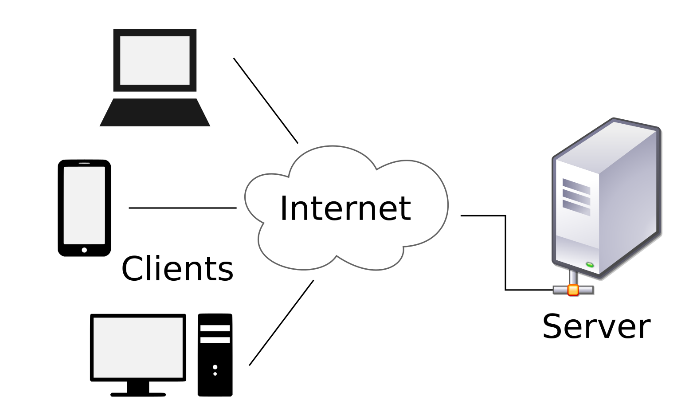
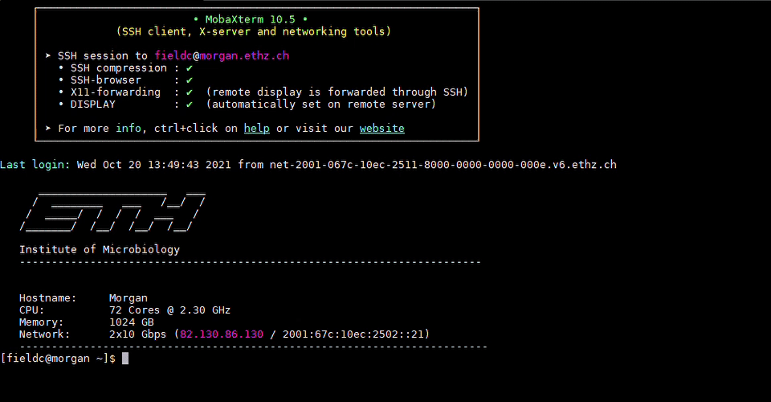

Introduction to Unix 1
======================

General information
^^^^^^^^^^^^^^^^^^^

Main objective
--------------

In this lecture we will introduce **Unix**: an operating system that runs on almost all high performance computing (HPC) servers, which we interface with via the **command line**.

Learning objectives
-------------------

* Students can connect to a remote server
* Students can use the command line to issue basic commands with arguments
* Students can navigate the Unix file system and perform basic file operations
* Students can get help with commands and programs

Networks
^^^^^^^^

Computers have been connected to each other to exchange data since the 1950s and now we take internet access for granted on our mobile devices. Behind the screen, there are countless pieces of software and protocols that make everything work, but we won't go into the details.

It is important however to understand the concept of a **remote server**. This is a computer sitting somewhere, possibly in the ETH basement, possibly in an enormous data centre in Iceland, which is only supposed to be connected to over the internet. To be able to connect to a server you need to have appropriate access - a username and password, and perhaps you will have to be connecting from an allowed location. For instance, you can only access the ETH remote servers from within the ETH domain, either because you are on the ETH WiFi or have connected via **VPN**.

A VPN, or virtual private network, is a way of connecting to a server that then channels all of your internet traffic through the server as if you were in its location. So if you use the ETH VPN, you will have access to everything as if you were connected to the ETH WiFi or cable network.

If you have not already connected your devices with the ETH VPN you can find the instructions to do so |VPN|.

.. |VPN| raw:: html
    
    <a href="https://ethz.ch/content/dam/ethz/special-interest/hest/isg-hest-dam/documents/pdf/vpn-de.pdf" target="_blank">here</a>

Exercises
---------
* Try to find out your IP-address before connecting to the ETH VPN. You can do so by going to the website |Hoststar|.
* Now connect to the ETH VPN and check your IP-address once more at |Hoststar|. What do you notice?

.. hidden-code-block:: bash

   You should notice that your IP-address change even though you did not physically change your location.

.. |Hoststar| raw:: html

    <a href="https://www.hoststar.ch/de/tools/meine-ip-adresse#:~:text=Geben%20Sie%20den%20Befehl%20»ping,öffentliche%20IP-Adresse%20der%20Seite." target="_blank">Hoststar</a>

Command Line interface
^^^^^^^^^^^^^^^^^^^^^^

Although software exists which allows you to access a server just as if you were logging into a normal computer - with a graphical user interface and everything - many will only provide a **command line interface**. This is a text-based method of communication that almost all computers have, though it is typically hidden out of sight for most users.

The terminal functions like an old fashioned text adventure game, or a voice-activated assistant that requires you to type in your commands.

Accessing the command line interface on your own computer depends on your system:

Windows
-------

* In the taskbar menu type 'command' and Command Prompt should appear for you to launch
* Alternatively press Windows Key + r and type 'cmd' into the box and Command Prompt should launch

Mac
---

* Click the launchpad icon in the dock, type 'Terminal' into the search field and launch from there
* Alternatively in the Finder, navigate to /Applications/Utilities folder and launch Terminal from there

Connecting to a remote server
-----------------------------

The ETH provides to its members access to a server named **Euler**, which can be accessed at the address: :code:`euler.ethz.ch`. In order to work on the server, we will connect to it using a protocol called **S**\ ecure **Sh**\ ell or **ssh**.

To log into the server use the ssh command your ETH user ID and the server address.

.. code-block:: bash

    # Command to connect to euler
    ssh <yourETH-ID>@euler.ethz.ch

Exercise
--------
* Try to connect to Euler yourself

.. hidden-code-block:: bash

   #First, you have to open the command line interface on you computer
   For Windows: Type "command" into the taskbar menu
   For Mac: Click onto the launchpad icon in the dock and type "Terminal" into the search field

   #Second, connect to Euler with the ssh command. You need your  user ID and your nethz password in order to connect to the serve
   ssh <yourETH-ID>@euler.ethz.ch

Workbench
^^^^^^^^^
In this course we will use the R-Workbench...

R-Section
---------
Explaining the R-part of the workbench and add image of the section

Terminal-Section
----------------
Explaining the Terminal in the Workbench and add image of the section

Python section?
---------------
Explain the python part (if there) and add image of the section

Exercise
----------
Try to connect to the workbench yourself

The structure of a command
^^^^^^^^^^^^^^^^^^^^^^^^^^
Commands are our tool to tell the computer what to do. Most commands have *options* and *arguments*. Arguments are often essential for a command to operate properly; they are the pieces of information required by a command, such as a file name. Options are, of course, optional, and offer ways to modify the way the command works.

For instance, **echo** will take any text you give it as an argument and then send it back to you as output:

.. code-block:: bash

    # My first command
    echo 'Hello World!'

If you use the option *-n*, then it will not add a 'new line' to the end of the output:

.. code-block:: bash

    # My second command
    echo -n 'Hello World!'

Some commands end up with very complex structures, because they can have many options and arguments. In general, options will be of the format '-a' where a is a single letter or '--word' where word is a string (a series of letters, in computer terms).

* Note: the command line is case-sensitive! So it does matter if you write *-a* or *-A*.

Useful tricks
-------------

* You can use the **up and down arrow keys** to navigate through previously used commands (known as your history) and repeat or modify them.

* Copy/Paste: Windows - by default in MobaXterm, you have to right-click the mouse to use the copy and paste commands. However this can be changed to the more common 'highlight-to-copy' method employed on most Linux systems, where right-click will paste whatever is in the clipboard. On a Mac - **cmd + c**, **cmd + v**.

* When typing a command or file name, you can press the 'tab' key to **auto complete** what you are typing. If there are multiple commands or files with similar names, auto completion will fill in as far as the first ambiguous character before you have to give it some more input. This method makes it *much* less likely that you make a spelling error.

* Pressing **ctrl + c** will send an interrupt signal that cancels the command and brings you back to the command line.

* Pressing **ctrl + r** will allow you to search through your command history.

* Pressing **ctrl + w** will delete the last word.

* Pressing **ctrl + l** will clear the screen.

* Pressing **ctrl + h** allows you to backspace.

* See previuos commands by typing **history** and pressing enter.

* Double click to select a word, triple click to select a line

* Using a **#** character allows you to make comments.

Exercises
---------

* Try to *echo* "My first command"

.. hidden-code-block:: bash

    echo 'My first command'

* Use the arrow key to execute the same command again

.. hidden-code-block:: bash

   #Press the up arrow once and the last command appears
   echo 'My first command'

* Use the arrow key to use the same command as before but delete the last word with a short cut

.. hidden-code-block:: bash

   #Use ctrl + w to delete the last word
   echo 'My first '
 
* Try typing *e* then pressing tab twice, what do you see?

.. hidden-code-block:: bash

   #You see all the possible commands that start with "e"
   e
   e2freefrag             edamisformat           embossversion          esac                   eu-readelf
   e2fsck                 edamisid               emma                   espdiff                eu-size
   e2image                edamname               emowse                 est2genome             eu-stack
   e2label                edialign               enable                 etags                  eu-strings
   e2undo                 editdiff               encode_keychange       etags.emacs            eu-strip
   e4defrag               edquota                entret                 etandem                eu-unstrip
   eapol_test             efibootmgr             env                    ether-wake             eval
   easy_install           egrep                  envsubst               ethtool                ex
   easy_install-2.7       einverted              epestfind              eu-addr2line           exec
   ebrowse                eject                  eprimer3               eu-ar                  exit
   ebtables               elfedit                eprimer32              eu-elfcmp              expand
   ebtables-restore       elif                   eps2eps                eu-elfcompress         export
   ebtables-save          else                   eqn                    eu-elflint             exportfs
   echo                   emacs                  equicktandem           eu-findtextrel         expr
   ed                     emacs-24.3-nox         era_check              eu-make-debug-archive  extractalign
   edamdef                emacsclient            era_dump               eu-nm                  extractfeat
   edamhasinput           embossdata             era_invalidate         eu-objdump             extractseq
   edamhasoutput          embossupdate           era_restore            eu-ranlib

* Try adding *c* to make *ec* and pressing tab twice again. What happens?

.. hidden-code-block:: bash

   #The command autocompletes
   echo

* Try to copy/paste your *echo* command "echo 'My first command'"

.. hidden-code-block:: bash

   #Note that ctrl + c and ctrl + v does not work on windows and you have to right click
   echo 'My first command'

* Try to clear the screen, can you still paste your *echo* command?

.. hidden-code-block:: bash

   #To clear the screen use ctrl + l and you can still paste the command
   echo 'My first command'

* Try to *echo* 'My first command 'once with the *-n* option and once with the *-N* option. What do you notice?

.. hidden-code-block:: bash

   #echo -n does not add a new line to the ouptput
   echo -n 'My first command'
   My first command[]$

   #There is no -N option for echo therefore echo will interpret '-N' as characters to display
   echo -N 'My first command'
   -N My first command

The file system
^^^^^^^^^^^^^^^
You may be used to the file system in Windows or Mac OS X, where directories can contain files and more directories. The Unix filesystem is structured in the same way, as a tree, that begins at the 'root' directory '**/**'. Directories are separated by slash characters **/**.

.. image:: images/filesystem_hierarchy.png

When you work on the command line, you are located in a directory somewhere in this tree. There are two ways to refer to a location: its **absolute path**, starting at the root directory, or its **relative path**.

.. code-block:: bash

    # Absolute path
    /cluster/home/<user_name>

    # Relative path
    ../home/<user_name>

The **..** refers to the directory above a location, so the relative path here goes up twice, then back down to your home directory. If a path starts with **~/** then it refers to your home directory. If a path starts with **./** then it refers to the current directory.

.. code-block:: bash

    # Go up one level
    ../

    # Home directory
    ~/

    # Same directory
    ./

Navigation
----------
**pwd** will tell you exactly where you are in the file system. Basiclly **pwd** tells you on which branch of the tree you are sitting. You will start off in your home folder.

.. code-block:: bash

    # Where am I?
    pwd

**ls** will list all of the files and directories where you are currently located. Basiclly **ls** tells you all the branches that go out of the branch you are sitting on.  If you give a path as an argument (the route to another branch), it will list the files at that location (the branches that go out from that branch).

.. code-block:: bash

    # What is here?
    ls

**cd** will change your location (the branch you are sitting on), your 'working directory', to the path given, absolute or relative. If no address is given, you return to your home directory.

.. code-block:: bash

    # Going places and check where you are
    cd ..
    pwd

    # Going back to previous diretory
    cd -
    pwd

    # Going to your home directory
    cd
    pwd

    # Going to the root
    cd /
    pwd

Exercises
---------

* Use *pwd* to find out where you are in your command line session

.. hidden-code-block:: bash

    #use pwd to find you current location
    pwd
    /nfs/home/<your eth name>

* Use *ls* to see if you have any files in your home directory

.. hidden-code-block:: bash

    #Use ls to see what in the directory is. Yours should be empty
    ls

* Use *cd* to go up one level

.. hidden-code-block:: bash

    #Use cd to change directory and .. to go up one level
    cd ..

* Use *ls* to see all the home directories of other users on the server

.. hidden-code-block:: bash

    #Use ls to see what in the directory is
    ls
    directory 1 directory 2 etc.

* Try to go up two levels using cd

.. hidden-code-block:: bash

    #use cd to change directory and .. to go up one level
    cd ../..

* Use cd to go back to your home directory

.. hidden-code-block:: bash

    #use cd to change directory and ~ to go to your home directory
    cd ~

* Use relative path to enter directory A what is in it?

.. hidden-code-block:: bash

    #use cd to change directory
    cd ../../share/A

    #use ls to see what is in there
    ls
    D1 D2 D3

* Use absolute path to go home

.. hidden-code-block:: bash

    #use cd to change directory and absolute path starts at the root
    cd /nfs/home/<your eth name>

* Go to the root

.. hidden-code-block:: bash

    #use cd to change directory and to go to the root use /
    cd /

* ETC. *We should probably design a file sctructure for them to explore and for us to form more explicit exercises and maybe we should include a picture of our file sctructure for visualization*
|
* Experiment with *cd* and *ls* to explore the directory structure on Euler, before returning to your home directory

.. hidden-code-block:: bash

    # Let's start at the 'root':
    cd /

    # Now we can have a look in the 'scratch' directory that we use to store data locally
    cd scratch
    ls

    # Finally let's go home
    cd ~

Getting Help
------------
**man** will show a manual for most basic commands, providing the correct syntax to use it and the various options available.

.. code-block:: bash

    # Read the manual
    man ls

Other programs have different ways to provide help on how to use them. A online tutorial is best, or a comprehensive manual, but sometimes you only have the command line to help you.

.. code-block:: bash

    # Help please!
    python -h
    python --help

Basic File Operations
---------------------
**cp** copies a file from one location to another. The example will copy a file containing the genome sequence of *E. coli K12 MG1655* to your home directory.

.. code-block:: bash

    # Copy
    cp <source> <destination>
    cp /cluster/home/ssunagaw/teaching/ecoli/GCF_000482265.1_EC_K12_MG1655_Broad_SNP_genomic.fna.gz ~/

**mv** moves a file from one location to another. The example actually renames the file, because the destination is not a directory. Thus you can move and rename a file with the same command.

.. code-block:: bash

    # Move or rename
    mv <source> <destination>
    mv ~/GCF_000482265.1_EC_K12_MG1655_Broad_SNP_genomic.fna.gz ~/E.coli_K12_MG1655.fna.gz

**rm** removes a file, so use it with care.

.. code-block:: bash

    # Remove
    rm <path_to_file>
    rm ~/E.coli_K12_MG1655.fna.gz

**mkdir** creates a new directory with the given name.

.. code-block:: bash

    # Make directory
    mkdir genomes

**rmdir** removes an empty directory.

.. code-block:: bash

    # Remove an empty directory
    rmdir genomes

Exercises
---------

* Create a new directory called "genomes"

.. hidden-code-block:: bash

    #Use the mkdir function to create a directory
    mkdir genomes

* Copy the E. coli file into your new directory "genome"

.. hidden-code-block:: bash

    #Use the cp function to copy. cp <source> <destination>
    cp /file/to/copy ~/genome

* Rename the file to "E.coli_file"

.. hidden-code-block:: bash

    #Use the move function to rename a file mv <source> <destination>
    mv complicated_name E.coli_file

* Use the help option of the ls function to find with option gives you the size of the genome

.. hidden-code-block:: bash

    #ls --help lists all the options possible
    ls --help
    # the -l options prints one file per line with the size and the -h options make it readable. You can join both optios together    ls -lh

* Using the *man* and *cp*, find out how to copy a directory.

.. hidden-code-block:: bash

    # create two directory
    mkdir dir1
    mkdir dir2

    # try to copy dir1 into dir2
    cp dir1 dir2/
     cp: dir1 is a directory (not copied).

    # if you check 'man cp', you see that you have to use -R:
    cp -R dir dir2/

Working with files
^^^^^^^^^^^^^^^^^^
In Unix systems there are only really two types of files: text or binary. The file name ending (.txt or .jpg) doesn't really matter like it does in Windows or Mac OS, however it is used to indicate the file type by convention. Some file types you will encounter include:

* .txt - A generic text file.
* .csv - A 'comma separated values' file, which is usually a table of data with each line a row and each column separated by a comma.
* .tsv - A 'tab separated values' file, which is the same but separated by tab characters.
* .fasta or .fa - A fasta formatted sequence file, in which each sequence has a header line starting with '>'.
* .fna - A fasta formatted nucleotide sequence file, usually gene sequences.
* .faa - A fasta formatted protein sequence file.
* .sh - A 'shell script', which contains commands to run.
* .r - An R script, which contains R commands to run.
* .py - A python script, which contains python commands to run.
* .gz or .tar.gz - A file that has been compressed using a protocol called 'gzip' so that it takes up less space on the disk and transfers over the internet faster.
Transferring files
------------------

The easiest way to transfer files between a server and your computer is to use the file browser offered by *MobaXterm*. This works via a protocol called **SFTP**, and other programs such as *Filezilla* offer the same utility.

.. image:: ../images/sftp.png
       :align: center

Another file transfer protocol is **scp**, and programs such as *WinSCP* use it. There are differences between the two protocols, but the outcome is the same. The command **scp** is an easy way to transfer a file immediately between the server you are working on and another (or two different servers!). Another command to copy files is **rsync**, which can be used with many options such as preserving the ownership and date of creation of a file (and much more).

.. code-block:: bash

    # Secure CoPy
    man scp
    scp source user@server:destination # local to server
    scp user@server:source destination # server to local

    # Rsync
    man rsync
    rsync -a source user@server:destination # local to server
    rsync -a user@server:source destination # server to local

    # Copy the E.coli genome (or any existing file) from the home directory on Euler to the current directory of your local computer
    # On Euler, run:
    cd
    cp /cluster/home/ssunagaw/teaching/ecoli/GCF_000482265.1_EC_K12_MG1655_Broad_SNP_genomic.fna.gz E.coli_K12_MG1655.fna.gz

    # Then, logout and run the following commands on your local system (not on Euler)
    scp user@euler.ethz.ch:~/E.coli_K12_MG1655.fna.gz .
    rsync -a user@euler.ethz.ch:~/E.coli_K12_MG1655.fna.gz .

    # Copy the E.coli genome (or any file) from your local computer to the home folder on Euler
    # Again, on your local system, run the following commands in a terminal (not on Euler)
    scp E.coli_K12_MG1655.fna.gz user@euler.ethz.ch:~/
    rsync -a E.coli_K12_MG1655.fna.gz user@euler.ethz.ch:~/

Sometimes you want to download a file directly from the internet to the server, rather than going via your local machine. **wget** allows you to download files in this way.

.. code-block:: bash

    # Download from the internet
    wget source-URL
    wget https://ftp.ncbi.nlm.nih.gov/genomes/all/GCF/000/482/265/GCF_000482265.1_EC_K12_MG1655_Broad_SNP/GCF_000482265.1_EC_K12_MG1655_Broad_SNP_genomic.fna.gz

Compressing and decompressing files
-----------------------------------

Files can be compressed to take up less space on the hard drive (disk), or for transfer over the internet. The file you downloaded is an example, and we can decompress it using the **gunzip** command:

.. code-block:: bash

    # Decompress a file
    gunzip GCF_000482265.1_EC_K12_MG1655_Broad_SNP_genomic.fna.gz

If you ever need to compress a file, for instance to send it to someone, you can use the **gzip** command:

.. code-block:: bash

    # Compress a file
    gzip GCF_000482265.1_EC_K12_MG1655_Broad_SNP_genomic.fna

Exercises
---------
*Probably needs rewriting*

* Windows: On your local computer, using the file browser, upload a file of your choice to your home directory on Euler.
* Mac OS X: In the *Terminal*, open a new window or logout from Euler, then upload a file from your local computer to your home directory on Euler using the **scp** command.

* On the server, download the file in the example above to your home folder.
* Decompress the file

.. hidden-code-block:: bash

    # Make sure I am in my home directory
    cd ~

    # Download the file
    wget https://ftp.ncbi.nlm.nih.gov/genomes/all/GCF/000/482/265/GCF_000482265.1_EC_K12_MG1655_Broad_SNP/GCF_000482265.1_EC_K12_MG1655_Broad_SNP_genomic.fna.gz

    # Decompress it
    gunzip GCF_000482265.1_EC_K12_MG1655_Broad_SNP_genomic.fna.gz

Homework
^^^^^^^^
Maybe first some simple tasks like

* Create a new directory called "Homework"
* Copy the "genome" directory into it
* Delete your old "genome" directory

And then some task where they have to think and not do are also usefull for a possible quiz in the next lecture

* What happens when you copy a file with the same name as an existing file?
* What happens when you delete the directory you are currently in?
* What happens when you create a directory with the same name as an existing one?
* What happens if you *echo* --help ?

The homework consists of working through the material from the demonstration, then completing some more involved exercises using the commands and tricks learnt. With only basic commands, the exercises will not be particularly challenging but we can still design them to make the students think about the commands they are executing. For instance, what happens if you copy a file with the same name as an existing file? 

.. container:: nextlink

    `Next: Introduction to Unix 2 <https://sunagawalab.ethz.ch/share/teaching/bioinformatics_praktikum/bioinf_spring22/contents/2_Unix2.html>`_

