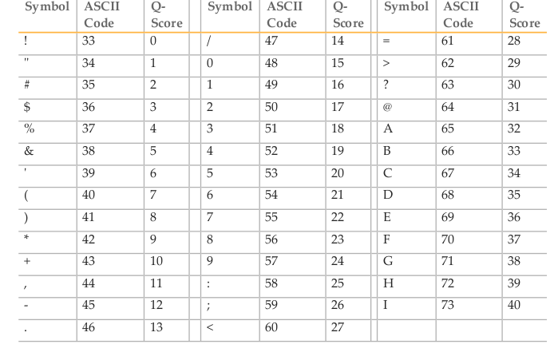
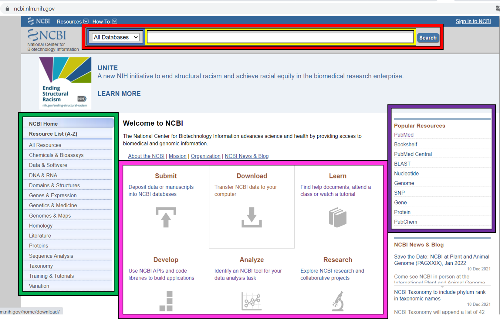
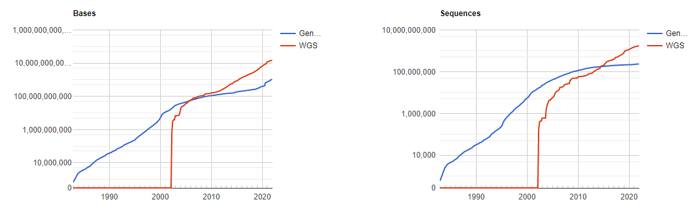
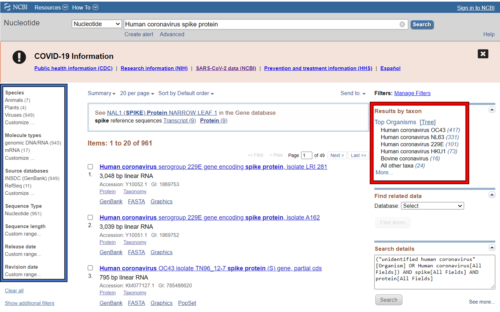

Sequence data
=============

General information
-------------------

Main objective
^^^^^^^^^^^^^^

In this lecture we will introduce sequence data formats *fastq* and *fasta*. We will discuss how features such as genes are annotated in *genbank* and *gff* formats. Sequence and feature data is available via any number of online databases, and we will explore NCBI and ENA resources.

Learning objectives
^^^^^^^^^^^^^^^^^^^

* Students can recognise and work with fastq and fasta formatted sequence files
* Students can interpret genbank and gff formatted files
* Students are proficient with Biopython to manipulate sequences programmatically
* Students are able to identify an appropriate online database to find relevant sequence files

Requirements
^^^^^^^^^^^^

This section requires the use of the |R_Workbench|.

.. |R_Workbench| raw:: html

    <a href="https://rstudio-teaching.ethz.ch/auth-sign-in?appUri=%2F" target="_blank">R Workbench</a>

Sequence data
-------------

DNA and protein sequences are fundamental to our understanding of biology and with the advent of high-throughput sequencing technologies, we generate ever more sequencing data at an ever increasing rate. At the core of our ability to use this data are two standard file formats:

* FASTQ - this is data from DNA sequencing that includes a quality score for each base
* FASTA - this is processed data, and can be DNA or protein sequence

FASTQ format
^^^^^^^^^^^^

A fastq file may contain multiple sequences in fastq format. This is a text-based format where each entry consists of 4 lines:

1. The sequence identifier, almost certainly automatically generated by the sequencing device; the line always begins with **@**
2. The raw sequence, consisting of A, C, G, T and perhaps N
3. These days unused, but in theory a repeat of line 1; the line always begins with **+**
4. The quality score for each base in the raw sequence

.. code-block:: bash

   @071112_SLXA-EAS1_s_7:5:1:817:345
   GGGTGATGGCCGCTGCCGATGGCGTCAAATCCCACC
   +
   IIIIIIIIIIIIIIIIIIIIIIIIIIIIII9IG9IC

Quality scores
^^^^^^^^^^^^^^

Quality scores in the standard Phred format range between 0 and 93, although sequencing read data is rarely higher than 60. The scores are encoded such that there is one character per base in the 2nd line of the fastq entry, using the ASCII encoding table (a computing standard). For instance, the letter **A** has a decimal equivalent of **65**. Sanger format offsets the quality score by **33**, so this represents a quality score of **32**.

The Phred quality score (Q) is logarithmically related to the error probability (E) and can therefore be interpreted as an estimate of error (E) or as an estimate of accuracy (A).

.. math::

    & Q = -10log(E) \\
    & E = 10^{-(Q/10)} \\
    & A = 1-E = 1 - 10^{-(Q/10)}

This formula gives us the following benchmarks for accuracy:

+------------------+-----------+------------+----------------------+
| Phred Quality Score          |   Error    |  Accuracy            |
|                              |            |                      |
+==============================+============+======================+
| 10                           | 10%        | 90%                  |
+------------------------------+------------+----------------------+
| 20                           | 1%         | 99%                  |
+------------------------------+------------+----------------------+
| 30                           | 0.1%       | 99.9%                |
+------------------------------+------------+----------------------+
| 40                           | 0.01%      | 99.99%               |
+------------------------------+------------+----------------------+

FASTA format
^^^^^^^^^^^^

A fasta file may also contain multiple sequences in fasta format (sometimes known as multi-fasta). The sequences will be either DNA or protein sequences, but never mixed in the same file. The fasta format is text-based, where each entry conists of:

1. A header line beginning with the **>** character and some information about the sequence such as ID, species name, gene name or position
2. One or more lines of sequence data. When multiple lines, each is usually 70 or 80 characters long, and this is done only for readability.

.. code-block:: bash
   
   # Nucleotide sequence
   >Mus_musculus_tRNA-Ala-AGC-1-1 (chr13.trna34-AlaAGC)
   GGGGGTGTAGCTCAGTGGTAGAGCGCGTGCTTAGCATGCACGAGGcCCTGGGTTCGATCC
   CCAGCACCTCCA

   # Protein sequence
   >gi|5524211|gb|AAD44166.1| cytochrome b [Elephas maximus maximus]
   LCLYTHIGRNIYYGSYLYSETWNTGIMLLLITMATAFMGYVLPWGQMSFWGATVITNLFSAIPYIGTNLV
   EWIWGGFSVDKATLNRFFAFHFILPFTMVALAGVHLTFLHETGSNNPLGLTSDSDKIPFHPYYTIKDFLG
   LLILILLLLLLALLSPDMLGDPDNHMPADPLNTPLHIKPEWYFLFAYAILRSVPNKLGGVLALFLSIVIL
   GLMPFLHTSKHRSMMLRPLSQALFWTLTMDLLTLTWIGSQPVEYPYTIIGQMASILYFSIILAFLPIAGX
   IENY

.. admonition:: Exercises
    :class: exercise

    * How might you count the number of entries in a multi-fasta file using command line tools?
    * How about for a fastq file?
    * HINT: in both cases think carefully about the ways your method might go wrong, consider using a regular expression

    * In the example fastq entry above, calculate the Phred quality scores for the final 4 bases.

    * How could you convert a fastq file to fasta format (discarding the quality scores) using command line tools?

    .. hidden-code-block:: bash

        # Count fasta records
        grep -c "^>" file.fasta

        # Count fastq records
        grep -c "^+$" file.fastq
        (expr $(wc -l short_reads.fastq | cut -d " " -f 1) / 4) # this method is a bit complicated

        # Convert fastq to fasta
        cat file.fastq | paste - - - - | cut -f 1,2 | tr "@\t" ">\n"

        # Alternatively there is a tool called seqtk that will perform all of these functions and more

Feature data
------------

As well as the sequence of biological molecules, it is useful to keep a record of identified *features* that exist on the molecule, whether they have been experimentally or computationally determined. For instance, the open reading frames of the genes in a bacterial genome. Here we cover two principle formats that are used to store feature information.

Genbank flat file format
^^^^^^^^^^^^^^^^^^^^^^^^

The genbank flat file is designed to contain a large and varied amount of information on DNA or RNA sequences. We are not going to cover here all of the possible features of the format, but the NCBI provide a sample record with a detailed description of each component |NCBI_GenBank|.

* **Locus**:
        * Locus name: Originally had a set format but now just has to be a unique name for the sequence record.
        * Sequence length: Number of base pairs or amino acids.
        * Molecule type: For instance DNA or mRNA, from a limited set of valid types.
        * GenBank division: A three letter designation such as PRI (primate), PLN (plant) or BAC (bacteria), from a limited set of valid designations.
        * Modification date: When the record was last updated.

* **Definition**: A brief description of the sequence such as source organism, gene name/protein name, or some description of the sequence's function.

* **Accession**: A unique identifier for each record that never changes (but the record may become redundant).

* **Source**: Organism name and sometimes molecule type. Under **Organism** you can find the formal scientific name for the source organism and its lineage.

* **Features**: Information about genes, gene products and biologically relevant regions. Each feature has:
        * Type: The type of feature such as gene or CDS, from a limited set of valid types.
        * Position: The start and end of the feature, possibly multiple start/ends for eukaryotic genes for instance.
        * Qualifiers: Various additional pieces of information such as /product (product name) or /translation (amino acid sequence), from a limited set of valid qualifiers.

* **Origin**: Optionally, the full sequence of record may be included here.

.. |NCBI_GenBank| raw:: html

    <a href="https://www.ncbi.nlm.nih.gov/Sitemap/samplerecord.html" target="_blank">here</a>

GFF format
^^^^^^^^^^

The **GFF** (**G**\eneral **F**\eature **F**\ormat) format is used in bioinformatics to describe genes and other features of DNA, RNA and protein sequences. The gff file consists of one line per feature, each containing 9 columns of data (fields) separated by **tab** characters. The 9 fields have the following properties (in the shown order). 

1. **Sequence name**: name of the sequence where the feature is located.
2. **Source**: name of the program the generated this feature or the data source for the feature.
3. **Feature**: feature type name such as *gene* or *exon*, etc.
4. **Start**: start position of the feature, sequence numbering starts at **1**.
5. **End**: end position of the feature, sequence numbering starts at **1**.
6. **Score**: a numeric value indicating the confidence of the source in the annotated feature; "." indicates a null value.
7. **Strand**: defined as **+** (forward), **-** (reverse) or **.** (undetermined).
8. **Frame**: indicates the first codon position for CDS features, 0, 1 or 2 for first, second or third position; otherwise ".".
9. **Attributes**: additional information about the feature, separated by **;**.

.. code-block:: bash

    # Excerpt from an example GFF file for E. coli MG1655
    NZ_AYEK01000001.1       RefSeq  region  1       4638920 .       +       .       ID=id0;Dbxref=taxon:511145;gbkey=Src;genome=genomic;mol_type=genomic DNA;strain=K-12;substrain=MG1655
    NZ_AYEK01000001.1       RefSeq  gene    190     255     .       +       .       ID=gene0;Name=P370_RS01000000122250;gbkey=Gene;gene_biotype=protein_coding;locus_tag=P370_RS01000000122250
    NZ_AYEK01000001.1       Protein Homology        CDS     190     255     .       +       0       ID=cds0;Parent=gene0;Dbxref=Genbank:WP_001386572.1;Name=WP_001386572.1;gbkey=CDS;inference=COORDINATES: similar to AA sequence:RefSeq:NP_414542.1;product=thr operon leader peptide;protein_id=WP_001386572.1;transl_table=11
    NZ_AYEK01000001.1       RefSeq  gene    337     2799    .       +       .       ID=gene1;Name=P370_RS0100015;gbkey=Gene;gene_biotype=protein_coding;locus_tag=P370_RS0100015
    NZ_AYEK01000001.1       Protein Homology        CDS     337     2799    .       +       0       ID=cds1;Parent=gene1;Dbxref=Genbank:WP_001264707.1;Name=WP_001264707.1;gbkey=CDS;inference=COORDINATES: similar to AA sequence:RefSeq:WP_005124053.1;product=bifunctional aspartokinase I/homoserine dehydrogenase I;protein_id=WP_001264707.1;transl_table=11

.. admonition:: Exercises
    :class: exercise

    ???

Working in BioPython
--------------------

BioPython is an extensive package that provides containers and functions for working with these file formats and more. You should be familiar with basic programming in Python, and here we will introduce how to use the package to read and manipulate sequence records.

Loading the package
^^^^^^^^^^^^^^^^^^^

There are two main components you are likely to want to use, the **Seq** object from the **Seq** module (confusing, yes) and **SeqIO**, and you load them with standard python syntax:

.. code-block:: python

    from Bio.Seq import Seq
    from Bio import SeqIO

Seq objects
^^^^^^^^^^^

To declare a new Seq object is straightforward:

.. code-block:: python

    my_seq = Seq("AGCTTTTCATTCTGACTG")

In many ways, Seq objects behave like strings, with find and count methods:

.. code-block:: python

    # Find the first position of a particular subsequence
    my_seq.find("ACT")
    my_seq.find("AAA") # returns -1 if not found

    # Count the number of a particular subsequence
    my_seq.count("A")
    my_seq.count("TT") # only non-overlapping sequences are counted

They also have useful, sequence specific methods:

.. code-block:: python

    # Complement
    my_seq.complement()

    # Reverse complement
    my_seq.reverse_complement()

    # Transcription and reverse transcription
    my_rna = my_seq.transcribe()
    my_dna = my_rna.back_transcribe()

    # Translation works on both DNA and RNA
    my_rna.translate()
    my_dna.translate()

Sequences can also be concatenated and sliced like strings, remembering that python uses 0-based indexing.

.. code-block:: python

    # Add some made up sequence
    my_newseq = Seq("ATG") + my_seq

    # Get the first 1000bp
    my_subseq = my_seq[0:1000]

    # Get the last 1000bp
    my_subseq = my_seq[-1000:]

Reading files with SeqIO
^^^^^^^^^^^^^^^^^^^^^^^^

SeqIO provides a function *parse()* that allows you to read in a multi-fasta file as an iterator or using a handle:

.. code-block:: python

    # As an interator
    records = SeqIO.parse("myfile.fasta", "fasta")

    # Using a handle
    with open("myfile.fasta" as handle:
        for record in SeqIO.parse(handle, "fasta")
            <do things>

The advantage of using a handle is guaranteeing that the file is closed correctly after reading.

Records read in by SeqIO are **SeqRecord** objects, which contain a *seq* variable that is a Seq object and additional information such as the record ID and description. Many of the methods for Seq objects work identically for SeqRecords.

Sometimes you don't want to work through the records in file order, in which case you can use *list()* to convert the iterator to a python list, but be careful with very large files as this will put every record into memory at the same time. You can also convert the iterator to a dictionary with record IDs as keys using a provided function.

.. code-block:: python

    # As a list object
    records = list(SeqIO.parse("myfile.fasta", "fasta"))

    # As a dictionary
    records = SeqIO.to_dict(SeqIO.parse("myfile.fasta", "fasta"))

Note that the *SeqIO.parse* examples above specify the file format as "fasta". Many other formats are supported, but the correct format must be explicitly given as an argument, for instance fastq is "fastq" and GenBank is "genbank" or "gb". Sadly, GFF format is not yet supported and requires an additional package or parsing it yourself. The full list of formats is available |BioPython_SeqIO|.

.. |BioPython_SeqIO| raw:: html

    <a href="https://biopython.org/wiki/SeqIO" target="_blank">here</a>

Accessing feature information
^^^^^^^^^^^^^^^^^^^^^^^^^^^^^

If you import a GenBank file with SeqIO, the Seq object will also contain information about the record's features, stored as SeqFeature objects.

.. code-block:: python

    # Import a genbank file and inspect its features
    records = list(SeqIO.parse("myfile.gbk", "gb"))
    record = records[0]

    # List of features
    record.features

    # Inspect a feature
    print(record.features[0])
    record.features[0].location
    record.features[0].qualifiers

    # Extract the sequence for the feature
    feature_seq = record.features[0].extract(record)

As features are a list, you can of course sort them using list comprehension by type, position, or similar. Note that when you slice a sequence to create a subsequence, only features that are contained completely within the subsequence are kept by it.

Writing files with SeqIO
^^^^^^^^^^^^^^^^^^^^^^^^

SeqIO can also be used to output records to file, in the supported format of your choice. Obviously if you convert file format you might lose information, for instance fastq to fasta, or genbank to fasta. Again, the file can be written using a handle if desired.

.. code-block:: python

    # Write to fasta
    SeqIO.write(records, "myrecords.fasta", "fasta")

    # Write to fasta with a handle
    with open("myrecords.fasta", w) as handle:
        SeqIO.write(records, handle, "fasta")

Converting file formats
^^^^^^^^^^^^^^^^^^^^^^^

If you use SeqIO to read in a file in one format, you can convert it by writing to another format. There are some things to note when doing this however:

* If you output to a format that does not support features, such as fasta, then you lose that information
* If you extract a feature sequence or slice a sequence, the new SeqRecord inherits the additional properties such as ID and description of the parent sequence
* If you translate a SeqRecord from nucleotide to amino acid sequence, the additional record information such as ID and description are lost and replaced with awkward '<unknown x>' strings

.. admonition:: Exercises
    :class: exercise
    
    * Using SeqIO, read in the GenBank file located at /nfs/course/PTB_551-0132-00/genomes/bacteria/escherichia/GCF_000005845.2_ASM584v2/GCF_000005845.2_ASM584v2_genomic.gbff
    * What is the GC content (the percentage of bases that are G or C) of the genome?
    * How many genes are there in the genome?

    * Pick any gene and write the sequence out to a new fasta file
    * For the same gene, write the translated amino acid sequence out to another fasta file

    * Write a script that:
       * Reads in the GenBank file
       * Extracts the nucleotide sequences of each gene
       * Writes them to a single multi-fasta file

    .. hidden-code-block:: python

        # Read in the file
        from Bio import SeqIO

        records = list(SeqIO.parse("/nfs/course/PTB_551-0132-00/genomes/bacteria/escherichia/GCF_000005845.2_ASM584v2/GCF_000005845.2_ASM584v2_genomic.gbff", 'gb'))
        record = records[0]

        # Calculate GC content
        gc = (record.seq.count('G') + record.seq.count('C')) / len(record)
        gc # GC content is 50.8%

        # Count genes
        genes = [feature for feature in record.features if feature.type=='gene']
        len(genes) # 4609 genes

        # Output a gene
        my_gene = genes[0]
        my_gene_seqrec = genes[0].extract(record)
        my_gene_seqrec.id = my_gene.qualifiers['gene'][0]
        my_gene_seqrec.description = 'extracted from ' + my_gene_seqrec.description
        SeqIO.write(my_gene_seqrec, 'my_gene.fna', 'fasta')

        # Output a translation
        my_gene_trans = my_gene_seqrec.translate()
        my_gene_trans # see that the metadata is messed up
        my_gene_trans.id = my_gene_seqrec.id
        my_gene_trans.description = my_gene_seqrec.description
        SeqIO.write(my_gene_trans, 'my_gene.faa', 'fasta')

Sequence databases
------------------

In your future work, you might want to reference the genome of the organism you are working with, or some of its genes, or those of species it is related to. If you generate sequence data, you might want to identify or annotate those sequences using bioinformatic methods that rely on an evidence base of existing public sequence data. It is therefore important that you are aware of the available databases that you might browse or search for such information.

There are three primary sequence databases that essentially contain the same data, exchanged daily between them.

* GenBank, part of the `NCBI <https://www.ncbi.nlm.nih.gov/>`_
* European Nucleotide Archive or `ENA <https://www.ebi.ac.uk/ena/browser/home>`_
* DNA Data Bank of Japan or `DDBJ <https://www.ddbj.nig.ac.jp/index-e.html>`_

There are additionally a vast array of secondary databases, often specialising in particular types of sequence or individual organisms. We will discuss some of them in future parts of the course.

NCBI
^^^^

The National Center for Biotechnology Information (`NCBI <https://www.ncbi.nlm.nih.gov/>`_) hosts a series of databases and tools that are considered essential for modern biology. 

The |NCBI| homepage (below) is a bit overwhelming. At the top you have the search bar (red frame). You can either search (yellow frame) in all databases or you can select a specific database out of the 39 available databases (blue frame).

In the bottom half of the page you have some popular resources on the right side (purple frame) and on the left hand side (green frame) you find a variety of sub areas. In the middle (pink frame) other common features are linked.

In the following section we will describe certain parts of the NCBI to help you find what you are looking for.

.. |NCBI| raw:: html

    <a href="https://www.ncbi.nlm.nih.gov/" target="_blank">NCBI homepage</a>

GenBank
+++++++

`GenBank <https://www.ncbi.nlm.nih.gov/genbank>`_ is an annotated collection of all publically available DNA sequences. This includes genomes, individual gene or feature sequences, transcripts and more. Sequences shorter than 200bp, that aren't based on a real molecule (for instance a consensus sequence) or that are not known in nucleotide space (for instance a directly sequenced protein), primers, and mixed DNA/mRNA sequences are not accepted. Additional to GenBank is the `WGS <https://www.ncbi.nlm.nih.gov/wgs>`_ (whole genome shotgun) database, which contains sequencing projects that are currently the most common form of high-throughput sequencing, but are not yet assembled, finished or annotatable. The graphs below show how the databases have grown over time in number of entries and total base pairs.

GenBank is searchable by selecting the 'Nucleotide' database on the NCBI homepage. It can also be searched by alignment, which will be covered in the next lecture. When you search, you are shown the results as seen below. These can be further filtered by convenient links on the left side of the page (blue frame), or by organism on the right side of the page (red frame).

RefSeq
++++++

The `Reference Sequence <https://www.ncbi.nlm.nih.gov/refseq>`_ database aims to be a comprehensive, well-annotated, non-redundant set of sequences - effectively a curated subset of GenBank to represent the best quality information available for use in biological research. For instance, RefSeq contains 66,541 bacterial entries as of release 207. If you are looking for a high quality and trustworthy sequence for your work, RefSeq is a good place to start.

RefSeq is not searchable from the NCBI frontpage. Instead, you can search GenBank by selecting the 'Nucleotide' database and then use the appropriate filter.

Genome
++++++

The `genome <https://www.ncbi.nlm.nih.gov/genome/>`_ database is another subset of GenBank that includes genomes, chromosomes and assemblies. It aims to assign taxonomy to each entry and give an assessment of completeness. It can be searched directly from the NCBI frontpage by selecting 'Genome'.

Taxonomy
++++++++

The `taxonomy <https://www.ncbi.nlm.nih.gov/taxonomy>`_ database is a curated classification of the organisms in GenBank, by which we mean their locations on the tree of life. There are alternative taxonomies available, such as the `GTDB <https://gtdb.ecogenomic.org/>`_, as phylogenetic methods differ. Taxonomy is continually under revision, and often submissions are unintentionally misassigned, so be wary when working with less well researched organisms or environments.

Taxonomy can be searched directly from the NCBI frontpage by selecting 'Taxonomy'.

.. admonition:: Exercises
    :class: exercise

    * Search for something..

Searching the NCBI
^^^^^^^^^^^^^^^^^^

The NCBI’s primary text search and retrieval system, Entrez, comprises 39 molecular and literature databases and is usually accessed via the search bar (Figure 1 red frame, nearly all search boxes on NCBI access the Entrez system). 

Since Entrez searches in a vast amount of databases and the search input can be almost anything (single words, short phrases, sentences, database identifiers, gene symbols, names, etc.) even simple searches can lead to an overwhelming amount of results. Therefore it is useful to know some tricks which make searching more efficient.

1. Boolean Operators: You should have be familiar with Boolean Operators from Statistics. They can be used in Entrez to make your search more specific:
       
    * **AND**: Finds documents that contain terms on both sides of the operator, the intersection of both searches.
    * **OR**: Finds documents that contain either term, the union of both searches.
    * **NOT**: Finds documents that contain the term on the left but not the term on the right of the operator, the subtraction of the right hand search from the one on the left.

    **Please note that these Boolean Operators have to be written in uppercase to work and are processed from left to right**

2. Phrases: Individual search terms separated by a **space** are joined as if an **AND** was put between them, unless the words match a phrase indexed by the database, in which case the phrase is searched for as written. If you want to force a search for a phrase, put the words in quotation marks "like this". Furthermore, you can use \* as a wildcard to represent any character.

3. Indexed Fields: Each database has various indices to improve and speed up searching - the metadata for each entry. A field can be searched specifically by putting its name in square brackets immediately after a search term. For instance, entries in Nucleotide are associated with an Organism and a Publication Date (amongst many other fields) that you can search for like so:

        "Escherichia coli"[Organism] AND 2020/1/1[Publication Date]

If you want to know more about Entrez click |Entrez|.

.. |Entrez| raw:: html

    <a href="https://www.ncbi.nlm.nih.gov/books/NBK3837/" target="_blank">here</a>

.. container:: nextlink

    `Next: Alignment <4_Alignment.html>`_

