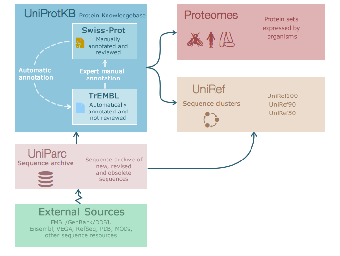

Sequence data
=============

General information
-------------------

Main objective
^^^^^^^^^^^^^^

In this lecture we will introduce sequence data formats *fastq* and *fasta*. We will discuss how features such as genes are annotated in *genbank* and *gff* formats. Sequence and feature data is available via any number of online databases, and we will explore NCBI and ENA resources.

Learning objectives
^^^^^^^^^^^^^^^^^^^

* Students can recognise and work with fastq and fasta formatted sequence files
* Students can interpret genbank and gff formatted files
* Students are able to identify an appropriate online database to find relevant sequence file
* ...

Requirements
^^^^^^^^^^^^

This section requires the use of the |R_Workbench|.

.. |R_Workbench| raw:: html

    <a href="https://rstudio-teaching.ethz.ch/auth-sign-in?appUri=%2F" target="_blank">R Workbench</a>

Sequence data
-------------

DNA and protein sequences are fundamental to our understanding of biology and with the advent of high-throughput sequencing technologies, we generate ever more sequencing data at an ever increasing rate. At the core of our ability to use this data are two standard file formats:

* FASTQ - this is data from DNA sequencing that includes a quality score for each base
* FASTA - this is processed data, and can be DNA or protein sequence

FASTQ format
^^^^^^^^^^^^

A fastq file may contain multiple sequences in fastq format. This is a text-based format where each entry consists of 4 lines:

1. The sequence identifier, almost certainly automatically generated by the sequencing device; the line always begins with **@**
2. The raw sequence, consisting of A, C, G, T and perhaps N
3. These days unused, but in theory a repeat of line 1; the line always begins with **+**
4. The quality score for each base in the raw sequence

.. code-block:: bash

   @071112_SLXA-EAS1_s_7:5:1:817:345
   GGGTGATGGCCGCTGCCGATGGCGTCAAATCCCACC
   +
   IIIIIIIIIIIIIIIIIIIIIIIIIIIIII9IG9IC

Quality scores in the standard format range between 0 and 93, although sequencing read data is rarely higher than 60. The scores are encoded such that there is one character per base in the 2nd line of the fastq entry. You can learn more about DNA sequence quality scores in the *Concept Course in Bioinformatics*.

FASTA format
^^^^^^^^^^^^

A fasta file may also contain multiple sequences in fasta format (sometimes known as multi-fasta). The sequences will be either DNA or protein sequences, but never mixed in the same file. The fasta format is text-based, where each entry conists of:

1. A header line beginning with the **>** character and some information about the sequence such as ID, species name, gene name or position
2. One or more lines of sequence data. When multiple lines, each is usually 70 or 80 characters long, and this is done only for readability.

.. code-block:: bash
   
   # Nucleotide sequence
   >Mus_musculus_tRNA-Ala-AGC-1-1 (chr13.trna34-AlaAGC)
   GGGGGTGTAGCTCAGTGGTAGAGCGCGTGCTTAGCATGCACGAGGcCCTGGGTTCGATCC
   CCAGCACCTCCA

   # Protein sequence
   >gi|5524211|gb|AAD44166.1| cytochrome b [Elephas maximus maximus]
   LCLYTHIGRNIYYGSYLYSETWNTGIMLLLITMATAFMGYVLPWGQMSFWGATVITNLFSAIPYIGTNLV
   EWIWGGFSVDKATLNRFFAFHFILPFTMVALAGVHLTFLHETGSNNPLGLTSDSDKIPFHPYYTIKDFLG
   LLILILLLLLLALLSPDMLGDPDNHMPADPLNTPLHIKPEWYFLFAYAILRSVPNKLGGVLALFLSIVIL
   GLMPFLHTSKHRSMMLRPLSQALFWTLTMDLLTLTWIGSQPVEYPYTIIGQMASILYFSIILAFLPIAGX
   IENY

.. admonition:: Exercises
    :class: exercise

    * How might you count the number of entries in a multi-fasta file using command line tools?
    * How about for a fastq file?
    * HINT: in both cases think carefully about the ways your method might go wrong, consider using a regular expression

    * How could you convert a fastq file to fasta format (discarding the quality scores) using command line tools?

    .. hidden-code-block:: bash

        # Count fasta records
        grep -c "^>" file.fasta

        # Count fastq records
        grep -c "^+$" file.fastq
        (expr $(wc -l short_reads.fastq | cut -d " " -f 1) / 4) # this method is a bit complicated

        # Convert fastq to fasta
        cat file.fastq | paste - - - - | cut -f 1,2 | tr "@\t" ">\n"

        # Alternatively there is a tool called seqtk that will perform all of these functions and more

Feature data
------------

As well as the sequence of biological molecules, it is useful to keep a record of identified *features* that exist on the molecule, whether they have been experimentally or computationally determined. For instance, the open reading frames of the genes in a bacterial genome. Here we cover two principle formats that are used to store feature information.

Genbank flat file format
^^^^^^^^^^^^^^^^^^^^^^^^

The genbank flat file is designed to contain a large and varied amount of information on DNA or RNA sequences. We are not going to cover here all of the possible features of the format, but the NCBI provide a sample record with a detailed description of each component |NCBI_GenBank|.

* **Locus**
  * Locus name: originally had a set format but now just has to be a unique name for the sequence record.
  * Sequence length: number of base pairs or amino acids.
  * Molecule type: for instance DNA or mRNA, from a limited set of valid types.
  * GenBank division: a three letter designation such as PRI (primate), PLN (plant) or BAC (bacteria), from a limited set of valid designations.
  * Modification date: when the record was last updated.

* **Definition**: A brief description of the sequence such as source organism, gene name/protein name, or some description of the sequence's function.

* **Accession**: A unique identifier for each record that never changes (but the record may become redundant).

* **Source**: Organism name and sometimes molecule type. Under **Organism** you can find the formal scientific name for the source organism and its lineage.

* **Features**: Information about genes, gene products and biologically relevant regions. Each feature has:
  * Type: the type of feature such as gene or CDS, from a limited set of valid types.
  * Position: the start and end of the feature, possibly multiple start/ends for eukaryotic genes for instance.
  * Qualifiers: various additional pieces of information such as /product (product name) or /translation (amino acid sequence), from a limited set of valid qualifiers.

* **Origin**: Optionally, the full sequence of record may be included here.

.. |NCBI_GenBank| raw:: html

    <a href="https://www.ncbi.nlm.nih.gov/Sitemap/samplerecord.html" target="_blank">here</a>

GFF format
^^^^^^^^^^

The **GFF** (**G**\eneral **F**\eature **F**\ormat) format is used in bioinformatics to describe genes and other features of DNA, RNA and protein sequences. The gff file consists of one line per feature, each containing 9 columns of data (fields) separated by **tab** characters. The 9 fields have the following properties (in the shown order). 

1. **Sequence name**: name of the sequence where the feature is located.
2. **Source**: name of the program the generated this feature or the data source for the feature.
3. **Feature**: feature type name such as *gene* or *exon*, etc.
4. **Start**: start position of the feature, sequence numbering starts at **1**.
5. **End**: end position of the feature, sequence numbering starts at **1**.
6. **Score**: a numeric value indicating the confidence of the source in the annotated feature; "." indicates a null value.
7. **Strand**: defined as **+** (forward), **-** (reverse) or **.** (undetermined).
8. **Frame**: indicates the first codon position for CDS features, 0, 1 or 2 for first, second or third position; otherwise ".".
9. **Attributes**: additional information about the feature, separated by **;**.

.. code-block:: bash

    # Excerpt from an example GFF file for E. coli MG1655
    NZ_AYEK01000001.1       RefSeq  region  1       4638920 .       +       .       ID=id0;Dbxref=taxon:511145;gbkey=Src;genome=genomic;mol_type=genomic DNA;strain=K-12;substrain=MG1655
    NZ_AYEK01000001.1       RefSeq  gene    190     255     .       +       .       ID=gene0;Name=P370_RS01000000122250;gbkey=Gene;gene_biotype=protein_coding;locus_tag=P370_RS01000000122250
    NZ_AYEK01000001.1       Protein Homology        CDS     190     255     .       +       0       ID=cds0;Parent=gene0;Dbxref=Genbank:WP_001386572.1;Name=WP_001386572.1;gbkey=CDS;inference=COORDINATES: similar to AA sequence:RefSeq:NP_414542.1;product=thr operon leader peptide;protein_id=WP_001386572.1;transl_table=11
    NZ_AYEK01000001.1       RefSeq  gene    337     2799    .       +       .       ID=gene1;Name=P370_RS0100015;gbkey=Gene;gene_biotype=protein_coding;locus_tag=P370_RS0100015
    NZ_AYEK01000001.1       Protein Homology        CDS     337     2799    .       +       0       ID=cds1;Parent=gene1;Dbxref=Genbank:WP_001264707.1;Name=WP_001264707.1;gbkey=CDS;inference=COORDINATES: similar to AA sequence:RefSeq:WP_005124053.1;product=bifunctional aspartokinase I/homoserine dehydrogenase I;protein_id=WP_001264707.1;transl_table=11

.. admonition:: Exercises
    :class: exercise

    ???

Working in BioPython
--------------------

BioPython is an extensive package that provides containers and functions for working with these file formats and more. You should be familiar with basic programming in Python, and here we will introduce how to use the package to read and manipulate sequence records.

Loading the package
^^^^^^^^^^^^^^^^^^^

There are two main components you are likely to want to use, the **Seq** object from the **Seq** module (confusing, yes) and **SeqIO**, and you load them with standard python syntax:

.. code-block:: python

    from Bio.Seq import Seq
    from Bio import SeqIO

Seq objects
^^^^^^^^^^^

To declare a new Seq object is straightforward:

.. code-block:: python

    my_seq = Seq("AGCTTTTCATTCTGACTG")

In many ways, Seq objects behave like strings, with find and count methods:

.. code-block:: python

    # Find the first position of a particular subsequence
    my_seq.find("ACT")
    my_seq.find("AAA") # returns -1 if not found

    # Count the number of a particular subsequence
    my_seq.count("A")
    my_seq.count("TT") # only non-overlapping sequences are counted

* Loading Seq, SeqIO
* Reading files
* Accessing information
* Modifying
* Writing files

Quality checking
^^^^^^^^^^^^^^^^

Phred Quality Scores
--------------------

There were several competing systems for encoding the quality scores but the Sanger format encoding Phred quality scores has won out. This is based on the decimal code for the character used from the ASCII encoding table. For instance, the letter **A** has a decimal equivalent of **65**. Sanger format offsets the quality score by **33**, so this represents a quality score of **32** for the letter **A**.

The Phred quality score (Q) is logarithmically related to the error probability (E) and can therefore be interpreted as an estimate of error (E) or as an estimate of accuracy (A). In the FASTQ-format the estimate of accuracy is used.

.. math::
   
   & Q = -10log(E) \\
   & E = 10^{-(Q/10)} \\
   & A = 1-E = 1 - 10^{-(Q/10)}

These formulas lead to this table on how the Phred scores can be interpreted. 

+------------------+-----------+------------+----------------------+
| Phred Quality Score          |   Error    |  Accuracy            |
|                              |            |                      |
+==============================+============+======================+
| 10                           | 10%        | 90%                  |
+------------------------------+------------+----------------------+
| 20                           | 1%         | 99%                  |
+------------------------------+------------+----------------------+
| 30                           | 0.1%       | 99.9%                |
+------------------------------+------------+----------------------+
| 40                           | 0.01%      | 99.99%               |
+------------------------------+------------+----------------------+

Phred quality scores usually range from 0-40 in FASTQ files. For most purposes a Phred score of 20 is the acceptable limit of quality (99% accuracy).

.. admonition:: Exercises
   :class: exercise

   * Copy the files “/nfs/course/551-1119-00L_masterdata/tutorials/linux/example.fasta” and “/nfs/course/551-1119-00L_masterdata/tutorials/dada2/00_rawData/AML_Mock_03_SUSHI_METAB_R1.fastq.gz” into a new directory in your home folder.
   * Use **grep** to find out how many sequences in the fasta file are
   * *Some exercise for the fastq (prep etc.)* 

   .. hidden-code-block:: bash

        # Copy the files into your homefolder
        # Copy the first file while creating a new directory
        cp /nfs/course/551-1119-00L_masterdata/tutorials/linux/example.fasta ~/fasta_fastq/
        # Copy the second file
        cp /nfs/course/551-1119-00L_masterdata/tutorials/dada2/00_rawData/AML_Mock_03_SUSHI_METAB_R1.fastq.gz ~/fasta_fastq/

        # Using grep to count
        grep -c ">" example.fasta

NCBI
^^^^^^^^^^^^^^^^^^
The National Center for Biotechnology Information (NCBI) houses a series of databases and tools relevant to biotechnology, biomedicine and bioinformatics. It is probably the most prominent and important online database for biological research. The NCBI includes major databases such as Gene, Genome or PubMed but also useful tools such as BLAST, Primer-BLAST or Taxonomy Common Tree. Since NCBI is one of the major webpages for biological research we want to take some time and highlight some of its features.

When you open the |NCBI| you should see something similar to figure 1. On top you have the search bar (red frame). You can either search (yellow frame) in all databases or you can select a specific database out of the 39 available databases (blue frame). 

In the bottom half of the page you have some popular resources on the right side (purple frame) and on the left hand side (green frame) you find a variety of sub areas. In the middle (pink frame) other common features are linked.

In the following section we want to highlight certain parts of the NCBI.

**Figure 1**
|P1|

.. |NCBI| raw:: html

    <a href="https://www.ncbi.nlm.nih.gov/" target="_blank">NCBI homepage</a>

.. |P1| image:: images/NCBI_1.png

Entrez
------
Entrez is the NCBI’s primary text search and retrieval system that comprises 39 molecular and literature databases and is usually accessed via the search bar (Figure 1 red frame, nearly all search boxes on NCBI access the Entrez system). 
Since Entrez searches in a vast amount of databases and the search input can be almost anything (single words, short phrases, sentences, database identifiers, gene symbols, names, etc.) even simple searches can lead to an overwhelming amount of results. Therefore it is useful to know some tricks which make searching more efficient.

1. Boolean Operators: You should have learned what Boolean Operators are in Statistics. They can also be used in Entrez to make your search more specific.
        * **AND**: Finds documents that contain terms on both sides of the operator terms, the intersection of both searches.
        * **OR**: Finds documents that contain either term, the union of both searches.
        * **NOT**: Finds documents that contain the term on the left but not the term on the right of the operator, the subtraction of the right hand search from the one on the left.

        **Please note that these Boolean Operators have to be written in uppercase to work and are processed from left to right**

        Individual search terms separated by a **space** are joined as if an **AND** was put in between, exceptions are if the words can be matched with parts of a sentence. If you want to search for full sentences (or parts) you have to put your sentence between quotation marks (“”) so that the single words are not joined together by an AND. Furthermore, you can use **\*** as a wildcard to represent any character.

2. Facet Filters: Facet filters may restrict to certain types of records or exclude undesired ones. Many useful restrictions can be applied to searches through the faceted filter links on the left-hand column of the Entrez search page (Figure 2 green frame). 

**Figure 2**
|P2|

 
This are only the basics about Entrez. If you want to know more about Entrez click |Entrez|

.. |Entrez| raw:: html

    <a href="https://www.ncbi.nlm.nih.gov/books/NBK3837/" target="_blank">here</a>

BLAST
-----
After we showed you how to search in NCBI we also want to introduce you one of the most important tools on NCBI the **B**\asic **L**\ocal **A**\lignment **S**\earch **T**\ool (**BLAST**).

Since you will probably use BLAST a few times throughout your ETH- and scientific career it is important that **BLAST** is not just a black-box to you, where you put something in and something comes out, but that you understand its basics so that you can probably handle the results.

BLAST is an algorithm designed to find regions of similarity between biological sequences. It compares nucleotide or protein sequences to sequence databases and calculates the statistical significance. BLAST is a so-called heuristic algorithm. Heuristic algorithms are designed to solve problems in faster and more efficient ways but they sacrifice optimality, accuracy, precision, or completeness for the gained speed. Since heuristic algorithms do not generate the best result 100% of the time, it is helpful to have some understanding about the Algorithm to properly evaluate the results.

A BLAST search begins with the input of your sequence you want to align. BLAST than filters out so-called **low complexity** regions (TTTTTTT, ACACACACAC, etc.). The remainder of the sequence is then fragmented into pieces (default setting is the length of 11 nucleotides, so the first piece goes from nucleotides 1-11, the second to 2-12 and so on) throughout the sequence.  BLAST then picks the pieces which are statistically unlikely to appear and searches for exact matches (no mismatches and gaps allowed) in the database. If BLAST finds such a piece, it starts to search for matches of the database-and search sequence in both directions. Mismatches are now allowed but still no gaps. If the matches are good, BLAST starts to connect the two sequences together (gaps are now allowed).

As you can see, BLAST relays on the believe that two related biological sequences have relatively long **exactly** matching sequence sections. With this assumption, BLAST can find results much faster. On the one hand, exactly matching sequences are easier to find than similarities and on the other hand you can reduce the search space. But if the sequence you are looking for does not have an exactly matching part, you are not going to find it.

To summarize, the speed of BLAST is dependent on the piece size selected. BLAST searches with long piece sizes (which need an exact match) are going to be faster than BLAST searches with small pieces sizes. But there is the danger that you miss good alignments, if the piece size is too long. It is therefore on you, the user, to set the parameters accordingly.

**Maybe this text is a better fit for the alignment part then NCBI**

Databases
------
As mentioned before, the NCBI consists of 39 different databases. In the following sections, we want to highlight some of them. 

PubMed
++++++
...

GenBank and RefSeq
++++++++++++++++++
GeneBank is a genetic sequence database which annotates and collects all publicly available DNA sequences and their protein translations.Currently, the GenBank harbours more than 12 trillion nucleotides in more than 2 billion sequences from more than 100’000 distinct organisms. The sequences are submitted from laboratories all around the world. Important, the sequences in GenBank are not raw data, all sequences in GenBank have been **annotated**, meaning information such as species, origin, potential genes, etc. are available for each sequence. Furthermore, each sequence can be identified by its individual identification number.

The strength of GenBenk is also its weakness. It is fairly simple to get lost in the huge amount of data GenBank offers. Therefore, GenBank offers you to search in subsets. One of these subsets is RefSeq. RefSeq is a database with non-redundant (only one entry per sequence), especially well annotated (lot of information available) sequences. As the name suggests, RefSeq sequences are usually used as a reference point from which differences can be described. 

Genome
------
...

ENA
---
The European Nucleotide Archive (ENA) repository for annotated DNA and RNA sequences with complementary information. The ENA consists of three main databases: The Sequence Read Archive (SRA), the Trace Archive (TA) and the EMBL Nucleotide Archive (EMBL-bank) 

Sequence Read Archive
+++++++++++++++++++++

The SRA is a bioinformatic database maintained by the NCBI, European Bioinformatics Institute (EBI) and DNA Data Bank of Japan (DDBJ) providing access to DNA sequences, especially short reads (less than 1’000 base pairs). In the SRA primary data from next-generation-sequencing are stored but also data from RNA-Seq and ChIP-Seq.

Trace Archive
+++++++++++++
Same as for the SRA also the TA is maintained by the NCBI, EBI and DDBJ together. The TA is a permanent repository of DNA sequence chromatograms (traces), base calls and quality estimates for single-pass reads from large-scale sequencing projects. 

EMBL-bank
+++++++++

The EMBL-bank contains high high-level genome assembly details, as well as assembled sequences and their functional annotation.

DDBJ
----
The DNA Data Bank of Japan (DDBJ) is a biological database collecting DNA sequences and is the only nucleotide database in Asia and collects mainly DNA data from Japanese researchers. 

Exercise
--------

**How to acces and work with these Databases probabley NCBI**

Protein databases
^^^^^^^^^^^^^^^^^

Uniprot
-------

The Universal Protein Resource (UniProt) is a database hosted by the European Bioinformatics Institute (EMBL-EBI), Swiss Institute of Bioinformatics (SIB) and  Protein Information Resource (PIR) for protein sequence, annotation and functions. Uniprot consists of three databases the UniProt Knowledgebase (UniProtKB), the UniProt Reference Clusters (UniRef), and the UniProt Archive (UniParc). 

   

The UniProtKB consists of two sections, a manually annotated part and an automated annotated part which awaits manual annotation. Each entry provides functional information about a protein with as much annotation information as possible.

NCBI
----

...

Homework
^^^^^^^^
