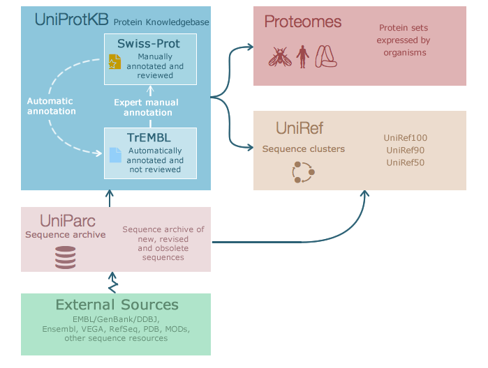

Annotation
==========

General information
^^^^^^^^^^^^^^^^^^^

Main objective
--------------

In this lecture we will introduce the concept of sequence annotation. We will look at how to predict genes from sequence, how to predict function by homology and the databases that we use to do this.

Learning objectives
-------------------

* Students are able to predict open reading frames (genes) from sequence in prokaryotes and understand the principle in eukaryotes
* Students understand the principle of predicting function by homology
* Students are able to use databases such as PFAM to search for functional components in a sequence

Requirements
------------

Laptop with access to the ETHZ network, via VPN if necessary

Introduction to annotation
--------------------------

When we look at a DNA sequence, how do we know what it does? What features it encodes? Like most of science, we build on the work done before. If the known function of a genetic element was determined at some point experimentally, and if we see that genetic element again, or something that looks like it, we might suspect that it has the same function. Then, when we have seen enough examples of a particular element, we might figure out a pattern or set of rules to predict the existence of that element in a completely new sequence. Broadly, this is known as *function by homology* or *homology-based inference*.

There are various different annotation tasks you might want to perform on a novel sequence, for example:

* Gene prediction
* Searching for a gene with a particular function
* Promoter and protein binding site prediction
* The prediction of various non-messenger RNAs
* Prediction of CRISPR arrays
* Finding signal peptide features in coding sequences

In these exercises we will show you how to predict genes in prokaryotes, how to predict gene function by homology and how to search for particular functions.

Gene prediction
---------------

Genes in prokaryotes are relatively simple in structure: they begin with a start codon, end with a stop codon and contain a ribosomal binding site (RBS) motif. The coding density across a genome is also relatively high - most sequence encodes a gene. When looking for a gene, there are six possible reading frames, or six possible ways to convert a nucleotide sequences into an amino acid sequence:

.. code-block::

    ACAACATCCATGAAACGCATTAGCACCACCATTACCACCACCATCACCATTACCACAGGTAACGGTGCGGGCTGACGCGT

An open reading frame (ORF) is a region in one of these reading frames that begins at a start codon and then extends long enough that the region could be a gene before reaching a stop codon. Gene prediction algorithms look across all six reading frames and use a model to determine which are likely genes, taking into account, based on training data:

* The start codon distribution
* RBS motifs
* Gene lengths
* Overlap between genes (on the same and opposite strands)

Quick TOC
---------

* Finding genes
* Annotation by homology
* The idea of weight matrices/statistical function prediction
* Protein domains and PFAM

Uniprot
-------

The Universal Protein Resource (UniProt) is a database hosted by the European Bioinformatics Institute (EMBL-EBI), Swiss Institute of Bioinformatics (SIB) and  Protein Information Resource (PIR) for protein sequence, annotation and functions. Uniprot consists of three databases the UniProt Knowledgebase (UniProtKB), the UniProt Reference Clusters (UniRef), and the UniProt Archive (UniParc).

The UniProtKB consists of two sections, a manually annotated part and an automated annotated part which awaits manual annotation. Each entry provides functional information about a protein with as much annotation information as possible.

