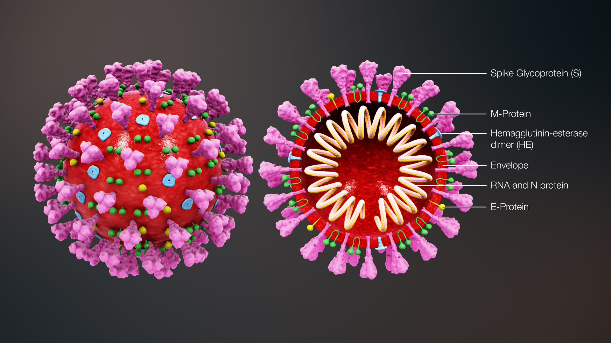

SARS-CoV-2 Evolution
====================

The aim of the homework is to test a hypothesis on the evolution of SARS-CoV-2. To this end, you will use basic UNIX commands to re-format and parse data files that will allow you to get some insights into the selective pressure on proteins encoded by the SARS-CoV-2 virus. 

You will:
 
* based on biological knowledge, to rationalize the degree of sequence conservation in two SARS-CoV2 proteins and formulate a testable hypothesis
* produce some basic statistics on a collection of these two proteins
* re-format the data to allow for hypothesis testing

Advanced participants will also:

* refine the analysis to account for confounding factors

Let's start with getting some background information on the structure and proteins of SARS-CoV-2.

Background information: SARS-CoV-2 - structure and proteins
-----------------------------------------------------------

Severe acute respiratory syndrome coronavirus 2 (SARS-CoV-2) is an enveloped, positive-sense, single-stranded RNA virus that causes coronavirus disease 2019 (COVID-19). Virus particles include the RNA genetic material and structural proteins needed for invasion of host cells. Once inside the cell the infecting RNA is used to encode *structural proteins* that make up virus particles, *nonstructural proteins* that direct virus assembly, transcription, replication and host control, and accessory proteins whose function have not been determined. 

ORF1ab, the largest gene, contains overlapping open reading frames that encode polyproteins PP1ab and PP1a. The polyproteins are cleaved to yield 16 nonstructural proteins, NSP1-16. Production of the longer (PP1ab) or shorter protein (PP1a) depends on a -1 ribosomal frameshifting event. The proteins, based on similarity to other coronaviruses, include the papain-like proteinase protein (NSP3), 3C-like proteinase (NSP5), **RNA-dependent RNA polymerase (NSP12, RdRp)**, helicase (NSP13, HEL), endoRNAse (NSP15), 2'-O-Ribose-Methyltransferase (NSP16) and other nonstructural proteins. SARS-CoV-2 nonstructural proteins are responsible for viral transcription, replication, proteolytic processing, suppression of host immune responses and suppression of host gene expression. 

The structural proteins of SARS-CoV-2 include the envelope protein (E), **spike or surface glycoprotein (S)**, membrane protein (M) and the nucleocapsid protein (N). The spike glycoprotein is found on the outside of the virus particle and gives coronavirus viruses their crown-like appearance. This glycoprotein mediates attachment of the virus particle and entry into the host cell. 

Source: https://www.ncbi.nlm.nih.gov/sars-cov-2/

    
Source: https://www.prof.uzh.ch/en/news/Coronavirus-(2019-nCoV).html

Homework
--------

.. admonition:: Homework 6
    :class: homework

    1. Based on the background information and knowledge acquired during previous biology courses, formulate a hypothesis on what you expect to find regarding the number of sequence variants when analysing the protein sequences of i) protein S and ii) RdRp from SARS-CoV2 samples collected around the world from the beginning of the outbreak.

    2. Describe a work plan how to test this hypothesis assuming you start with FASTA-formatted sequence files that contain >70k amino acid sequences.

    3. Discuss how differences in the length of the genes would impact your results. What do you need to do to account for gene length differences?

    Execute your work plan, by applying what you have learned in the previous weeks and by consulting your peers via Slack and/or online resources.

    Provide your answers and code for points 1-3 above in a document named "Homework_week6.txt" in your homework directory (in your home folder). **DO NOT COPY PASTE THE WORK OF OTHERS.**

Get started
-----------
To prepare the data for the tasks, you will learn a new command to create symbolic links (instead of copying the actual files) to a location. This will save space on the hard drive, and there is no need to maintain several copies of the same file.

.. code-block:: bash

    # Create symbolic links from the original location to your home folder (or a subfolder, after creating one)
    cd
    ln -s /nfs/course/551-0132-00L/6_Phylogenetics/homework/sars-cov2/protein.*.faa .
    ln -s /nfs/course/551-0132-00L/6_Phylogenetics/homework/sars-cov2/cds.*.fna .
    ln -s /nfs/course/551-0132-00L/6_Phylogenetics/homework/sars-cov2/genome.tsv .
    
    # Have a look at what has been linked to your home folder now (and from where)
    ls -l

The files protein.S.faa and protein.NSP12.faa contain amino acid sequences of the spike glycoprotein S and RNA-dependent RNA polymerase of SARS-CoV2. The files cds.S.fna and cds.NSP12.fna contain nucleotide sequences of these proteins. Remember: files ending in \*.faa and \*.fna are conventionally used to represent sequences in FASTA format. Lines starting with a ">" symbol contain information about the sequence, such as an identifier, which are followed by the actual sequences.

The file genome.tsv contains information on the genomes from which the nucleotide sequences originate.

.. code-block:: bash

    # Have a look:
    head protein.S.faa
    head cds.NSP12.fna
    grep MT007544.1 genome.tsv

Once you have the data prepared, here are some questions that may guide the development of your work plan. Feel free to consult your peers or online resources for help.

How many sequences are in the \*.faa files? - Hint: grep
How many different sequences (i.e. sequence variants) are in a file? - Hint: sort and uniq
How long are the sequences? - Hint: awk (see last week's OLM)

Advanced questions:
Are the data complete? That is, do the sequences only contain the one letter codes used for amino acids?
Do all sequences represent the full lengths of the respective proteins?

Tasks
-----
1. Based on your knowledge on how the immune system works, what would you expect, which protein will have more sequence variants? Formulate a biologically meaningful hypothesis. 

.. code-block:: bash

..
 Example: Immunogenic epitopes on the surface of the virus will lead to the generation of antibodies that will ideally bind to them and help the immune system clear the viral infection. Thus, to escape this recognition, it should be advantageous for the virus to generate structural variants of exposed surfaces. On the other hand, non-structural proteins that are important for basic functions, such as the replication of RNA, should maintain a high degree of conservation. We could perform a simple test if we find some evidence for this hypothesis by counting the number of different variants of the spike glycoprotein S and the RNA-dependent RNA polymerase. Other hypotheses may include that a variation of the surface protein may broaden the range of tissues or hosts that the virus can infect, or increase the infectivity of the virus within the same host (individual or animal).

2. Describe your work plan.

.. code-block:: bash

..
  ## Hypothesis testing using the provided sequence data.

  # How many sequences are in the *.faa file?
  grep -c '>' protein.S.faa

  # How many different sequences (i.e. sequence variants) are in a file?
  # We need to only consider the sequence part of the FASTA files, not the headers. One solution would be to use grep -v:
  grep -v '>' protein.S.faa | head
    
  # Then we need to count the number of unique sequences. We can pipe the output of the previous command to a new one:
  grep -v '>' protein.S.faa | sort -u | wc -l

  # Calculate the numbers for both proteins. What is your interpretation?

..
 This was the most basic way to find some evidence for the hypothesis. Note that it is important to check for potential artifacts. For example, not all sequences may be complete, or some sequences may have missing information. For example, the length of the proteins should not vary significantly. Also, unknown amino acids are conventionally encoded by the letter "X". Let's do some sanity checks:

..
 How long are the individual sequences? Try to think of solutions. To calculate the length of a string, you will likely need to consult the internet for help. Please do so, this is what a professional Bioinformatician also does on a daily basis. Keyword tips: awk, length, string, unix basic calculator.

3. Discuss how differences in the length of the genes would impact your results. What do you need to do to account for gene length differences?

.. code-block:: bash

.. admonition:: Homework 6
    :class: homework

    Provide your answers and code for points 1-3 above in a document named "Homework_week6.txt" in your homework directory (in your home folder). **DO NOT COPY PASTE THE WORK OF OTHERS.**

..
  # How long are the sequences (on average)?
  grep -v '>' protein.S.faa | awk '{print length}'
    
  # What does the next command tell you?
  grep -v '>' protein.S.faa | awk '{print length}' | sort | uniq -c | sort -n
    
  # And this one?
  grep -v '>' protein.S.faa | awk '{print length}' | paste -sd+ - | bc #version 1
  grep -v '>' protein.S.faa | awk '{n += length $1}; END{print n}' #version 2

  # Remove artifacts #1: remove amino acid sequences that contain X's
  grep -v '>' protein.S.faa | grep -v "X" | sort -u | wc -l

  # Remove artifact #2: remove sequences that are too short
  grep -v '>' protein.S.faa | awk 'length==1273'
  
  # Remove artifact #3: remove sequences that are too short or contain X's
  grep -v '>' protein.S.faa | awk 'length==1273' | grep -v X
  
  # Count unique sequences without artifacts
  grep -v '>' protein.S.faa | awk 'length==1273' | grep -v X | sort -u | wc -l
  
  # Normalize by protein length
  echo 3391 / 1273 | bc -l # per amino acid we have 3391 / 1273 variants
  
.. 
 To account for the random expectation that longer sequences will also have more sequence variants, we have to normalize the number of sequence variants by the length of the protein sequence. When comparing the protein sequence length-normalized number of variants, what do you find? Does this change your result?

.. admonition:: Feedback
    :class: homework

    Please consider giving us feedback on this week's lecture and OLM via `Moodle <https://moodle-app2.let.ethz.ch/mod/feedback/view.php?id=731766&forceview=1>`__.

