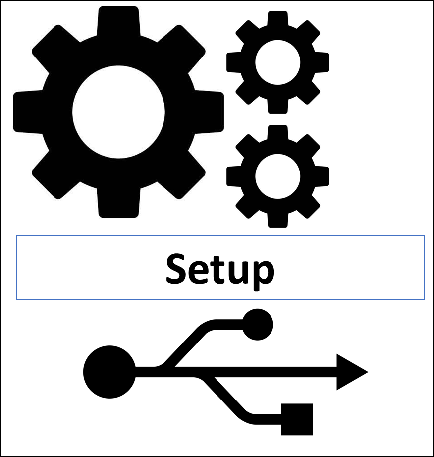
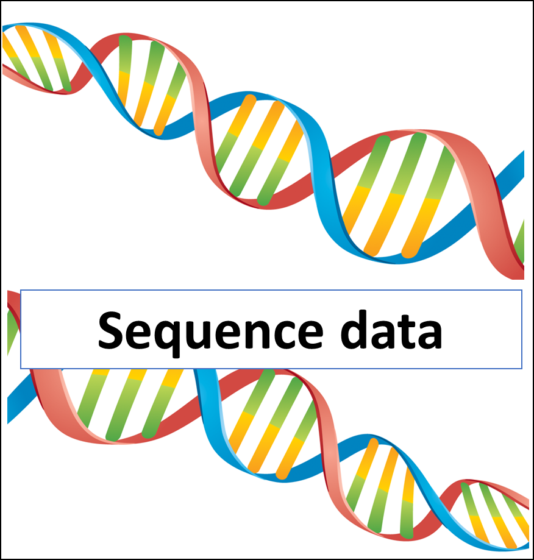
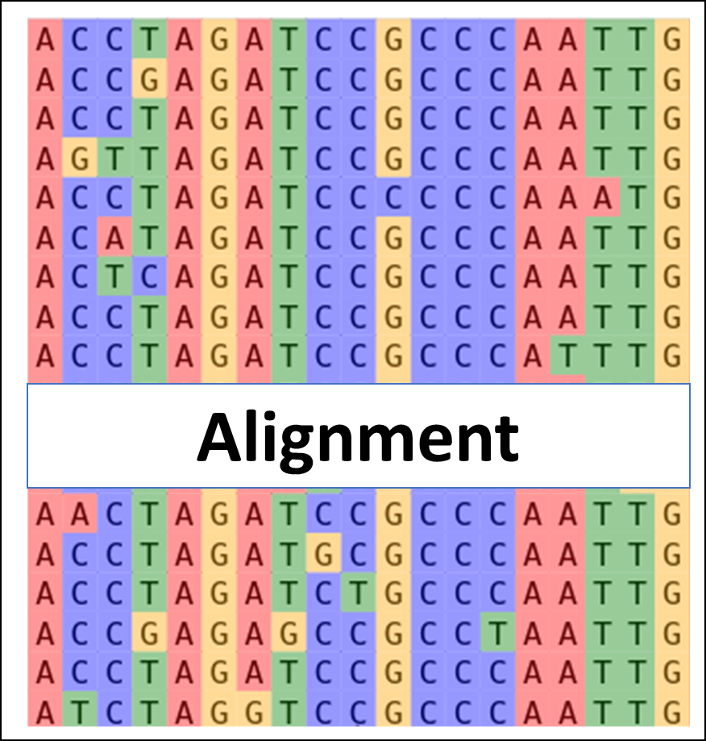
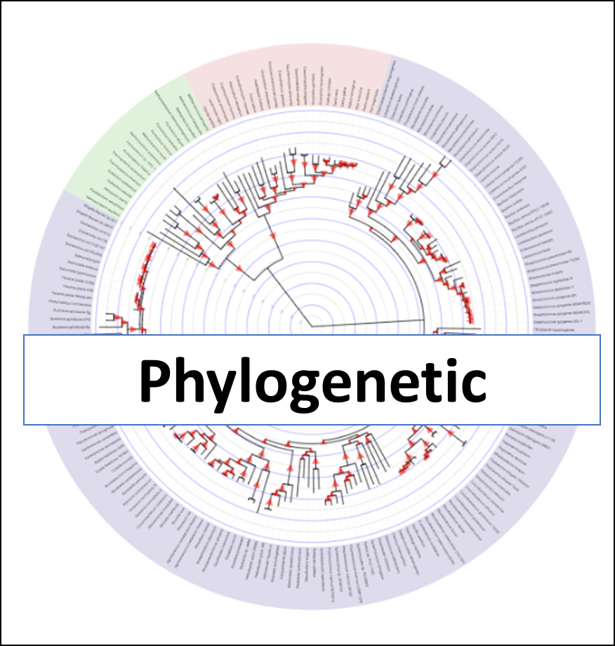
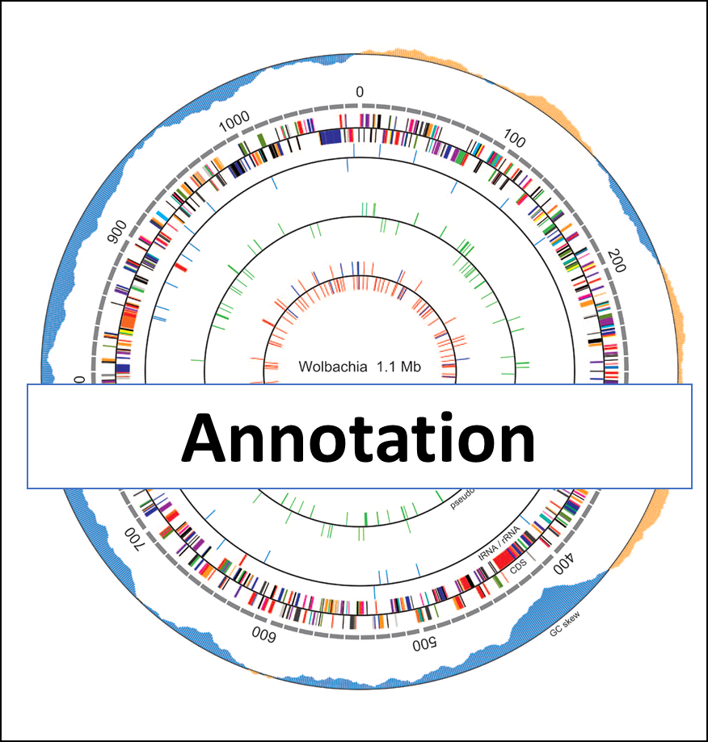
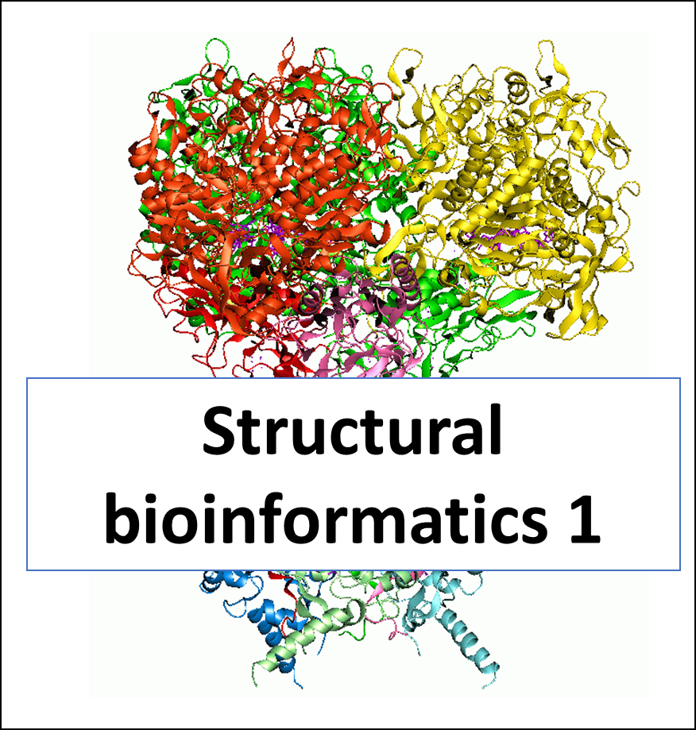
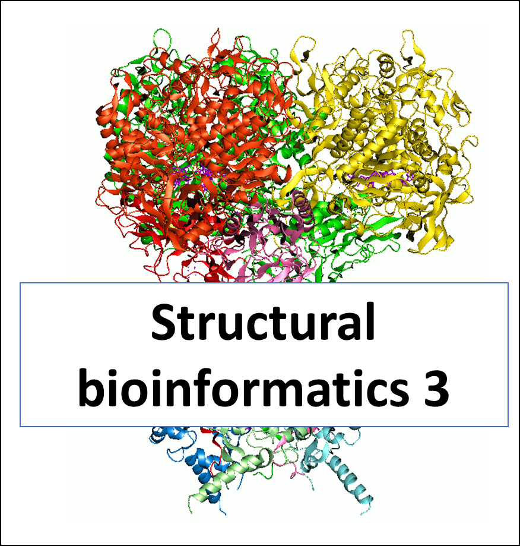
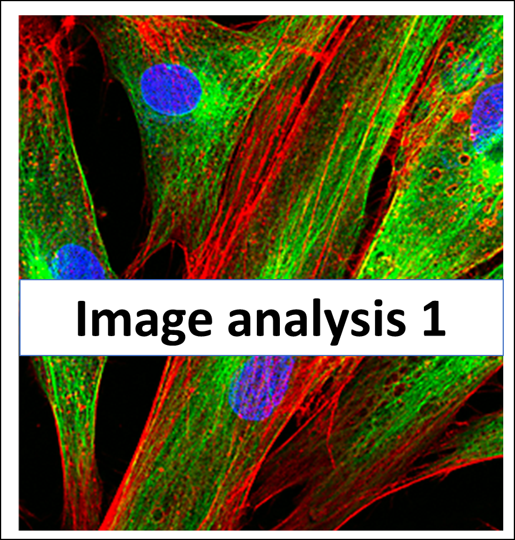
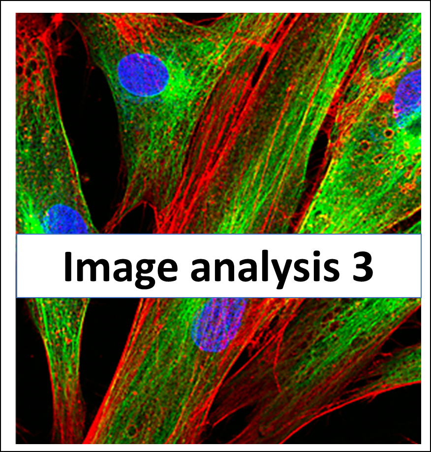

Practical Training in Bioinformatics: Online learning materials
===============================================================
|pic0| |pic1| |pic2| |pic3| |pic4| |pic5| |pic6| |pic7| |pic8| |pic9| |pic10| |pic11| |pic12| |pic13|

.. toctree::
    :hidden:
    :glob:

    contents/*
