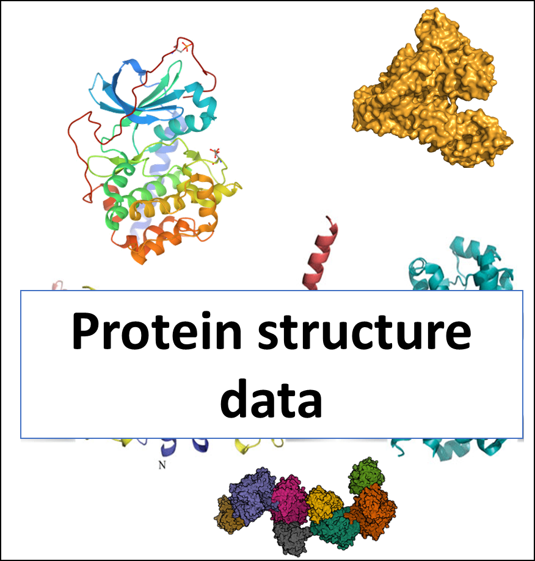
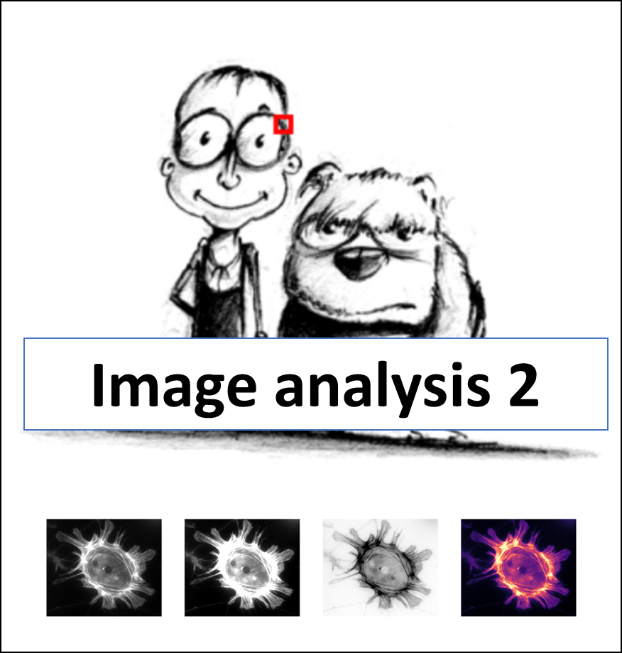

Practical Training in Bioinformatics FS22
=========================================

Working on the Computer
-----------------------

|pic0| |pic1| |pic2| |pic3|

Comparative Sequence Analysis
-----------------------------

|pic4| |pic5| |pic6| |pic7|

Structural Bioinformatics
-------------------------

|pic8| |pic9| |pic10| 

Image Analysis
--------------

|pic11| |pic12| |pic13|

.. |pic0| image:: images/Setup.png
         :width: 24%
         :target: bioinf_spring22/contents/0_Setup.html

.. |pic1| image:: images/Unix_1.png
         :width: 24%
         :target: bioinf_spring22/contents/1_Unix1.html

.. |pic3| image:: images/Sequence_data.png
         :width: 24%
         :target: bioinf_spring22/contents/3_Sequence.html

.. |pic4| image:: images/Alignment.png
          :width: 24%
          :target: bioinf_spring22/contents/4_Alignment.html

..          :target: bioinf_spring22/contents/8_Structural_bioinformatics_1.html

..          :target: bioinf_spring22/contents/9_Structural_bioinformatics_2.html

..           :target: bioinf_spring22/contents/10_Structural_bioinformatics_3.html

..           :target: bioinf_spring22/contents/11_Image_analysis_1.html

..           :target: bioinf_spring22/contents/12_Image_analysis_2.html

..           :target: bioinf_spring22/contents/13_Image_analysis_3.html

.. toctree::
    :maxdepth: 1
    :titlesonly:
    :hidden:

    bioinf_spring22/contents/0_Setup.rst
    bioinf_spring22/contents/1_Unix1.rst
    bioinf_spring22/contents/2_Unix2.rst
    bioinf_spring22/contents/3_Sequence.rst
    bioinf_spring22/contents/4_Alignment.rst
    bioinf_spring22/contents/5_Annotation.rst
    bioinf_spring22/contents/6_Phylogenetics.rst
    bioinf_spring22/contents/7_Connections.rst
..    bioinf_spring22/contents/8_Structural_bioinformatics_1.rst
..    bioinf_spring22/contents/9_Structural_bioinformatics_2.rst
..    bioinf_spring22/contents/10_Structural_bioinformatics_3.rst
..    bioinf_spring22/contents/11_Image_analysis_1.rst
..    bioinf_spring22/contents/12_Image_analysis_2.rst
..    bioinf_spring22/contents/13_Image_analysis_3.rst
