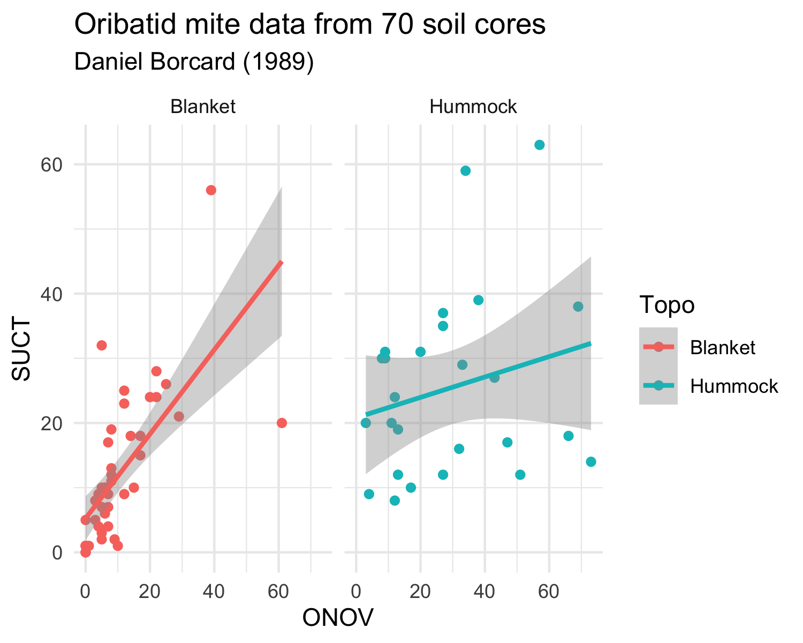
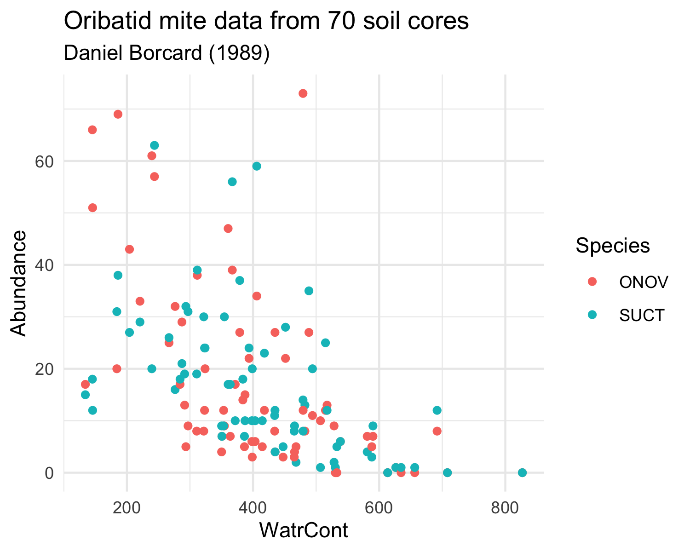

Data visualization with **ggplot2**
======================================

Learning Goals
---------------

In this tutorial you will learn the basics of data visualization with the ggplot2 R package.

ggplot2
-------

The package *ggplot2* has a specific grammar for data visualization which uses three main entities:

- the **data**: the data frame that contains the data that we want to plot
- the **aesthetics**: the variables in the data that we want to be the dimensions of the plot (i.e. the x and y dimension, but also the color if we want to color-code according to a variable)
- the **geometric object (geom)**: specifies the type of plot we want to make (a scatter plot, a boxplot, an histogram, etc.)

The general notation of a plot is (DON'T EXECUTE):

.. code-block:: R

    ggplot(data,aes(x=aesthetic_1,y=aesthetic_2)) +
      geom_*()

Let's see a basic example. We'll use the *iris* dataset as the **data** and will plot a scatterplot (that is the **geom**) with *Sepal.Length* and *Petal.Length* as the *x* and *y* dimensions (that is the **aesthetics**):

.. code-block:: R

    ggplot(data=iris,aes(x=Sepal.Length,y=Petal.Length)) +
      geom_point()

You can have a look to the Data Visualization cheatsheet (https://rstudio.com/wp-content/uploads/2015/03/ggplot2-cheatsheet.pdf) which is a good one-page summary of the main functions.

Aesthetics
----------

We can add more aesthetics than just the x and y dimensions. For example we can plot the information of a 3rd variable (*Species* for example) as the color of the dots, or as the shape. **ggplot2** will handle it easily and will produce a legend automatically:

.. code-block:: R

    ggplot(data=iris,aes(x=Sepal.Length,y=Petal.Length,col=Species)) +
      geom_point()

    ggplot(data=iris,aes(x=Sepal.Length,y=Petal.Length,shape=Species)) +
      geom_point()

Geometric objects
-----------------

We can tune the type of plot by choosing the appropiate geometric object. Let's make an histogram and a boxplot of the sepal length by species. You will have to change the aesthetics accordingly: note that the histogram won't need a *y* aesthetic and the collor is defined with *fill* (instead of *col*).

.. code-block:: R

    ggplot(data=iris,aes(x=Sepal.Length,fill=Species)) +
      geom_histogram()

    ggplot(data=iris,aes(x=Species,y=Sepal.Length,fill=Species)) +
      geom_boxplot()

Other layers
------------

We can further tune the plot by adding more layers that will add new features to the plot.

First, we'll see how we can add a linear fit to the scatter plot:

.. code-block:: R

    ggplot(data=iris,aes(x=Sepal.Length,y=Petal.Length)) +
      geom_point() +
      geom_smooth(method="lm")

We can re-write the axis labels and add a title and subtitle:

.. code-block:: R

    ggplot(data=iris,aes(x=Sepal.Length,y=Petal.Length,col=Species)) +
      geom_point() +
      geom_smooth(method="lm") +
      xlab("Sepal length (cm)") +
      ylab("Petal length (cm)") +
      labs(title="Fisher's or Anderson's iris dataset",subtitle = "Content: 50 flowers from each of 3 species of iris")

We can also tune the general style of the plot by setting a different *theme*:

.. code-block:: R

    ggplot(data=iris,aes(x=Sepal.Length,y=Petal.Length,col=Species)) +
      geom_point() +
      geom_smooth(method="lm") +
      xlab("Sepal length (cm)") +
      ylab("Petal length (cm)") +
      labs(title="Fisher's or Anderson's iris dataset",subtitle = "Content: 50 flowers from each of 3 species of iris") +
      theme_minimal()

    ggplot(data=iris,aes(x=Sepal.Length,y=Petal.Length,col=Species)) +
      geom_point() +
      geom_smooth(method="lm") +
      xlab("Sepal length (cm)") +
      ylab("Petal length (cm)") +
      labs(title="Fisher's or Anderson's iris dataset",subtitle = "Content: 50 flowers from each of 3 species of iris") +
      theme_classic()

Finally, we can easily more than one plot with a single ggplot command if we can split the dataset according to a variable, for example the *Species*:

.. code-block:: R

    ggplot(data=iris,aes(x=Sepal.Length,y=Petal.Length,col=Species)) +
      geom_point() +
      geom_smooth(method="lm") +
      xlab("Sepal length (cm)") +
      ylab("Petal length (cm)") +
      labs(title="Fisher's or Anderson's iris dataset",subtitle = "Content: 50 flowers from each of 3 species of iris") +
      theme_minimal() +
      facet_wrap(~Species)

Exercises
---------

Load the *mite* and *mite.env* datasets from the *vegan* package and try to reproduce the two following plots.

The *mite* datasets are similar in structure to the *dune* dataset that we have already used. It contains information on Oribatid mite data from 70 soil cores collected by Daniel Borcard in 1989. The *mite* data frame contains the species abundances and the *mite.env* contains environmental information.

Note that you will have to transform the data differently for each plot.

Plot 1:

Plot 2:

.. hidden-code-block:: R

    data(mite)
    data(mite.env)

    mite<-mite %>%
      rownames_to_column(var="site")

    mite.env<-mite.env %>%
      rownames_to_column(var="site")

    mite.all<-mite %>%
      left_join(mite.env,by="site")

    ggplot(data=mite.all,aes(x=ONOV,y=SUCT,col=Topo)) +
      geom_point() +
      geom_smooth(method="lm") +
      labs(title="Oribatid mite data from 70 soil cores",subtitle = "Daniel Borcard (1989)") +
      theme_minimal() +
      facet_wrap(~Topo)

  mite.all.long<-mite %>%
    pivot_longer(-site,names_to = "Species",values_to = "Abundance") %>%
    left_join(mite.env,by="site") %>%
    filter(Species %in% c("ONOV","SUCT"))

  ggplot(data=mite.all.long,aes(x=WatrCont,y=Abundance,col=Species)) +
    geom_point() +
    labs(title="Oribatid mite data from 70 soil cores",subtitle = "Daniel Borcard (1989)") +
    theme_minimal()
