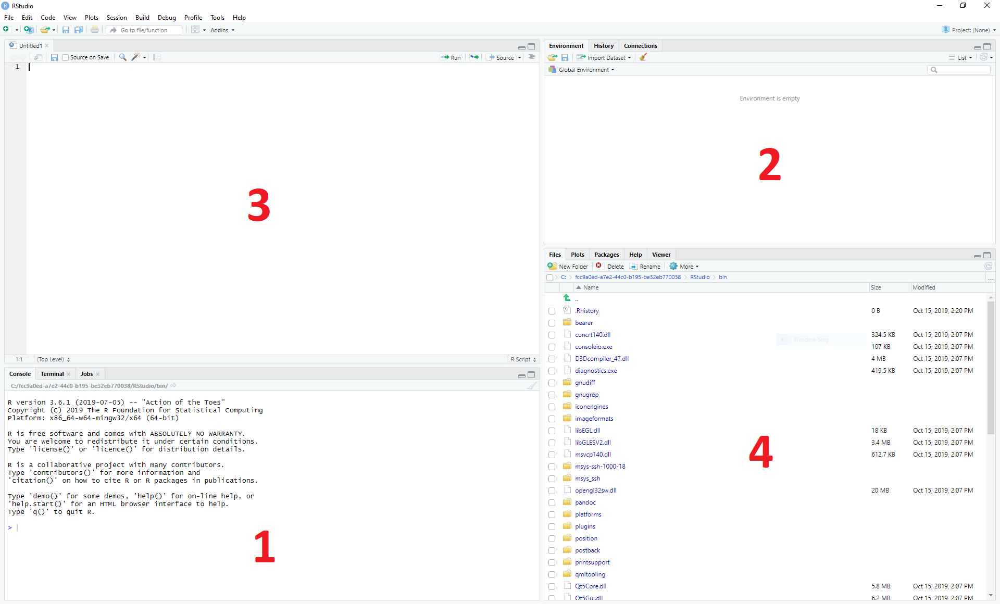

Introduction to R
=================

Learning Goals
---------------

In this tutorial you will learn to:

* Work in R Studio (a graphical user interface for the programming language R)
* Grasp the basic concepts of R programming such as variables and functions
* Perform basic manipulations on data

Working R and R studio
-----------------------
**R** is a programming language for statistics. When working with large data sets, it enables the manipulation of data, statistical analysis and creation of graphical representations (i.e. plots).

**R Studio** is an integrated development environment (IDE) for **R**. This means that it provides an interface to help you write, run and debug code.

1. The bottom left panel is the R console. Here you can type in commands and have them immediately evaluated.

2. The top right panel shows you the current variables in your environment. By default you are shown the variable names and a short preview of their contents, but you can get more information by changing the view type from *List* to *Grid*. Another tab here shows you your command history.

3. The top left panel is where you can view and edit script files, and where can you view 2D variables such as matrices and data frames.

4. The bottom right panel shows a file browser. This will show your home directory by default. You can check what your current working directory is using the :code:`getwd()`function and change it using :code:`setwd("S:\home\biolcourse-XX")`. Other tabs show plots that you create, packages you have installed, and help files for various functions.

Tips
-----
* When you want to run the script you are looking at, you can press **Control+Shift+Enter**.

* When you just want to run a single line in the script, or the lines you have highlighted, you can press **Control+Enter**.

* In the script window there are line numbers to make it easier to organise your code and to find errors

Basic calculations and variable definition
==========================================
Using R at its most basic, it is a calculator. You can enter a calculation into the console and immediately evaluate the result.

.. code-block:: R

    # R is a calculator
    1 + 2
    3 * 4

A **variable** is a core concept in programming and is essentially a named piece of data. That is, when you refer to the variable by its name within the program, you are actually referring to the data stored under that name.

To **assign** data to a variable in R, use the following syntax:

.. code-block:: R

    # Assignment
    x <- 2
    y <- 3.5

After you have assigned data to variables, you can then use the variables to perform calculations:

.. code-block:: R

    # R is a clever calculator
    x + 2
    x * y
    z <- x + x + x

If you need to see the value of a variable in the command line, you can just type its name:

.. code-block:: R

    # What is x?
    x

Note that variable names are case sensitive, and cannot start with a number.

Exercises
---------

* Experiment for yourself with the R command line to do some simple calculations
* Assign some different numbers to the variables *x* and *y* and check if calculations with them work as you expect
* Try to do a calculation with a variable you haven't assigned any data to, *a* for instance
* Set *x* to 1, then check what happens when you run the calculation *x <- x + 1*, what value is *x* afterwards?
* Be aware that R has special values for certain calculations - try dividing by 0 for instance.

Types of data in R
==================

Variables also have a **type**, which defines the sort of data they store. There are two different types in R:

* A **mode** determines the type of data stored, such as 'numeric' or 'character'.
* A **class** is a container that describes how the data is arranged and tells functions how to work with the data.

Some modes you might encounter:

* **numeric** - numbers, including integers
* **character** - strings
* **logical** - TRUE or FALSE
* **list** - a special mode for containing multiple items of any, possibly different, mode(s), whose mode becomes 'list'

Some classes you might encounter:

* **vector** - a one-dimensional set of items of the same mode
* **matrix** - a multidimensional set of items of the same mode
* **data.frame** - a two-dimensional table with columns of different modes
* **formula** - a declaration of how variables are related to each other, for fitting models
* **factor** - a categorical variable

The reason that it is sometimes important to know what mode and class your variable has, is that functions behave differently according to the data they are given. It's easy to accidentally transform your variable into an unexpected format and then get an unexpected result from the functions you use in your program.

Mode detection
--------------

To a certain extent, R will auto-detect what mode a variable should have based on the data. There are convenient functions to check a variable's mode when you need to.

.. code-block:: R

    # Auto-detection of variable mode
    x <- 1
    y <- "word"

    mode(x)
    mode(y)

    # What about if we make a mistake
    x <- "1"

    is.numeric(x)

Vectors
-------

If we want to create a variable that contains multiple pieces of data, we must make a **declaration** when we assign data to the variable.

.. code-block:: R

    # Creating a vector
    x <- c(1, 2, 3)
    x

    # Lazy sequences
    x <- 1:3
    x

    # Creating a vector with variables
    x <- 1
    y <- 2
    z <- c(x, y, 3)
    z

Exercises
---------

* Create a vector containing the numbers 1 to 10
* What happens if you add 1 to this variable?
* What happens if you multiple the variable by 2?
* What happens if you add the variable to itself?
* Now create two vectors of the same length containing different numbers, say 1 to 3 and 4 to 6.
* What happens when you add or multiply these together?
* What happens if you add or multiply two vectors of different lengths?

Lists
-----

Vectors and matrices have the limitation that they must contain data all in the same mode, i.e.: all numbers or all characters. **Lists** circumvent this limitation, acting as containers for absolutely any type of data.

.. code-block:: R

    # Define an empty list
    l <- list()

    # Define a list with items
    l <- list("a", 1, "b", 2:4)
    l

    # Define a list with named items
    l <- list(names=c("Anna", "Ben", "Chris"), scores=c(23, 31, 34))
    l

Data Frames
-----------

In that last example, it would be ideal if we could link the names with the scores, and maybe further data. We can store tabular data in R in a **data frame**.

.. code-block:: R

    # Define a data.frame
    df <- data.frame(names=c("Anna", "Ben", "Chris"), scores=c(23, 31, 34))
    df

Looking at the *df*, you can see that the data is neatly arranged in named columns. You can check what mode the individual vectors in your dataframe have using the str()-function:

.. code-block:: R

    str(df)

You can also change the format of a variable between list and data frame quite easily.

.. code-block:: R

    # Change between list and data.frame
    l <- list(names=c("Anna", "Ben", "Chris"), scores=c(23, 31, 34))
    df_from_l <- as.data.frame(l)

    df <- data.frame(names=c("Anna", "Ben", "Chris"), scores=c(23, 31, 34))
    l_from_df <- as.list(df)

If you then look at *l_from_df*, the way the list is shown includes the line 'Levels: Anna Ben Chris'. **Levels** are the possible choices for a categorical **factor**, which is a variable mode in R for storing that sort of data. Data frames will almost always convert text into a factor, which will cause that data to behave differently than a character variable.

Exercises
---------

* Create a simple list containing some numbers - not vectors of numbers
* What happens if you try to do arithmetic with the list?
* Now create a data frame with three columns, a name and two numeric values per name, such as coordinates.
* What happens if you try to do arithmetic with the data frame?

.. hidden-code-block:: R

    # A list of only numbers
    numbers <- list(1, 3, 6, 10)
    numbers + 1
    # We get an error - lists cannot be used like vectors!

    # A data frame of mixed types
    coords <- data.frame(Place=c("London", "Paris", "Zurich"), Latitude=c(51.5074, 48.8566, 47.3769), Longitude=c(-0.1278, 2.3522, 8.5417))
    coords + 1
    # We get a result, and a warning - the data frame cannot do arithmetic with factors, but can with the numbers.

Importing Data
==============

R has a host of functions for importing data of different types. The easiest way to import data you have stored in an Excel sheet, for example, is to save it as a **tab-delimited text** file before importing it into R.

Firstly we need a data table to import: :download:`Ecoli Genes <downloads/ecoli_genes.txt>`. We can then use the **read.table** function.

.. code-block:: R

    # Import a data table
    genes <- read.table("ecoli_genes.txt")

Note that R assumes that the file is in your working directory, which you can find with the command **getwd()** or set in the **Session** menu. Alternatively you can give a relative or absolute path, just as on the Unix command line.

We can now see what the table looks like using the **Environment** tab in the top-right - but something went wrong and the column headings are in the first row. We can fix this pretty easily.

.. code-block:: R

    # Import the table again
    genes <- read.table("ecoli_genes.txt",header=TRUE)

There are a few other useful arguments to help import tables of various formats:

* sep - determines the field separator (between columns), i.e.: sep=","
* quote - determines the quote mark (items in quote marks are considered to be the same field), i.e.: quote="\""
* row.names - determines which column contains the row names, if there are any
* comment.char - determines which character, if at the start of a line, indicates the line should be ignored, i.e.: comment.char="#"
* stringsAsFactors - determines whether the table should turn text into factors, which you may want to turn off, i.e.: stringsAsFactors=F

Exporting Data
==============

Conversely, R has functions for exporting data into different formats. You will most likely want to create a file to open in R later, or a *.csv* file to open in *Excel*.

.. code-block:: R

    # Write a data.frame to a .csv file
    write.csv(df,"df.csv")

Many of the arguments for the *read* functions also apply to the *write* functions, so you can decide whether you want to see row or column headings, how the text fields are separated, etc.

Exercises
---------

* Download and import the ecoli_genes.txt table for yourself, make sure to get the column headings correct
* Write the table out to a new file name using **write.table**
* Now import the table again without any additional arguments to **read.table** - do you still need to correct the column headings?

Indexing
========

Sometimes you want to refer to only part of a vector, matrix or data.frame -- perhaps a single column or even single item. This is called **slicing** and requires an understanding of how R **indexes** the elements in objects.

For a vector, you can either reference an item by its **position** or **name**.

.. code-block:: R

    # Slicing a vector
    x <- c("Melanie","Lang","Postdoc")
    names(x) <- c("Name","Surname","Job")

    x[1]
    x["Name"]

For a matrix or data.frame, the same methods work for indexing the row or column of the object, or both. The convention is that first you give the row, then the column, separated by a comma, and if one is left blank it implies you want 'all' rows or columns. For this example we are going to load up a pre-made set of data that comes with R.

.. code-block:: R

    # Slicing a data.frame
    data(swiss)

    swiss[1,]
    swiss[,1]
    swiss[1,1]
    swiss["Gruyere",]
    swiss[,"Fertility"]

Functions in R
==============

A function requires input *arguments*, some necessary, such as the data you want to run the function on, and some optional, such as the choice of method or additional parameters. As most optional arguments already have a pre-set default value it can be tricky to grasp how many arguments the function has. We will now look at a very simple first function **mean** in R.

First, if we want to understand a function, we read its help file.

.. code-block:: R

    # Get help
    ?mean

This prints out the documentation of that function. The first paragraph provides a description of what the function does. The second paragraph shows how to use the function in your script or the console. It also explains if there are any default values set for any of the arguments. The third paragraph takes you through all the different arguments and explains each of them. In our example, the only necessary argument x is an object that we want to apply this function to. The paragraph called Value explains what the output of the function will be. At the very bottom of the documentation you can also find some examples of how to use the function.
If we don’t even know if a function exists, we can use the double question mark to search for key words

.. code-block:: R

    # #search keywords
    ??substring

Now let’s start using the **mean** function with a vector that contains all numbers from 1 to 10. *Arguments* for a function can be declared both by their *position* or their *name*. A function expects to see the arguments in a specific order, so the first argument without a name is expected to be the first argument in the function. As already discussed, the mean function only needs one input argument x.

.. code-block:: R

    # Find the mean of a vector
    c <- 1:10
    #method 1: using the predefined postions
    mean(x)
    #method 2: declare input by name
    mean(x = c)

You can also define your own functions that perform operations that are specific to what you would like to do. This is particularly useful if you want to perform the same task with many different data sets.

When you write a function, it should always follow the same structure:

.. code-block:: R

  function_name <- function(argument, argument = default value) {
        statement or operations
        return(result)
  }

Let's have a look at an example. We would like to write a function that converts temperature Fahrenheit to Celsius.

.. code-block:: R

  # defining function
  f_to_c <- function(temp_F) {          #define a function and argument temp_F, no default arguments
    temp_C <- (temp_F - 32) * 5 / 9     #perform calculations using the argument
    return(temp_C)                      #return the result to the main program
  }

  # using the function
  f_to_c(70) # = 21.1                   #using the name of the function to call it

Exercises
---------
* try calculating the sum of the same vector using the **sum** function
* extract the length of the vector using the **length** function
* define a function that adds the value 2 to each argument and then divides the result by 2
* Write a function to add up all numbers in a vector except for the highest

.. hidden-code-block:: R

  # add up all numbers in a vector except for the highest
  SumWithoutMax <- function(input_vector){            #defining function
    sum_v <- sum(input_vector)                        #sum over whole vector
    max_v <- max(input_vector)                        #determine max value
    sum_final <- sum_v - max_v                        #subtract
    return(sum_final)
  }
  #using it
  v <- c(1:10)
  SumWithoutMax(v) #=45

Packages
========

We've so far used a lot of fundamental functions in R, the sort without which you couldn't execute simple scripts at all. When performing data analysis however, there may well be better or more specific functions available for what you are trying to do. R is very flexible because it allows the loading of additional **packages** created by the user community to enhance and add functionality.

Loading a Package
-----------------

To load a package, we use the **library** function. Once loaded, all of the functions inside the package become available to R. If a function should have the identical name to an existing function, it will mask the current version and refer instead to the version in the package, and give you a warning.

.. code-block:: R

    # For instance if we want to work with phylogenetic trees
    # If you look at the example.tree file itself you can see the format is non-intuitive
    library(ape)
    tree <- read.tree("/science/teaching/example.tree")

    # Packages can load other packages and mask functions
    library(Hmisc)

Installing a Package
--------------------

For native R packages, the **install.packages** function allows installation of new packages into a personal user library.

.. code-block:: R

    # Install a new package
    install.packages("beeswarm")

    # Load the package and demonstrate
    library(beeswarm)
    random_numbers <- rnorm(100)
    beeswarm(random_numbers)
    beeswarm(random_numbers,method="hex")

If the package has not been submitted to the standard R repositories, but exists for instance on github, the package **devtools** allows you to install it directly - you may have to install it yourself using the method above.

.. code-block:: R

    # Load devtools
    library(devtools)

    # Install a package from github
    install_github(https://github.com/Gibbsdavidl/CatterPlots)

    # Load the package and demonstrate
    library(catterplots)
    x <- rnorm(10)
    y <- rnorm(10)
    multicat(x,y)

Bioconductor
------------

**Bioconductor** is a popular set of specific bioinformatics tools, such as DESeq2 and Biostrings, that need to be installed via the **BiocManager** package.

.. code-block:: R

    # First of all install the manager
    install.packages("BiocManager")

    # Use it directly without loading
    BiocManager::install("Biostrings")

    # Load the package and demonstrate
    library(Biostrings)
    cdss <- read.DNAStringSet("ecoli/EC_K12_MG1655_genomic.fna")
    subseq(cdss,1,10)

Program Flow
------------

Without controls, a program will simply run from top to bottom, performing each command in turn. This would mean writing a lot of code if you wanted to perform the same set of actions on multiple different sets of data. Here we will learn how to control which parts of a program execute with **if**, and how to perform repetitive actions with the **for** loop.

The *if* function
-----------------

An **if** function performs a logical test -- is something *TRUE*? -- and then runs commands if the test is passed.

.. code-block:: R

    # If function
    x <- 4
    if(x >= 0){
        y = sqrt(x)
    }

Here, we only want to calculate the square root of x if x is positive.

We can extend the use of *if* to include a block of code to execute if something is *FALSE*.

.. code-block:: R

    # If / Else
    x <- -2
    if(x >= 0){
        y = sqrt(x)
    }else{
        cat("The result would be a complex number!")
    }

You can go further by making *if* dependent on multiple logic statements, or use recursive *if* statements.

.. code-block:: R

    # Only allow integer square roots
    x <- 4.2
    if((x >= 0) & (x%%1==0)){
        y = sqrt(x)
    }else{
        cat("The result would not be an integer!")
    }

    # Alternative method
    if(x >= 0){
        if(x%%1==0){
            y = sqrt(x)
        }else{
            cat("The result would not be an integer!")
        }
    }else{
        cat("The result would be a complex number!")
    }

Exercises
---------

* In the script window, copy the first **if** statement above and execute it. You should get the correct result, 2.
* Now make x a negative value and execute the script again, what happens?
* Add an **else** statement to your script as in the second example above and test it.
* Using either multiple logic statements or nested *if* statements, write a script that tests whether *x* is an even square number.

.. hidden-code-block:: R

    # Script to determine is x is a square number
    if(x%%2==0){
        y = sqrt(x)
        if(y%%1==0){
            cat(paste(x,"is even and the square of",y))
        }else{
            cat(paste(x,"is not a square number"))
        }
    }else{
        cat(paste(x,"is not an even number"))
    }

    # Test it for yourself with different values of x!

The *for* loop
--------------

Whilst it's very simple to run basic calculations on a vector or matrix of data, more sophisticated code is required for data.frames or when you want to perform complex functions on individual pieces of data.

The **for** loop is a basic programming concept that runs a series of commands through each loop, with one variable changing each time, which may or may not be used in the loop's code. For instance we could loop through the numbers 1 to 10 if we wanted to perform an action 10 times, or if we wanted to use the numbers 1 to 10 each in the same calculation.

.. code-block:: R

    # A basic for loop
    for(i in 1:10){
        cat("Loop!")
    }

    # A loop involving the loop variable
    for(i in 1:10){
        cat(paste("Loop",i,"!"))
    }

These are simple examples and don't capture the results of the loop. If we want to store our results, we have to declare a variable ahead of time to put them into.

.. code-block:: R

    # A loop that gets results
    data(EuStockMarkets)
    plot(EuStockMarkets[,1])
    movingAverage <- vector()
    for(i in 1:length(EuStockMarkets[,1])){
        movingAverage[i] <- mean(EuStockMarkets[i:(i+29),1])
    }
    plot(movingAverage)

Note that an error was produced because when we reach the end of the time series, the data points we ask for don't exist -- we could adjust our loop to account for this by reducing the number of times we go through the loop so that we don't reach past the end of the data.

Also, rather than refer to the pieces of data directly, we are using *i* to keep track of the *index* of the data we want to work with. This allows us to refer to data by its index, and therefore slice a moving section of data. In other circumstances, you can of course refer to items by their names.

Exercises
---------

* Write a **for** loop that prints out a countdown from 10 to 1.
* Using the **EuStockMarkets** data, make a plot of the FTSE data. Note that this data is not a *data.frame* but a *time.series* - you can find out more with **?ts**.
* Using a *for* loop, calculate a moving average and make a corresponding vector of time points with the centres of each average.
* Add the moving average to the plot using the **lines** function.

.. hidden-code-block:: R

    # Countdown
    for(i in 10:1){
        cat(i)
    }
    cat("Blast off!")

    # Plot FTSE data
    data(EuStockMarkets)
    plot(EuStockMarkets[,"FTSE"])
    # Note that the $ syntax does not work with time.series objects

    # Calculate the moving average
    movingAverage <- c()
    for(i in 1:(length(EuStockMarkets[,"FTSE"])-29)){
        # Note that we avoid the error from earlier
        movingAverage[i] <- mean(EuStockMarkets[i:(i+29),"FTSE"])
    }
    times <- time(EuStockMarkets)[15:(length(EuStockMarkets[,"FTSE"])-15)]

    # Add to the plot
    plot(EuStockMarkets[,"FTSE"])
    lines(times,movingAverage,col=2)
