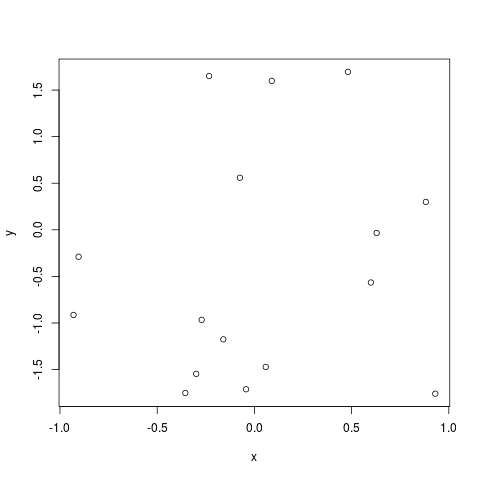

Case Study: Analysis of mOTUs Output in R
=========================================

The mOTUs profiler is a computational tool that estimates relative abundance of known and currently unknown microbial community members using metagenomic shotgun sequencing data.

For this set of exercises we provide two files:

* /science/teaching/default.merge.motus is a data file in which each column is a sample and each row is a mOTU; each entry is the relative abundance of a mOTU in a particular sample
* /science/teaching/motus_metadata.tsv contains metadata about the samples

A mOTU is a marker gene-based operational taxonomic unit - a set of sequences from a set of single-copy marker genes that distinguish a particular cluster of strains, as a proxy for the less well defined (in bacteria) species.

The data comes from multiple individuals in different families, whose stool samples were taken and sequence both metagenomically and metatranscriptomically.

This exercise is a challenge and example of the sort of data processing and analysis that you can do now that you have learned Unix and R.

Q1. How does metagenomic data compare with metatranscriptomic data?
-------------------------------------------------------------------

* Copy the files above to your home directory
* Import the relative abundance data (you will need to give *read.table* a few arguments to do this correctly, perservere!)
* Remove rows with no abundance
* Create separate sets of data for the metagenomic and metatranscriptomic samples
* Plot one of the metagenomic samples against the equivalent metatranscriptomic sample
* Determine whether they are well correlated
* How would you systematically check the correlation for each sample in turn?

.. hidden-code-block:: R

    # Import the data, ignoring the first two rows and changing the comment and quote characters to read the column and row labels correctly, avoiding factors
   all.data <- read.table("default.merge.motus",sep="\t",stringsAsFactors = F,quote="\"",row.names=1,comment="",skip=2,header=T)

   # Subset the data to get rid of uninformative rows with all zeros
   valid.data <- all.data[rowSums(all.data)>0,]

   # Make two data sets for metaG and metaT
    metaG.data <- valid.data[,seq(1,ncol(valid.data),2)]
    metaT.data <- valid.data[,seq(2,ncol(valid.data),2)]

    # Plot metaG against metaT, adding a small pseudocount so that we can even visualise zero abundances
    plot(1e-5+metaG.data[,1],1e-5+metaT.data[,1],log="xy",xlab="metaG",ylab="metaT",pch=20,col=rgb(1,0,0,0.1),panel.first=grid())
    abline(0,1)

    # Determine if they are well correlated
    fit <- lm(log(1e-5+metaT.data[,1]) ~ log(1e-5+metaG.data[,1]))
    summary(fit)

    # Systematically check each sample using either a loop or a sapply function that operates on the numbers 1:ncol(metaG.data) with a custom function, i.e.:
    fits <- sapply(1:ncol(metaG.data),function(x) lm(metaT.data[,x] ~ metaG.data[,x]))
    lapply(fits, summary)

Q2. Is there structure in the data?
----------------------------------- 

There are many ways to answer this question but here we will consider **ordination** and **hierarchical clustering**.

Ordination
^^^^^^^^^^

Ordination refers to a series of techniques for exploring multivariate data that in one way or another put similar pieces of data close together and separate those that are different. To understand this, consider points on a 2D graph:

You can see the differences between the points on the two axes in the form of the horizontal or x distance and the vertical or y distance, and you intuitively understand which points are closer to one another. When you look at higher dimensional data, however, it becomes impossible to intuit these distances.

Of course, we can calculate distance in a number of different ways other than euclidean, rotating or stretching x and y distances to give a final value. Ordination techniques essentially do this, following some mathematical principles to better present the distances between points for your understanding. Bear in mind that some techniques may not tell you anything about the real separation between points, and they should not all be used for downstream analysis such as clustering.

Commonly used examples for the sort of data we are working with here include Principle Components Analysis (PCA), and Principle Coordinate Analysis (PCoA), which is a type of Multidimensional Scaling (MDS).

To use these techniques in R, we can use the built-in function **prcomp**, or **vegan** package functions **vegdist** (to create a distance matrix), followed by **monoMDS**.

Hierarchical Clustering
^^^^^^^^^^^^^^^^^^^^^^^

Hierarchical clustering is a method of cluster analysis that tries to construct a hierarchy, or tree of clusters. There are many algorithms for this, but broadly speaking they either attempt to split the samples into groups recursively (the **divisive**, top-down method) or combine them one sample or cluster at a time (the **agglomerative**, bottom-up approach).

Built into R is the **hclust** function that incorporates several well known algorithms and produces an 'hclust' class object from a distance matrix. It is rather limiting when it comes to plotting however, and I suggest the **dendextend** package, with the **as.dendrogram** function that allows you to add colours, for instance, to a plot of a hierarchy.

Challenge
^^^^^^^^^

* Read in the metadata file
* Calculate a Euclidean distance matrix with the *vegdist* function
* Perform MDS with the *monoMDS* function
* Plot the MDS, assigning colours according to the individual the sample came from

.. code-block:: R

    # This will give you more colours to work with
    palette(c('#e6194b', '#3cb44b', '#ffe119', '#4363d8', '#f58231', '#911eb4', '#46f0f0', '#f032e6', '#bcf60c', '#fabebe', '#008080', '#e6beff', '#9a6324', '#fffac8', '#800000', '#aaffc3', '#808000', '#ffd8b1', '#000075', '#808080', '#ffffff', '#000000'))

* Repeat this, but now colour according to the family the sample came from
* Explore further with the metadata of your choice

* Hierarchically cluster the distance matrix you made
* Convert the *hclust* object into a *dendrogram* and add colours according to individual with the *labels_colours* function
* Plot the dendrogram, what conclusions can you draw already?
* Explore the data again with different sets of metadata determining the colours of the plot
* What conclusions can you draw about correlation of the samples with the metadata?

.. hidden-code-block:: R

    # Import the metadata
    metadata <- read.table("motus_metadata.tsv",sep="\t",row.names=1,header=T)

    # Calculate a distance matrix
    library(vegan)
    dm <- vegdist(t(log(valid.data+1e-6)),method="euclidean")

    # Perform MDS
    mds <- monoMDS(dm,pc=T,k=4)

    # Plot the mds
    sample.individuals <- substr(colnames(valid.data),1,5)
    sample.colors <- as.numeric(as.factor(sample.individuals))

    plot(mds$points,pch=20,col=sample.colors)
    legend("topleft",legend=unique(sample.individuals),fill=unique(sample.colors),cex=0.5)

    # Repeat with family data
    sample.family <- metadata[sample.individuals,"FAMNO"]
    plot(mds$points,pch=20,col=sample.family)
    legend("topleft",legend=unique(sample.family),fill=unique(sample.family))

    # Repeat with diabetes status
    sample.diabetes <- metadata[sample.individuals,"DIABETESTY1"]
    plot(mds$points,pch=20,col=sample.diabetes)
    legend("topleft",legend=unique(sample.diabetes),fill=unique(sample.diabetes))

    # Hierarchically cluster and convert the data
    hc <- as.dendrogram(hclust(dm))

    # Colour and plot the dendrogram
    labels_colors(hc) <- sample.colors
    par(mar=0.1+c(12,4,4,1))
    plot(hc)

    # Again for diabetes status
    diabetes.colors <- as.numeric(as.factor(metadata[sample.individuals,"DIABETESTY1"]))
    labels_colors(hc) <- diabetes.colors
    plot(hc)

    # And by sex
    meta.colors <- as.numeric(as.factor(metadata[sample.individuals,"SEX"]))
    labels_colors(hc) <- meta.colors
    plot(hc)

    # Conclusions are your own to consider!
