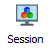

The Command Line
================

The command line interface offers a fast, powerful way to use a computer. Many bioinformatics tools are written for or can be used more effectively with the command line.

Connecting to a server
----------------------

**Since we are currently working remotely you must ensure that you are using the correct VPN to access the ETH network, which is sslvpn.ethz.ch/biol-micro !**

----

**If you are not a member of D-BIOL then you will have to use either the student-net or staff-net VPN. Instead of connecting to Morgan you should connect to Euler. The files for courses will be placed in /cluster/home/fieldc instead of /science/teaching**

----

The institute provides a Unix server for everyone's use, named **Morgan**, situated at **morgan.ethz.ch**. The ETH also provides a general use server named **Euler** at **euler.ethz.ch**. The specifications for Morgan are:

====== =================================
====== =================================
CPU    72 Cores (144 Threads) @ 2.30 GHz
Memory 1024 GB                          
====== =================================

In order to work on a server, you have to connect to it using a protocol called **S**\ ecure **Sh**\ ell or **ssh**. In *MobaXterm*, you should start with the **Session** button:

Then select SSH and enter the server address and your ETH ID as the user name:

When prompted, enter your password and you will connect to the server.

The main window is your interactive session with the server - the command line. On the left is a convenient file browser that you can use to transfer files between the server and your local computer (more on that later).

The structure of a command
--------------------------

Most commands have *options* and *arguments*. Arguments are often essential for a command to operate properly; they are the pieces of information required by a command, such as a file name. Options are, of course, optional, and offer ways to modify the way the command works.

.. figure:: images/command_structure.png
    :align: center

For instance, **echo** will take any text you give it as an argument and then send it back to you as output:

.. code-block:: bash

    # My first command
    echo 'Hello World!'

If you use the optional flag *-n* then it will not add a 'new line' to the end of the output:

.. code-block:: bash

    # My second command
    echo -n 'Hello World!'

Some commands end up with very complex structures because they can have many options and arguments. In general, options will be of the format '-a' where a is a single letter or '--word' where word is a string (a series of letters, in computer terms).

* Note: the command line is case-sensitive!

Useful tricks
-------------

* You can use the **up and down arrow keys** to navigate through previously used commands and repeat or modify them.

* By default in MobaXterm, you have to right-click the mouse to use the copy and paste commands, however this can be changed to the more common 'highlight-to-copy' method employed on most linux systems, where right-click will paste whatever is in the clipboard.

* When typing a command or file name, you can press the 'tab' key to **autocomplete** what you are typing. However, if there are multiple files with similar names, it may only fill in as far as the first ambiguous character before you have to give it some more input. This method makes it *much* less likely that you make a spelling error.

* If a command stops responding (perhaps it has crashed) then pressing **Ctrl+C** will send an interrupt signal that often cancels the command and brings you back to the command line.

Exercises
---------

* Try the *echo* command for yourself.
* What happens if you don't use quote marks around the text you want to print?
* Try typing *e* then pressing tab twice, what do you see?
* Try adding *c* to make *ec* and pressing tab twice again.
* How many characters do you have to type before pressing tab auto-completes *echo*?

.. container:: nextlink

    `Next: The File System <1.2_FileSystem.html>`_
