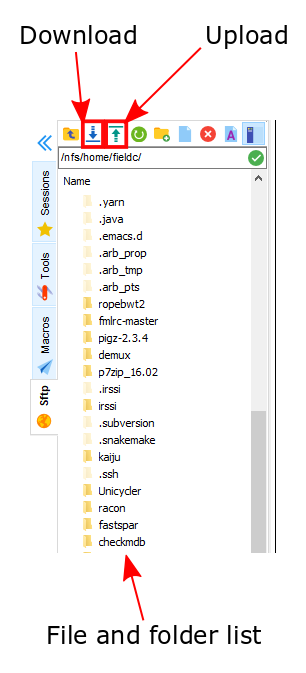

Working with Files
==================

In Unix systems there are only really two types of files: text or binary. The file name ending (.txt or .jpg) doesn't really matter like it does in Windows or MacOS, however it is used to indicate the file type by convention. Some file types you will encounter include:

* .txt - A generic text file
* .csv - A 'comma separated values' file, which is usually a table of data with each line a row and each column separated by a comma
* .tsv - A 'tab separated values' file, which is the same by separated by tab characters
* .fasta or .fa - A fasta formatted sequence file, in which each sequence has a header line starting with '>'
* .fna - A fasta formatted nucleotide sequence file, usually gene sequences
* .faa - A fasta formatted protein sequence file
* .sh - A 'shell script', which contains terminal commands to run sequentially
* .r - An R script, which contains R commands to run
* .py - A python script, which contains python commands to run
* .gz or .tar.gz - A file that has been compressed using a protocol called 'gzip' so that it takes up less space on the disk and transfers over the internet faster

Looking at files
----------------

**cat** is a simple command that displays the entire contents of a file directly on the terminal. For large files this can be disastrous, so remember that you can cancel commands in progress with *Ctrl-C*.

.. code-block:: bash

    # ConCATenate
    cat E.coli_K12_MG1655.fna

**head** displays only the first 10 lines of a file directly on the terminal. If you look at the available options for the command, *-n x* outputs the first *x* lines instead, and using a negative number outputs the lines except for the last *x*.

.. code-block:: bash

    # Show file head
    head E.coli_K12_MG1655.fna

**tail** displays only the last 10 lines of a file directly on the terminal. It has similar options to *head*; *-n x* outputs the last *x* lines, and using an explicitly positive number *+x* outputs the lines except for the first *x*.

.. code-block:: bash

    # Show file tail
    tail E.coli_K12_MG1655.fna

**less** is the most versatile and useful way to look at a file in the command line. Instead of showing you the contents of a file directly on the terminal, it 'opens' the file to browse. You can use the arrow keys, page up, page down, home, end and the spacebar to navigate the file. Pressing *q* will quit. A number of useful options exist for the command, such as showing line numbers or displaying without line wrapping. It also has a search feature that we will cover later.

.. code-block:: bash

    # Browse file
    less E.coli_K12_MG1655.fna

**wc** is a command that will quickly count the number of lines, words and characters in a file, including invisible characters like 'newline' and whitespace. It's options allow you to specify which value to return, otherwise it gives all three.

.. code-block:: bash

    # Count things
    wc E.coli_K12_MG1655.fna

Exercises
---------

* Use *cat* to look at the *E. coli* genome file you copied last time, is it suitable for looking at this file?
* Use *head* and *tail* to examine the first and last 10 lines of the genome file. Now try to look at the first and last 20 lines.
* Use *less* to look at the genome file. Navigate through the file with the keys listed above, then return to the terminal.
* Use the *man* command we learned to read about the *wc* command.
* Can you find out how many lines are in the genome file?

.. hidden-code-block:: bash

    # Look at the first 20 lines
    head -n 20 E.coli_K12_MG1655.fna

    # Look at the last 20 lines
    tail -n 20 E.coli_K12_MG1655.fna

    # Count the number of lines in the file
    wc -l E.coli_K12_MG1655.fna

Transferring files
------------------

The easiest way to transfer files between a server and your computer is to use the file browser offered by *MobaXterm*. This works via a protocol called **SFTP**, and other programs such as *Filezilla* offer the same utility.

Another file transfer protocol is **SCP** and programs such as *WinSCP* use it. There are differences between the two protocols but they don't often matter. *SCP* is an easy way to transfer a file immediately between the server you are working on and another (or two different servers!).

.. code-block:: bash

    # Secure CoPy
    scp source user@server:destination # local to server
    scp user@server:source destination # server to local

    scp E.coli_K12_MG1655.fna fieldc@cousteau.ethz.ch:genomes/

Sometimes you want to download a file directly from the internet to the server, rather than going via your local machine. **wget** allows you to download files in this way.

.. code-block:: bash

    # Download from the internet
    wget source-URL
    wget ftp://ftp.ncbi.nlm.nih.gov/genomes/all/GCF/000/482/265/GCF_000482265.1_EC_K12_MG1655_Broad_SNP/GCF_000482265.1_EC_K12_MG1655_Broad_SNP_genomic.fna.gz

Editing files
-------------

There are several ways in which you can edit files on the server, either through the terminal or on your local computer. *MobaXterm* provides a file browser on the left, and you can simply open a file from there, edit it and it will ask if you would like to replace the existing version on the server.

You can also use the file browser to download a file, then open it with the program of your choice, edit it, and reupload the file to replace the old version.

Alternatively there are terminal-based text editors such as *vim* or *emacs*. These are quite complex and unintuitive so we will cover them much later.

Decompressing files
-------------------

Files can be compressed to take up less space on disk, or for transfer over the internet. The file you downloaded is an example, and we can decompress it using the *gunzip* command:

.. code-block:: bash

    # Decompress a file
    gunzip GCF_000482265.1_EC_K12_MG1655_Broad_SNP_genomic.fna.gz

If you ever need to compress a file, for instance to send it to someone, you can use the gzip command:

.. code-block:: bash

    # Compress a file
    gzip GCF_000482265.1_EC_K12_MG1655_Broad_SNP_genomic.fna

Exercises
---------

* Using the file browser, download the *E. coli* genome file to your computer
* Open the file with a program such as *notepad* or *notepad++* if you have it and make a small change in the first line
* Then upload any file you like to your home directory
* Confirm that you can see the uploaded file using *ls* and that you can see the change you made with one of the commands from the earlier exercises
* Using *wget*, download the file in the example above
* Use *ls* to find out the file size
* Decompress the file and then check the new file size, how many times larger is it?

.. hidden-code-block:: bash

    # Make sure I am in my home directory
    cd ~

    # Check the file I uploaded
    ls
    less E.coli_K12_MG1655.fna

    # Download the file and check the size
    wget ftp://ftp.ncbi.nlm.nih.gov/genomes/all/GCF/000/482/265/GCF_000482265.1_EC_K12_MG1655_Broad_SNP/GCF_000482265.1_EC_K12_MG1655_Broad_SNP_genomic.fna.gz
    ls -lh

    # Decompress it and check the size again
    gunzip GCF_000482265.1_EC_K12_MG1655_Broad_SNP_genomic.fna.gz
    ls -lh

.. container:: nextlink

    `Next: Searching <2.2_Searching.html>`_

