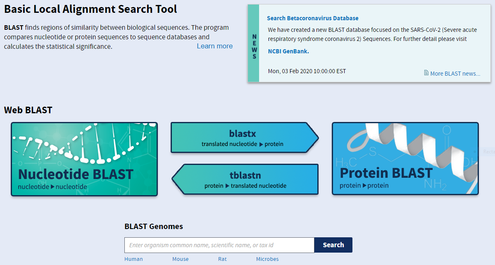
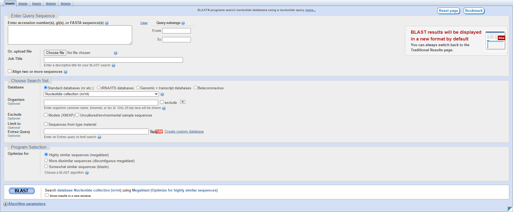
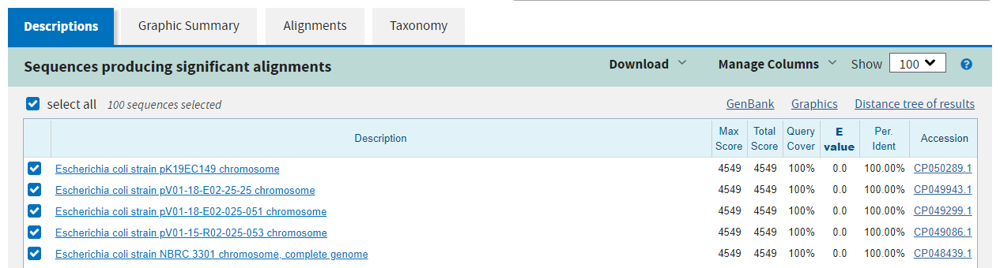
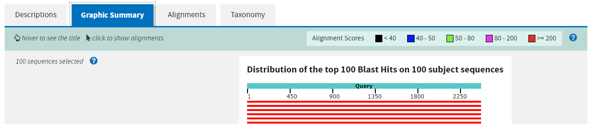
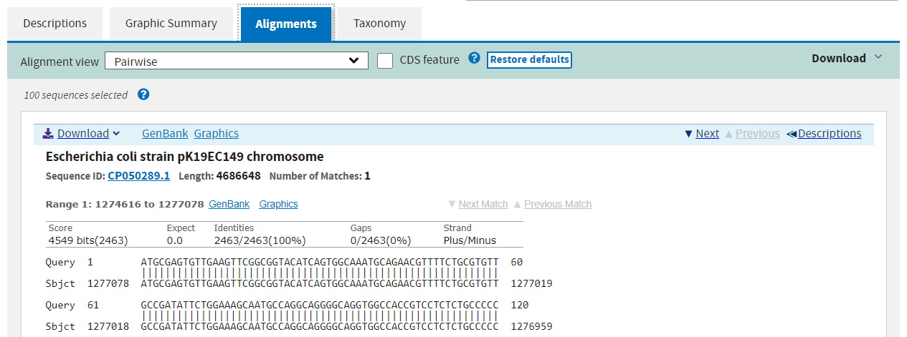
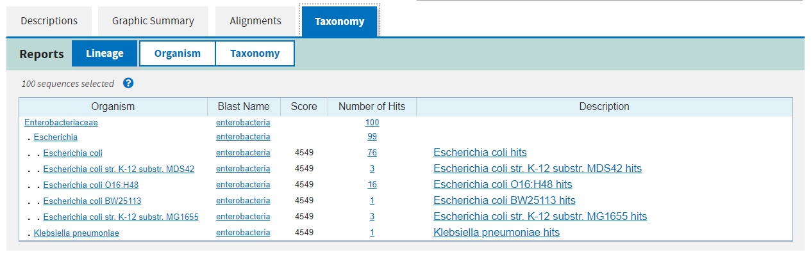

Alignment
=========

At the core of sequence analysis is identifying where a sequence comes from and comparing it to existing records of similar sequences. Sequence alignment is thus at the core of a large number of bioinformatic analyses. There are two approaches to alignment:

* **Global** - attempt to align every residue in every sequence, and only make sense when the sequences are approximately the same length, for instance sequences from a protein family
* **Local** - find regions of similarity within the larger sequence context, for instance comparing two genomes to see how much similar material they share

Without going into details, the classic method for global alignment is the **Needleman-Wunsch** algorithm, and for local alignment the **Smith-Waterman** algorithm, both based on dynamic programming.

BLAST
-----

The alignment tool that you are most likely familiar with is **BLAST**, a local alignment search tool primarily used to identify similar sequences from the NCBI database or in a pairwise manner. There are actually several BLAST programs for different tasks:

* **blastn** - for nucleotide-nucleotide alignment
* **blastp** - for protein-protein alignment
* **blastx** - for nucleotide-protein alignment with the query translated in all six reading frames
* **tblastn** - for protein-nucleotide alignment with the database translated in all six reading frames
* **tblastx** - for nucleotide-nucleotide alignment in protein space, i.e.: query and database are both translated in all six reading frames

The NCBI maintains a web server for running BLAST queries online: https://blast.ncbi.nlm.nih.gov/Blast.cgi

Let's look at an example using *blastn*. The interface is fairly straightforward for basic searches: you can paste your query sequence into the large text box or select a file containing the sequence and just let it search the entire nucleotide database. You can also be more specific with your search, restricting it to an organism or taxon, or excluding certain organisms or taxa. When you cannot find any hits in the database, you may want to change the **Program Selection** to optimise for less similar sequences. FInally, you can align two sequences by ticking the appropriate box beneath the first sequence entry box.

The first page of the results lists all of the hits in the database sorted by **Expectation value**, the likelihood of seeing this alignment by chance.

The second page shows a graphical summary of the alignments across the query where the colours indicate the alignment score.

The third page shows the exact alignments summarised on the previous two pages.

Finally the fourth page summarises the taxonomic distribution of all of the hits.

The alignments on pages 1 and 2 link to the alignment view on page 3, and links there will take you to the database entry for the subject. You can also filter the results after the fact at the top of the results page, but it is faster to apply filters in the search step.

BLAST on the command line
-------------------------

Whilst the web server is an incredible utility for individual sequence searches or alignments, it is impractical to use it for a large number of queries. Fortunately the suite of programs is available for Unix, for both online and offline use and is installed as a module, **BLAST+**, on Morgan. If using it offline, you may have to download a database or use the command **makeblastdb** to construct one locally from a fasta file.

.. code-block:: bash

    # Run blastn online
    blastn -query input.fasta -db nt -remote

    # Run blastn offline
    makeblastdb -in subject.fasta -dbtype nucl
    blastn -query input.fasta -db subject.fasta

You can direct the output of the search to a file with the **-out** argument. By default the output format is as the third page of the web server's results, but you can change this to a tabular format with the command **--outfmt 6** and other formats are available.

Because you are running the program locally, you can write a bash script that runs as many jobs as the server will allow.

Exercises
---------

* Locate the nucleotide sequence for dnaA in the file GCF_000482265.1_EC_K12_MG1655_Broad_SNP_cds_from_genomic.fna
* Perform a BLAST search for the sequence using the web server, excluding the *Escherichia* genus
* Make a BLAST database of the *Salmonella* genome nucleotide gene sequences previously downloaded
* Use command line BLAST to search for *E. coli* dnaA hits in the *Salmonella* gene sequences
* Do the reverse search, for *Salmonella* dnaA in the *E. coli* gene sequences
* Is there a reciprocal best hit, i.e.: the top hit from the first search is *Salmonella* dnaA and vice-versa

.. container:: nextlink

    `Next: ? <?>`_
