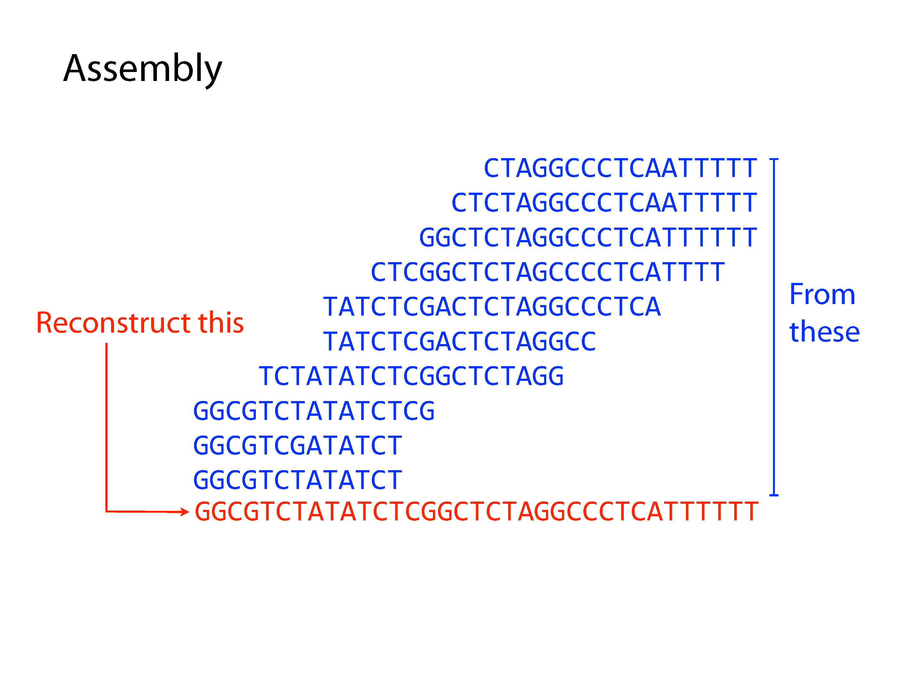
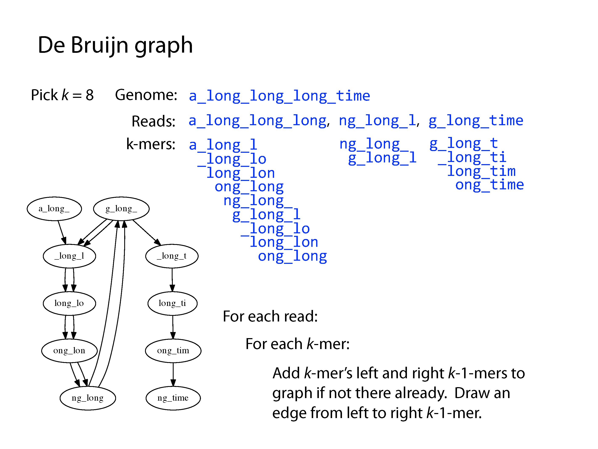

Assembly
========

**Assembly** is the process of constructing longer sequences from short sequencing reads. These assembled pieces are known as **contigs**, or for paired-end sequencing an additional step creates **scaffolds**. Assembly aims to construct a complete genome with no errors, but due to the nature of sequencing and repeated sequences in the genome, this is rarely achievable.

Both principle methods of assembly use **graph** structures, which consist of **nodes** connected by **edges**. The first major method developed was **Overlap-Layout-Consensus**, where the nodes were sequences and the edges represented overlaps between them, but we won't go into detail of this method here. The current preferred method is the **De Bruijn Graph**, where the nodes are **kmers** and edges link sequential kmers one base at a time. A **kmer** is simply a fixed length subsequence, and the set of kmers for a given read are all possible subsequences of that fixed length.

After construction of the graph, the assembly procedure involves a complex series of decisions to find a path through the graph. A program will consider kmer frequency and incorporate an error model based on this to correct sequencing errors. Ultimately there may still be parts of the graph that can be resolved due to repeats or a lack of coverage, which result in contig breaks. The final set of contigs could be arranged in any order and comprise a valid genome based on the input data. Paired-end reads help resolve some of these by providing evidence of connectivity at a greater distance, creating scaffolds. Long reads are even better, despite their low accuracy, as they can cover very large distances and go through even large repeats more easily, however their assembly is an altogether more difficult problem.

SPAdes
------

We typically use the program **SPAdes** for genomic and metagenomic assembly and it is available on our module system. The required input is a set or multiple sets of reads that have been through quality control, and it will also accept an existing genome or assembly as a guide, though this is only recommended when reassembling a known genome or a very close relation.

.. code-block:: bash

    # An example command to run spades
    spades.py --isolate --pe1-1 <R1 reads file> --pe1-2 <R2 reads file> --pe1-s <singletons> -o <output directory> -t 32 -m 128

Here we have R1, R2 and singleton reads from quality control, and we have asked for 32 threads and 128GB of RAM to run on. This is considerable computing power and so you should always write a full job script to submit to the queue when running an assembly. For more options, including metagenomic assembly, which requires considerably *more* computing resources, I recommend reading the SPAdes manual.

Assembly Assessment
-------------------

How do we know whether an assembly is good or not? If you have a reference genome you can obtain a ground truth - how many errors and rearrangements - and this is how assemblers are assessed against one another in publication, but for day-to-day use we have a different set of metrics we refer to:

* Number of contigs/scaffolds - perhaps the most important, the fewer the better
* Total length - for a single genome, useful as a check against contamination, for a metagenome, gives you a rough idea of the number of genomes (if bacterial only)
* Median contig/scaffold length - the higher the better
* N50/N90 - if you arrange the contigs from smallest to largest, the size of the contig/scaffold halfway or 90% of the way through the total length, again the higher the better

Additionally, it is useful for a metagenome to consider these stats for contigs/scaffolds above a certain size, such as 1kb or 1.5kb, which is roughly how large a sequence needs to be for reliable gene detection and annotation.

For a more detailed look at an assembly, the reads used to construct it can be realigned to the contigs/scaffolds. This allows us to look at coverage and variation in coverage, to detect possible heterozygous sites and for metagenomes, help in the binning procedure that tries to place contigs/scaffolds from the same genome together.

Exercises
---------

* Use the quality controlled reads you previously produced, or those in */science/teaching/ecoli_wgs/qc/*, to assemble an isolate genome with *SPAdes*
* Don't forget to write a job submission script to load the module and run the SPAdes command with the correct arguments - you should use only 8 threads and 8GB of memory per thread
* Assess the quality of your assembly using the script */science/teaching/assembly_stats.py*
* To run and get help with the arguments of the script:

.. code-block:: bash

    ml Python
    python /science/teaching/assembly_stats.py -h

.. container:: nextlink

    `Next: Annotation <3.2_Annotation.html>`_

