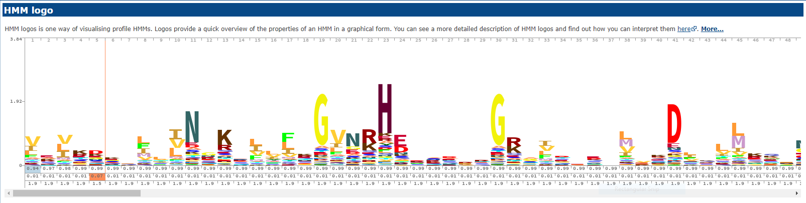
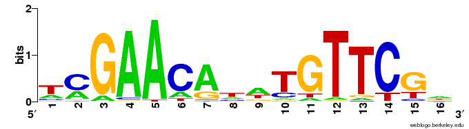

Annotation
==========

**Annotation** is the process of assigning function or properties to sequences, primarily through similarity to existing, known sequences. Regions of interest are identified by **structural** annotation, and then assigned biological information by **functional** annotation.

ORF Finding
-----------

Before identifying gene function, the genes need to be found in the genome sequence. **Open reading frames** or **ORFs** can be identified relatively easily in prokaryotes by finding stretches of sequence between start and stop codons that are long enough in any of the six reading frames. For a long list of programs that do this, see `Wikipedia <https://en.wikipedia.org/wiki/List_of_gene_prediction_software>`_.

We use **Prodigal** for bacterial genomes and metagenomes, which is available as a module on Morgan. Some options worth highlighting:

* -a : output translations, i.e.: protein sequences to a given file
* -c : do not allow genes to run off the ends of contigs
* -d : output nucleotide sequences to a given file
* -f : select output format
* -i : input file
* -o : output to a given file

.. code-block:: bash

    ml prodigal
    prodigal -a asm.faa -d asm.fna -f gff -o asm.gff -c -i contigs.fasta

Protein Identification
----------------------

There are many different programs available for functional annotation of protein sequences. The primary method of identification is through sequence similarity - if a sequence is sufficiently similar to one we already know about, then it is likely to perform the same function.

Sequence Similarity
___________________

Many databases exist for looking up unknown sequences. Programs often curate smaller sets of well characterised proteins from these databases in order to provide accurate annotations. As these programs have been designed and tested to minimise false calls, they are almost certainly better than just using BLAST for general genome annotation. Later we will discuss some more specificprograms for identifying certain kinds of protein that have been optimised for that task.

This method struggles with proteins that look like hybrids of known sequences, and with sequences much longer or shorter than their closest hits. Additionally, any method reliant on a database can only tell you about similarity to things it already knows.

Two example programs are **prokka** and **eggnog mapper**, both of which are available in modules on Morgan. *Prokka* actually annotates a variety of different features beyond genes, and uses both sequence similarity and HMMs, the idea being that you might fully annotate your novel genome with just one tool. *Eggnog mapper* focuses on gene function via orthology prediction and will also link its annotations with multiple other databases such as KEGG. Both programs require considerable computing resources so should be run in the job queue.

HMMs
____

At a fundamental level, a protein consists of one or more **domains**, and so one way to identify function is by domain or combination of domains. Domains are recurring features across a wide spectrum of sequences, so are quite variable in sequence, and one way to summarise multiple sequences with a single mathematical construct is a **hidden Markov model**. From a multiple alignment of sequences encoding for the same domain, the probability of each amino acid occuring at each position can be calculated, as well as the likelihood of an insertion or deletion existing between positions. Any given sequence can be compared to an HMM to determine the likelihood of a match.

The **Pfam** database is the best known example of this method and contains a vast quantity of useful information beyond HMMs for each of the protein domains it recognises. The **HMMER** module provides a suite of programs for building and searching with HMMs.

Motif Finding
-------------

A **motif** is a term used to describe a short sequence that's indicative of a feature such as a promoter, restriction site or protein binding site. A strict motif would be the consensus sequence for a feature that has to be matched perfectly - a restriction site is a good example - but others are typically defined by a **position weight matrix**, which is similar to an HMM, but only encodes the probability of each nucleotide (or amino acid) at each position.

There are databases for transcription factor binding sites in various organisms. For producing and searching with PWMs, programs such as the **MEME** suite are available on Morgan.

RNA Finding
------------

There are specialised tools for finding particular RNAs other than mRNAs. Some examples that are useful in bacteria include:

* tRNA - Aragorn, tRNAscan-SE
* rRNA - RNAmmer, Barrnap
* ncRNA - Infernal

Usually used for quality checking the bins from a metagenome, **CheckM** also has a function for extracting rRNA sequences and trying to taxonomically identify them. The **SILVA** and **GTDB** databases are also comprehensive reference databases for 16S sequences.

Other
-----

Science is all about specialisation and so it's natural that there are very specific tools and databases available for very specific features. They can't all possibly be listed here, but it's certainly worth searching the literature if you think there might be some compiled information or piece of software for annotating a feature that you work on. For instance, **antiSMASH** is designed to identify secondary metabolite biosynthesis gene clusters.

Exercises
---------

* Use **prodigal** to call genes on your assembly of the *E. coli* genome (or the already assembled genome)
* Use **prokka** to annotate the genome - be sure to submit the job to the queue as it will take a reasonably long time - use 8 threads and 4GB memory per thread
* Looking at the results, how many of the genes have been annotated? How many have meaningful annotations, i.e.: not 'hypothetical protein'?
