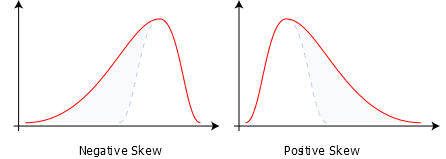
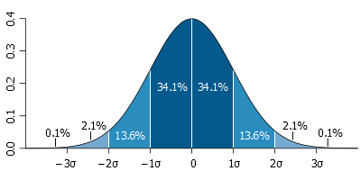

Basic Concepts in Statistics
============================

In this brief course, we will look at statistics from the point of view of a researcher who is planning, or has collected data from an experiment and wants to draw conclusions from it that stand up to scrutiny. Before understanding the sort of tests we can perform on our data, we need to understand some of the basic properties of the data itself.

Simple Measures
---------------

The arithmetic **mean** is the simplest measure of average that everyone is familiar with.

The **median** is the 'middle value' if all values were arranged in order.

Related to the median are **quartiles** and **quantiles** which tell you the value 25% or 75%, or an arbitrary percentage of the way through the data, if arranged in order.

The **mode** is the most frequent value(s).

Finally, the **minimum** and **maximum** are the lowest and highest values, covering the **range** of the data.

Variability
-----------

Perhaps the most important factor in data analysis is variability. Biology is a very messy field of study with many sources of noise: from instruments used to take measurements, from the stochastic differences inherent in a population of cells, from barely controllable factors that change from experiment to experiment, and so on. Wherever possible we try to control for these, by taking repeat measurements, repeat samples and repeat experiments, as well as designing suitable controls that inform us what exactly is causing the observed differences in a treated sample.

The **standard deviation** is the most common measure of variability.

.. math::

    \sigma = \sqrt{\frac{1}{N-1} \sum_{i=1}^N (x_i - \overline{x})^2}

The formula above is for the **sample** standard deviation, which gives an unbiased estimate of variability. For the **population** measure, instead divide by *N*, which is accurate when you have all possible values. Otherwise use the *sample* measure, although even more accurate measures can be found for data that follows a particular distribution.

The **variance** is simply the *standard deviation* squared.

A useful measure of how far a particular value is from the mean is the **standard** or **z-score**.

.. math::

    z = {x- \mu \over \sigma}

The **coefficient of variation** is useful for comparing the spread of different sets of data and is calculated by dividing the *standard deviation* by the *mean*.

Properties of Data
------------------

A set of data as a whole can have various properties that make it easier or more difficult to work with, and determine whether or not it might be suitable for a particular statistical test.

Data that is evenly spread about its *mean*, i.e.: the *median* is equal to or very close to the *mean*, is **symmetrical**.

If not, then we refer to the **skew** of the data. **Positively skewed** data has a long high tail and the *median* is lower than the *mean*. **Negatively skewed** data has a long low tail and the *median* is higher than the *mean*.

Data that could be any value (excepting the precision of your instruments) is **continuous**, whereas count data is **discrete**.

Certain types of count data, such as from short-read sequencing, might be **compositional**, i.e.: if the count of one item in the data goes up in a particular sample, the other counts must necessarily go down. This is much harder to work with!

Typical Distributions
---------------------

The most common and easiest data distribution to work with is the **normal** or **gaussian** distribution. It is *continuous* and *symmetrical*, with a relationship between *mean* and *variance* that results in 68% of the data with a *z-score* less than 1, 95% with a *z-score* less than 2, and 99.7% with a *z-score* less than 3.

Another related distribution that is the result of multiplying many random variables, is the **log-normal** distribution. This means that if you take the log of your data values, they will appear normally distributed.

Another common distribution is the **Poisson**, which describes the probability of a number of events occuring based on an occurence rate. It is *discrete* and *asymmetrical*, where both the *mean* and *variance* are equal to a single parameter, **lambda**.

Related to the poisson, the **exponential** distribution describes the time between events in a Poisson process. It is *continuous* and *asymmetrical*.

The **binomial** distribution describes the probability of a number of successes in a number of tests, each of which is equally likely to succeed. It is *discrete*.

The related **hypergeometric** distribution describes the probability of drawing a number of objects from a collection in a number of draws, where the objects are not replaced as they are drawn. It is also *discrete*.

Useful R Functions
------------------

**mean** and **median** return their respective values, but perhaps more useful is **summary** on a vector of numbers, which returns almost all the simple measures listed above.

**range** returns the minimum and maximum values alone.

There is no built-in function for **mode**, but **table** will perform a frequency count of values, and **sort** will arrange them from lowest to highest frequency.

**quantile** by default returns quartiles, but you can give an argument to return any quantiles you like.

**sd** and **var** return the *sample* standard deviation and variance respectively.

To understand the properties of your data, it's usually a good idea to plot it. A **histogram** is a good way to understand a distribution, and R offers the function **hist**.

.. code-block:: R

    # Plot a histogram
    data(iris)
    h = hist(iris[,1])
    h = hist(iris[,1],breaks=20)

An alternative is to consider the cumulative distribution. R has the function **ecdf**, or slightly more flexible is **Ecdf** in the package **Hmisc**.

.. code-block:: R

    # ecdf
    e = ecdf(iris[,1])
    plot(e)

    # Ecdf
    E = Ecdf(iris[,1])
    E = Ecdf(iris[,1],what='f')

If you want to generate data that conforms to a particular distribution, there are consistently named functions for each of the distributions mentioned above. Taking the normal as example, **dnorm** generates the density function, **pnorm** generates the distribution function, **qnorm** generates the quantile distribution and **rnorm** chooses random values from the distribution. You can use the **d**, **p**, **q** and **r** prefixes with **pois**, **exp**, **binom** and **hyper** for those distributions.

.. code-block:: R

    # Normal examples
    plot(-30:30/10,dnorm(-30:30/10))
    plot(-30:30/10,pnorm(-30:30/10))
    plot(1:99/100,qnorm(1:99/100))
    hist(rnorm(1000))

Exercises
---------

* Load the **LakeHuron** data set and determine for yourself what properties the data has, and whether it looks like a particular distribution or not.
* Load the **treering** data set and repeat the exercise.

.. hidden-code-block:: R

    # LakeHuron data
    data(LakeHuron)
    mean(LakeHuron)
    median(LakeHuron)
    sd(LakeHuron)
    hist(LakeHuron,breaks=20)
    # So very close to normal, perhaps a slight negative skew

    # treering data
    data(treering)
    mean(treering)
    median(treering)
    sd(treering)
    hist(treering)
    # Again very close to normal with a stronger negative skew

.. container:: nextlink

    `Next: Fitting Data <1.2_FittingData.html>`_

