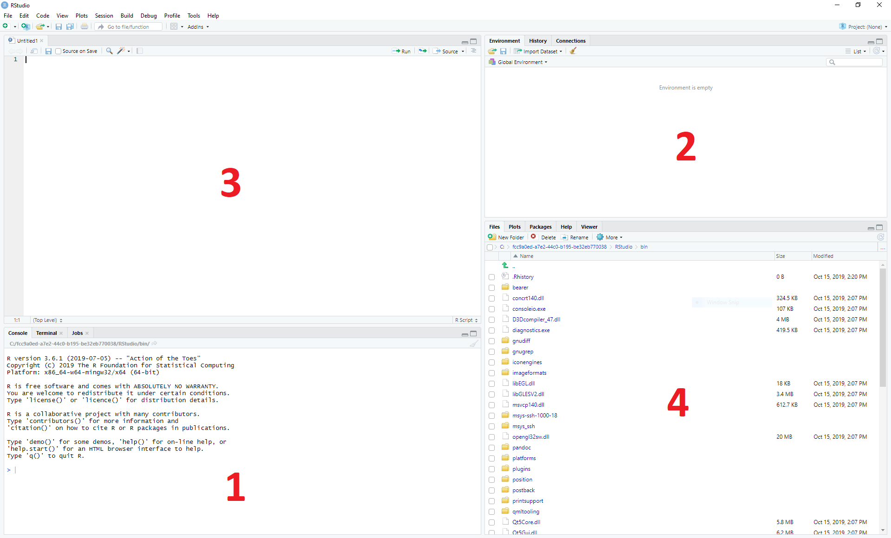

R Studio
========

**R Studio** is an integrated development environment (IDE) for **R**. This means that it provides an interface to help you write, run and debug code.

1. The bottom left panel is the R console. Here you can type in commands and have them immediately evaluated.

2. The top right panel shows you the current variables in your environment. By default you are shown the variable names and a short preview of their contents, but you can get more information by changing the view type from *List* to *Grid*. Another tab here shows you your command history.

3. The top left panel is where you can view and edit script files, and where can you view 2D variables such as matrices and data frames (more on those later).

4. The bottom right panel shows a file browser. If you are working on the web version, this will show your Unix home directory by default. Other tabs show plots that you create, additional functions, known as packages, you have installed, and help files for various functions.

Useful commands
---------------

* When you want to run the script you are looking at, you can press **Control+Shift+Enter**.

* When you just want to run a single line in the script, or the lines you have highlighted, you can press **Control+Enter**.

* If you want to interrupt a running command or script, you can press **Escape** in the console window.

* If something goes really wrong, you can select **Interrupt Kernel** or **Restart R** from the *Session* menu.

Other Tips
----------

* Use the R console to try things out, and when you're happy that you have written a command correctly you can copy and paste it into your script

* The R console works very much like the Unix terminal:

  * You can use the arrow keys to scroll back through previously run commands

  * You can use tab to auto-complete commands and variables - a handy menu comes up with options if there is ambiguity

  * Unlike the Unix terminal, in R Studio you can copy and paste as you would do normally in other programs

* In the script window there are line numbers to make it easier to find errors

.. container:: nextlink

    `Next: Calculation and Variables <1.2_Variables.html>`_

