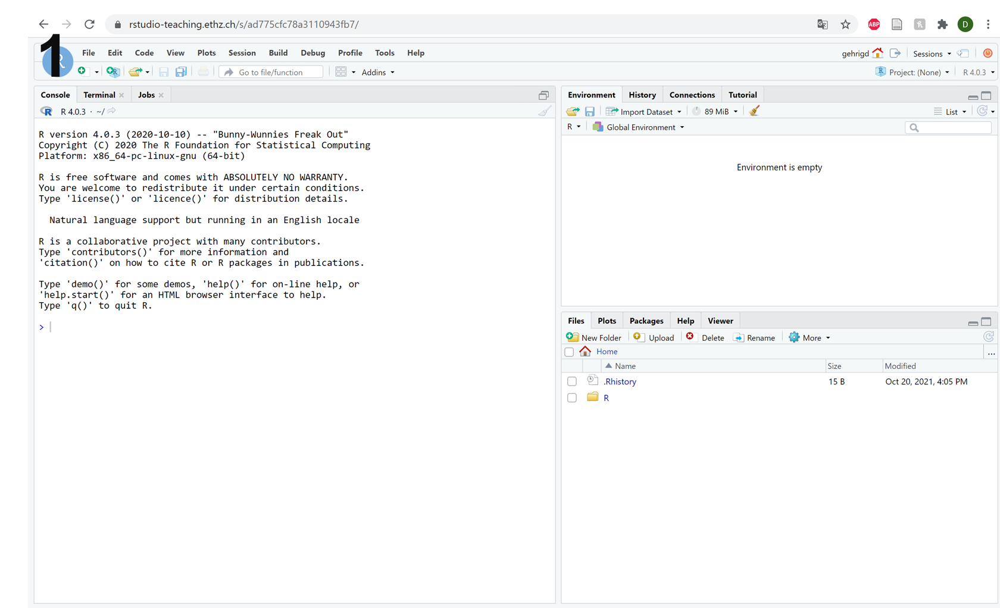
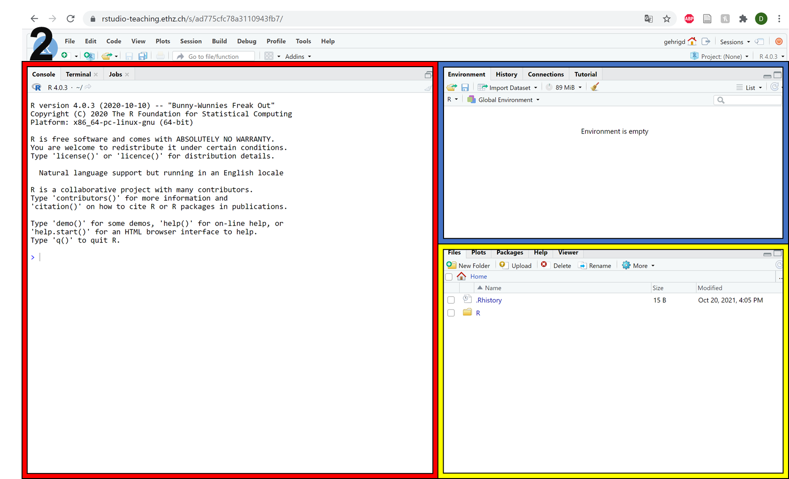
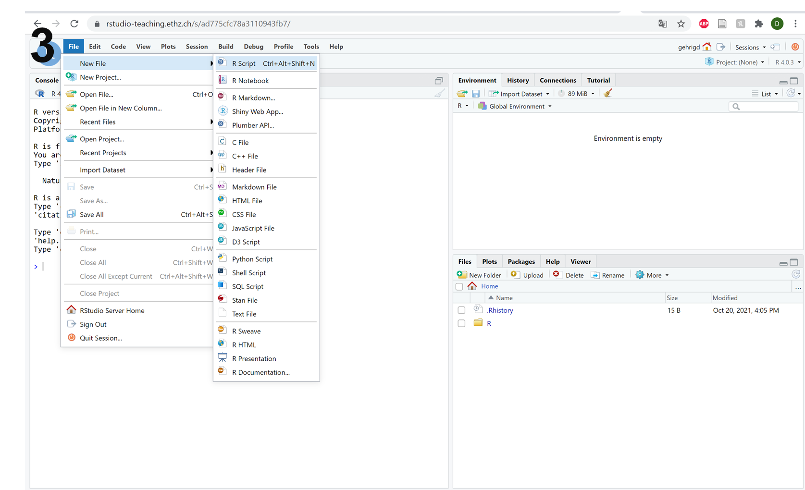
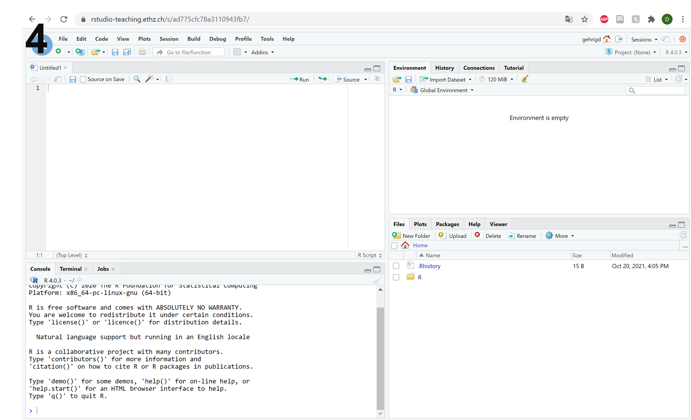
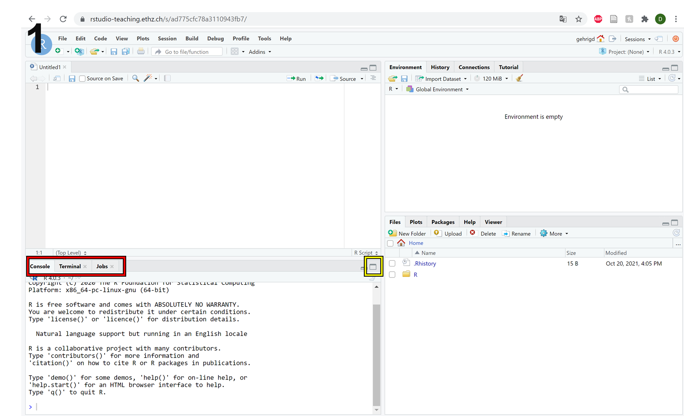
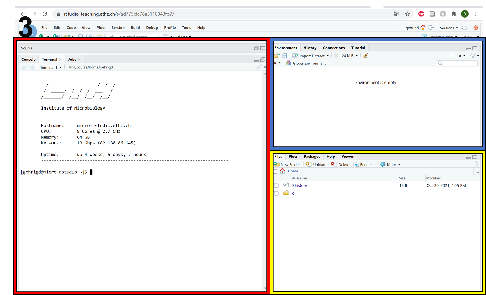

Setup
=====

General information
-------------------

Main objective
^^^^^^^^^^^^^^

The aim of this setup is to ensure that you can access the ETH network from outside and to introduce our teaching platform.

Learning objectives
^^^^^^^^^^^^^^^^^^^

* Students can use the VPN to access the ETH network from outside
* Students can connect to a remote server with their own computer
* Students are familiar with the R Workbench teaching platform

Networks
--------

Computers have been connected to each other to exchange data since the 1950s and now we take internet access for granted on our mobile devices. Behind the screen, there are countless pieces of software and protocols that make everything work, but we won't go into the details.

.. figure:: images/client_server_model.png
    :align: center

It is important however to understand the concept of a **remote server**. This is a computer sitting somewhere, possibly in the ETH basement, possibly in an enormous data centre in Iceland, which is only supposed to be connected to over the internet. To be able to connect to a server you need to have appropriate access - a username and password, and perhaps you will have to be connecting from an allowed location. For instance, you can only access the ETH remote servers from within the ETH domain, either because you are on the ETH WiFi or have connected via **VPN**.

A VPN, or virtual private network, is a way of connecting to a server that then channels all of your internet traffic through the server as if you were in its location. So if you use the ETH VPN, you will have access to everything as if you were connected to the ETH WiFi or cable network.

If you have not already connected your devices with the ETH VPN you can find the instructions to do so |VPN|.

.. |VPN| raw:: html
    
    <a href="https://ethz.ch/content/dam/ethz/special-interest/hest/isg-hest-dam/documents/pdf/vpn-de.pdf" target="_blank">here</a>

.. admonition:: Exercises
    :class: exercise

    * Try to find out your IP-address before connecting to the ETH VPN. You can do so by going to the website |Hoststar|.
    * Now connect to the ETH VPN and check your IP-address once more at |Hoststar|. What do you notice?

    .. hidden-code-block:: bash

        You should notice that your IP-address change even though you did not physically change your location.

    .. |Hoststar| raw:: html

        <a href="https://www.hoststar.ch/de/tools/meine-ip-adresse#:~:text=Geben%20Sie%20den%20Befehl%20»ping,öffentliche%20IP-Adresse%20der%20Seite." target="_blank">Hoststar</a>

Command line interface
----------------------

Although software exists which allows you to access a server just as if you were logging into a normal computer - with a graphical user interface and everything - many will only provide a **command line interface**. This is a text-based method of communication that almost all computers have, though it is typically hidden out of sight for most users.

The terminal functions like an old fashioned text adventure game, or a voice-activated assistant that requires you to type in your commands.

.. figure:: images/command_line.gif

Accessing the command line interface on your own computer depends on your system:

Windows
^^^^^^^

* In the taskbar menu type 'command' and Command Prompt should appear for you to launch
* Alternatively press Windows Key + r and type 'cmd' into the box and Command Prompt should launch

Mac
^^^

* Click the launchpad icon in the dock, type 'Terminal' into the search field and launch from there
* Alternatively in the Finder, navigate to /Applications/Utilities folder and launch Terminal from there

Connecting to a remote server
-----------------------------

The Institute of Microbiology provides to its members access to a server named **Morgan**, which can be accessed at the address: :code:`morgan.ethz.ch`. In order to work on the server, we will connect to it using a protocol called **S**\ ecure **Sh**\ ell or **ssh**.

To log into the server use the ssh command your ETH user ID and the server address.

.. code-block:: bash

    # Command to connect to morgan
    ssh <yourETH-ID>@morgan.ethz.ch

.. admonition:: Exercise
    :class: exercise

    * Try to connect to morgan yourself

        # First, you have to open the command line interface on you computer
        For Windows: Type "command" into the taskbar menu
        For Mac: Click onto the launchpad icon in the dock and type "Terminal" into the search field

        # Second, connect to morgan with the ssh command. You need your  user ID and your nethz password in order to connect to the serve
        ssh <yourETH-ID>@morgan.ethz.ch

The ETH also provides a much larger computing cluster to its members, a server called **Euler**, which can be accessed at the address: :code:`euler.ethz.ch`. You can also access it via SSH, but to work on it you must follow slightly stricter rules that we will discuss later.

R Workbench
-----------

Since everyone is working on different devices and we are using multiple program languages, we have arranged a single web-based platform for you to work on: |R-Workbench|. You may already be familiar with R-Studio, a development platform for programming in R. R-Workbench is built on R-Studio and can also be used for other programming languages and as a Unix terminal.

**From now on, all exercises and homework should be done in R-Workbench.**

.. |R-Workbench| raw:: html

    <a href="https://rstudio-teaching.ethz.ch/" target="_blank">here</a>

Working in R
^^^^^^^^^^^^

When you first login into the R-Workbench, it should look like picture 1. Picture 2 gives you an overview of the different parts of the interface.

* The red frame shows the R console where you can issue commands and results are shown.
* The blue frame shows the environment, here all your variables are stored.
* The yellow frame shows you the files, plots and packages from your session but it can also give you helpful information.

If you are wondering where the R script is, you have to open it manually. Click on File -> New File -> R Script (or Ctrl + Alt + Shift + N for the short) as you can see in picture 3. This will give you a layout with 4 windows (picture 4).

|R1| |R2| |R3| |R4|

Working in Unix
^^^^^^^^^^^^^^^

Most of the work will not be done with R-Studio but in Unix.

* To access the remote server’s terminal click on **Terminal** on top of the console panel (picture 1, red frame).
* To enlarge the panel you can click onto the yellow framed button in picture 1.
* You should already be logged in to the server and your setup should look similar to picture 2.

When you are working on the terminal, please note that the environment (blue frame in picture 3) and the files/plots/packages/help (yellow frame in picture 3) become irrelevant and everything will be displayed in the terminal panel (red frame picture 3).

|T1| |T2| |T3|

.. |T2| image:: images/Terminal_Workbench_2.png
              :width: 49%

.. admonition:: Exercise
    :class: exercise

    * Log into the workbench yourself and check that you can access the different modes above. **If you need any help please feel free to ask**

    .. hidden-code-block:: bash

        #The workbench can be found at https://rstudio-teaching.ethz.ch/

        #You can switch between the console and the terminal at the top bar

        #To open a script press on File -> New File and select R Script

        #You should already be logged in to the server

R-Workbench is also capable of running scripts in some other programming languages such as Python, if you are interested.

.. container:: nextlink

    `Next: Introduction to Unix 1 <1_Unix1.html>`_

