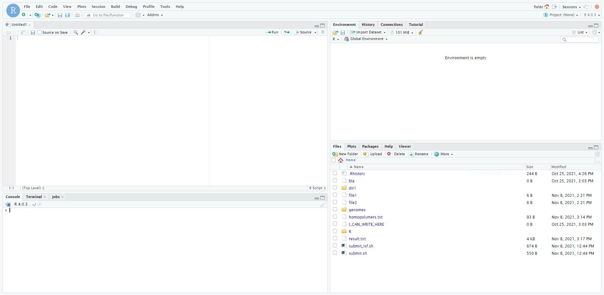

Introduction to R 1
===================

General information
-------------------

Main objective
^^^^^^^^^^^^^^

In this lecture we will introduce **R**, a programming language for data analysis and statistics.

Learning objectives
^^^^^^^^^^^^^^^^^^^

* Students can use R Studio to write scripts and execute code
* Students can recognise and use variables, types and functions
* Students can import and export data
* Students understand names, indexing and can slice data

Resources
^^^^^^^^^

This section requires the use of the |R_Workbench|.

.. |R_Workbench| raw:: html

    <a href="https://rstudio-teaching.ethz.ch/auth-sign-in?appUri=%2F" target="_blank">R Workbench</a>

R Workbench
-----------

**R Workbench** is an integrated development environment (IDE) for **R**. This means that it provides an interface to help you write, run and debug code. It is an extended, web-based version of **R Studio**, which you might like to use on your own computer for working in R.

1. The bottom left panel is the R console. Here you can type in commands and have them immediately evaluated.

2. The top right panel shows you the current variables in your environment. By default you are shown the variable names and a short preview of their contents, but you can get more information by changing the view type from *List* to *Grid*. Another tab here shows you your command history.

3. The top left panel is where you can view and edit script files, and where can you view 2D variables such as matrices and data frames (more on those later). Initially this panel will not appear, but you can bring it up by going to the menu, *File* -> *New File* -> *R Script*.

4. The bottom right panel shows a file browser. If you are working on the web version, this will show your Unix home directory by default. Other tabs show plots that you create, additional functions, known as packages, you have installed, and help files for various functions.

Useful commands
^^^^^^^^^^^^^^^

* When you want to run the entire script you are looking at, you can press **Control+Shift+Enter**.

* When you just want to run a single line in the script, or the lines you have highlighted, you can press **Control+Enter**.

* If you want to interrupt a running command or script, you can press **Escape** in the console window.

* If something goes really wrong, you can select **Interrupt R** or **Restart R** from the *Session* menu.

Other tips
^^^^^^^^^^

* Use the R console to try things out, and when you're happy that you have written a command correctly you can copy and paste it into your script

* The R console works very much like the Unix terminal:

  * You can use the arrow keys to scroll back through previously run commands

  * You can use tab to auto-complete commands and variables - a handy menu comes up with options if there is ambiguity

  * Unlike the Unix terminal, in R Studio you can copy and paste as you would do normally in other programs

* In the script window there are line numbers to make it easier to find errors

Calculation and variables
-------------------------

R as a calculator
^^^^^^^^^^^^^^^^^

Using R at its most basic, it is a calculator. You can enter a calculation into the console and immediately evaluate the result.

.. code-block:: R

    # R is a calculator
    1 + 2
    3 * 4

Variables
^^^^^^^^^

A core concept in programming, a **variable** is essentially a named piece of data. That is, when you refer to the variable by its name within the program, you are actually referring to the data stored under that name.

To **assign** data to a variable in R, use the following syntax:

.. code-block:: R

    # Assignment
    x <- 2
    y <- 3.5

After you have assigned data to variables, you can then use the variables to perform calculations:

.. code-block:: R

    # R is a clever calculator
    x + 2
    x * y
    z <- x + x + x

If you need to see the value of a variable in the command line, you can just type its name:

.. code-block:: R

    # What is x?
    x

Note that variable names are case sensitive, and cannot start with a number.

.. admonition:: Exercises
    :class: exercise

    * Experiment for yourself with the R command line to do some simple calculations
    * Assign some different numbers to the variables *x* and *y* and check if calculations with them work as you expect
    * Try to do a calculation with a variable you haven't assigned any data to, *a* for instance
    * Set *x* to 1, then check what happens when you run the calculation *x <- x + 1*, what value is *x* afterwards?
    * Be aware that R has special values for certain calculations - try dividing by 0 for instance.

Types
-----

In R, and many other languages, variables also have a **type**, which defines the sort of data they store. R is actually a bit more complicated because it has **modes** and **classes**:

* A **mode** is most like a type in other languages, and determines the type of data stored, such as 'numeric' or 'character'.
* A **class** is a container that describes how the data is arranged and tells functions how to work with the data.

Some modes you might encounter:

* **numeric** - numbers, including integers and floating points numbers
* **character** - strings
* **logical** - TRUE or FALSE
* **list** - a special mode for containing multiple items of any, possibly different, mode(s), whose mode becomes 'list'

Some classes you might encounter:

* **vector** - a one-dimensional set of items of the same mode
* **matrix** - a multidimensional set of items of the same mode
* **data.frame** - a two-dimensional table with columns of different modes
* **formula** - a declaration of how variables are related to each other, for fitting models
* **factor** - a categorical variable

The reason that it is sometimes important to know what mode and class your variable has, is that functions behave differently according to the data they are given. It's easy to accidentally transform your variable into an unexpected format and then get an unexpected result from the functions you use in your program.

Mode detection
^^^^^^^^^^^^^^

To a certain extent, R will auto-detect what mode a variable should have based on the data. There are convenient functions to check a variable's mode when you need to.

.. code-block:: R

    # Auto-detection of variable mode
    x <- 1
    y <- "word"

    mode(x)
    mode(y)

    # What about if we make a mistake
    x <- "1"

    is.numeric(x)

Vectors
-------

If we want to create a variable that contains multiple pieces of data, we must make a **declaration** when we assign data to the variable.

.. code-block:: R

    # Creating a vector
    x <- c(1, 2, 3)
    x

    # Lazy sequences
    x <- 1:3
    x

    # Creating a vector with variables
    x <- 1
    y <- 2
    z <- c(x, y, 3)
    z

.. admonition:: Exercises
    :class: exercise

    * Create a vector containing the numbers 1 to 10
    * What happens if you add 1 to this variable?
    * What happens if you multiple the variable by 2?
    * What happens if you add the variable to itself?
    * Now create two vectors of the same length containing different numbers, say 1 to 3 and 4 to 6.
    * What happens when you add or multiply these together?
    * What happens if you add or multiply two vectors of different lengths?

    .. hidden-code-block:: R

        # Create a vector
        x <- 1:10

        # Do some arithmetic
        x + 1 
        # It adds 1 to each value in the vector
        x * 2
        # It multiplies every value by 2
        x + x
        # This time it adds the first value to the first value, the second to the second, etc.

        # Create two different vectors
        a <- 1:3
        b <- 4:6

        # Do some arithmetic
        a + b
        # It adds them element-wise, i.e.: first to first, etc.
        a * b
        # It multiplies element-wise

        # Different length vectors
        a + x
        # We get a warning, but it produces a result: repeating the shorter vector to have enough elements to add to the larger vector
        # But let's try another
        x <- 1:6
        a + x
        # No warning this time because the length of a (3) is a multiple of the length of x (6)
        # R assumes you meant to do this, and repeats a twice to add to x

Lists and data frames
---------------------

Lists
^^^^^

Vectors and matrices have the limitation that they must contain data all in the same mode, i.e.: all numbers or all characters. **Lists** circumvent this limitation, acting as containers for absolutely any type of data.

.. code-block:: R

    # Declare an empty list
    l <- list()

    # Declare a list with items
    l <- list("a", 1, "b", 2:4)
    l

    # Declare a list with named items
    l <- list(names=c("Anna", "Ben", "Chris"), scores=c(23, 31, 34))
    l

Data frames
^^^^^^^^^^^

In that last example, it would be ideal if we could link the names with the scores, and maybe further data. We can store tabular data in R in a **data frame**, which is really a special kind of list.

.. code-block:: R

    # Declare a data.frame
    df <- data.frame(names=c("Anna", "Ben", "Chris"), scores=c(23, 31, 34))
    df

Looking at the *df*, you can see that the data is neatly arranged in named columns. You can also change the format of a variable between list and data frame quite easily.

.. code-block:: R

    # Change between list and data.frame
    l <- list(names=c("Anna", "Ben", "Chris"), scores=c(23, 31, 34))
    df_from_l <- as.data.frame(l)
    
    df <- data.frame(names=c("Anna", "Ben", "Chris"), scores=c(23, 31, 34))
    l_from_df <- as.list(df)

If you then look at *l_from_df*, the way the list is shown includes the line 'Levels: Anna Ben Chris'. **Levels** are the possible choices for a categorical **factor**, which is a variable mode in R for storing that sort of data. Data frames will almost always convert text into a factor, which will cause that data to behave differently than a character variable. This can be avoided:

.. code-block:: R

    # No factors please
    df <- data.frame(names=c("Anna", "Ben", "Chris"), scores=c(23, 31, 34), stringsAsFactors=F)
    as.list(df)

.. admonition:: Exercises
    :class: exercise

    * Create a simple list containing some numbers - not vectors of numbers
    * What happens if you try to do arithmetic with the list?
    * Now create a data frame with three columns, a name and two numeric values per name, such as coordinates.
    * What happens if you try to do arithmetic with the data frame?

    .. hidden-code-block:: R

        # A list of only numbers
        numbers <- list(1, 3, 6, 10)
        numbers + 1
        # We get an error - lists cannot be used like vectors!

        # A data frame of mixed types
        coords <- data.frame(Place=c("London", "Paris", "Zurich"), Latitude=c(51.5074, 48.8566, 47.3769), Longitude=c(-0.1278, 2.3522, 8.5417))
        coords + 1
        # We get a result, and a warning - the data frame cannot do arithmetic with factors, but can with the numbers.

Importing and exporting data
----------------------------

Importing data
^^^^^^^^^^^^^^

R has a host of functions for importing data of different types. I generally recommend that if you have a data table from *Excel*, for instance, you save the file as **tab-delimited text** for import into R. The most versatile import function is **read.table**.

.. code-block:: R

    # Import a data table
    genes <- read.table("/nfs/course/rfiles/ecoli_genes.txt")

We can now see what the table looks like using the **Environment** tab in the top-right - but something went wrong and the column headings are in the first row. We can fix this pretty easily.

.. code-block:: R

    # Import the table again
    genes <- read.table("ecoli_genes.txt",header=TRUE)

There are a few other useful arguments to help import tables of various formats:

* sep - determines the field separator (between columns), i.e.: sep=","
* quote - determines the quote mark (items in quote marks are considered to be the same field), i.e.: quote="\""
* row.names - determines which column contains the row names, if there are any
* comment.char - determines which character, if at the start of a line, indicates the line should be ignored, i.e.: comment.char="#"
* stringsAsFactors - determines whether the table should turn text into factors, which you may want to turn off, i.e.: stringsAsFactors=F

Exporting data
^^^^^^^^^^^^^^

Conversely, R has functions for exporting data into different formats. You will most likely want to create a file to open in R later, or a *.csv* file to open in *Excel*.

.. code-block:: R

    # Write a data.frame to an R-friendly format
    write.table(df,"Rfriendly_df.txt")

    # Write a data.frame to a .csv file
    write.csv(df,"df.csv")

Many of the arguments for the *read* functions also apply to the *write* functions, so you can decide whether you want to see row or column headings, how the text fields are separated, etc.

.. admonition:: Exercises
    :class: exercise

    * Download and import the ecoli_genes.txt table for yourself, make sure to get the column headings correct
    * Write the table out to a new file name using **write.table**
    * Now import the table again without any additional arguments to **read.table** - do you still need to correct the column headings?

Names and Indexing
------------------

Names
^^^^^

In R, it is not just variables that have names. We have seen that data frames can have column names, and it's also possible to give them row names. In fact, any element in a vector or list can be given a name, and these names are accesible through a simple function.

.. code-block:: R

    # Naming a vector
    x <- 1:5
    names(x) # NULL

    names(x) <- c("A","B","C","D","E")
    names(x)
    x

This is slightly different in a matrix or data.frame, where you can name the rows and columns.

.. code-block:: R

    # Naming rows and columns
    df <- data.frame(1:3,4:6,7:9)
    df
    rownames(df)
    colnames(df)

    rownames(df) <- c("A","B","C")
    colnames(df) <- c("X","Y","Z")
    df

Indexing
^^^^^^^^

Sometimes you want to refer to only part of a vector, matrix or data.frame -- perhaps a single column or even single item. This is called **slicing** and requires an understanding of how R **indexes** the elements in objects.

For a vector, you can either reference an item by its **position** or **name**.

.. code-block:: R

    # Slicing a vector
    x <- c("Chris","Field","Bioinformatician")
    names(x) <- c("Name","Surname","Job")

    x[1]
    x["Name"]

For a matrix or data.frame, the same methods work for indexing the row or column of the object, or both. The convention is that first you give the row, then the column, separated by a comma, and if one is left blank it implies you want 'all' rows or columns. For this example we are going to load up a pre-made set of data that comes with R.

.. code-block:: R

    # Slicing a data.frame
    data(swiss)
    
    swiss[1,]
    swiss[,1]
    swiss[1,1]
    swiss["Gruyere",]
    swiss[,"Fertility"]

Finally there are two additional ways to access items in a list, or columns (only) of a data frame.

.. code-block:: R

    # Accessing a list item
    l <- list(names=c("Anna", "Ben", "Chris"), scores=c(23, 31, 34))
    l$names
    l[[1]]
    l[["names"]]

    # The difference between single and double brackets for a list
    l[1] # Produces a list of one item
    l[1:2] # Produces a list of two items
    l[[1]] # Produces a vector
    l[[1:2]] # Produces a single item, the second entry in the first item in the list

    # Accessing a column of a data frame
    swiss$Fertility
    swiss[[1]]
    swiss[["Fertility"]]

You can also slice multiple items by giving a vector of numbers or names. Remember that R automatically translates the code *n:m* into a range of integers from *n* to *m*.

.. code-block:: R

    # Slicing a range
    x[1:2]
    swiss[1:3,]
    swiss[4:5,1:3]
    swiss[c("Aigle","Vevey"),c("Fertility","Catholic")]

.. admonition:: Exercises
    :class: exercise

    * Load the pre-made data set **swiss**
    * Look at the row and column names, then try to rename the columns
    * What happens if you give fewer names than there are columns?
    * Create a vector containing the numbers 1 to 10 and then create a vector containing the first ten square numbers
    * Slice the vector to check the value of the 7th square number
    * Returning to the *swiss* data set, extract the data for just **Sion**
    * Now extract only the **Catholic** data for the first ten places, and for just *Sion*
    * Finally use vectors to find the data on **Examination** and **Education** for **Neuchatel** and **Sierre**

    .. hidden-code-block:: R

        # Load the data
        data(swiss)

        # Look at the row and col names, try to rename
        rownames(swiss)
        colnames(swiss)
        colnames(swiss) <- c("A","B","C","D","E","F")

        # What happens if I don't give enough names
        colnames(swiss) <- c("A","B")
        # The other columns are named NA, which is a problem

        # Create the vectors
        n <- 1:10
        sq <- n*n

        # Slice the 7th square
        sq[7]

        # Reload (because we renamed things) and extract data for Sion
        data(swiss)
        swiss["Sion",]
        
        # Extract just Catholic data
        swiss$Catholic
        # or
        swiss[,"Catholic"]
        # or even, but this is less reliable if things move around
        swiss[,5]

        # Extract more specific data
        swiss[1:10,"Catholic"]
        swiss["Sion","Catholic"]

        # Extract very specific data
        swiss[c("Neuchatel","Sierre"),c("Examination","Education")]
        # Note that in the original table, Neuchatel appears after Sierre, but here they are reported in the order I gave

Logical slicing
^^^^^^^^^^^^^^^

We have seen that we can give R a vector of numbers or names and it will slice out the corresponding data from a vector or data frame. We can actually go further than that and use a vector of **logical** values, **TRUE** or **FALSE** to determine which elements we want to slice out. Furthermore, we can write the vector as a variable ahead of time if we like.

.. code-block:: R

    # Slice using premade vectors
    places <- c("Neuchatel","Sierre")
    cols_of_interest <- c("Examination","Education")
    
    data(swiss)
    swiss[places,cols_of_interest]

    # Slice using a logical
    cols_of_interest <- c(FALSE, FALSE, TRUE, TRUE, FALSE, FALSE)
    swiss[places,cols_of_interest]

Now the really clever bit is that we can generate a vector of logical values using the data itself, with any of the comparison functions such as **>**, **<**, **==**.

.. code-block:: R

    # Logical slicing
    isCatholic <- swiss$Catholic > 50
    swiss[isCatholic,]

    # Logical slicing without saving the vector ahead of time
    swiss[swiss$Fertility < 50,]

.. admonition:: Exercises
    :class: exercise

    * Reload the *swiss* data set, in case you have edited it
    * Create a vector with the column names in alphabetical order and use it to 'slice' the table (we are really just rearranging!)
    * Slice the table to see just the places with an *Agriculture* score less than 50
    * Now, making sure to save the results into new variables, split the table into two based on whether a place has more or less than 50 in *Catholic*
    * In each table, look at the *Catholic* column data only, what do you notice about it?

    .. hidden-code-block:: R

        # Reload the data
        data(swiss)

        # Create a sorted vector of column names
        names_sorted <- c("Agriculture", "Catholic", "Education", "Examination", "Fertility", "Infant.Mortality")
        swiss_sorted <- swiss[,names_sorted]

        # Find places with low agriculture
        low_ag <- swiss$Agriculture < 50
        swiss[low_ag,]
        # or directly
        swiss[swiss$Agriculture < 50,]

        # Split the table by catholic score
        low_cath <- swiss[swiss$Catholic < 50,]
        hi_cath <- swiss[swiss$Catholic >= 50,]

        # Look at the values
        low_cath$Catholic
        hi_cath$Catholic
        # With only a couple of exceptions, the values are either very low or very high - the distribution of scores is bimodal!

.. admonition:: Homework
    :class: homework

    * Load a dataset with information on US states with the command *data(state)*

    * This creates several variables - you can see information on the data with the command *?state*

    * Calculate the total income for each state with the data in state.x77

    * Use the state.region variable to slice the data frame state.x77 - for each region calculate the total income of all states within it

      * As a sneak preview of the next part, you will find the sum() function useful!

    * Do the same using state.division

    Write all of your commands into a script and save it in your home directory as *homework.r*

.. container:: nextlink

    `Next: Introduction to R 2 <4_R2.html>`_

