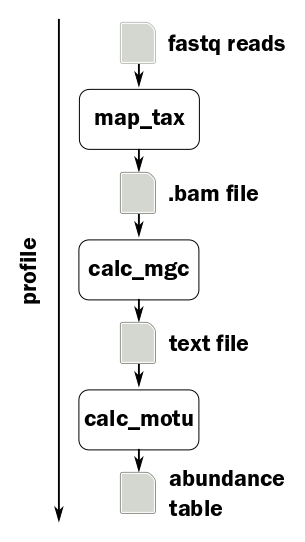

Introduction to mOTUs
=====================

mOTUs uses 10 universal marker genes to taxonomically profile metagenomes, to quantify metabolically active members in metatranscriptomics and to quantify differences between strain populations using single nucleotide variation (SNV) profiles.

----

Today we will show how to use the tool for the first and second of these tasks, profiling metagenomes and metatranscriptomes.

Running a single sample
^^^^^^^^^^^^^^^^^^^^^^^

The most basic command is **profile**, which runs the entire mOTUs pipeline with default parameters.

.. code-block:: bash

   submit motus profile -f <forward reads> -r <reverse reads> -o <output file> -t 12

We will have to put this command into a job submission script as described in the earlier session and then leave it to run in the queueing system.

Running individual steps
^^^^^^^^^^^^^^^^^^^^^^^^

Whilst this is running, let's take a look at the individual steps of the pipeline:

map_tax
~~~~~~~

This command uses the program *BWA* to align the reads against the mOTUs database. The output is a *SAM* or *BAM* file (\ *Sequence* or *Binary Alignment/Map*\ ), which is a standard format used by the *SAMtools* set of utilities.

.. code-block:: bash

   submit motus map_tax -f <forward reads> -r <reverse reads> -o <bam file> -b -t 12

calc_mgc
~~~~~~~~

The intermediate step calculates the number of reads aligned to each marker gene cluster, weighted by gene length.

.. code-block:: bash

   submit motus calc_mgc -n <sample name> -i <bam file> -o <mgc file>

The output format consists of two columns: the name of the marker gene cluster and the count.

calc_motu
~~~~~~~~~

The final step controls the output format of the final abundance table.

.. code-block:: bash

   submit motus calc_motu -n <sample name> -i <mgc file> -o <output file>

mOTUs output
^^^^^^^^^^^^

The standard output format consists of two columns: the mOTU name and the relative abundance of the mOTU in the sample. Note that the table lists all possible mOTUs, i.e.: it includes zeros.

.. code-block:: bash

   #consensus_taxonomy     M01.1-V1-stool-metaG
   Kandleria vitulina [ref_mOTU_v2_0001]   0.0000000000
   Methyloversatilis universalis [ref_mOTU_v2_0002]        0.0000000000
   Megasphaera genomosp. [ref_mOTU_v2_0003]        0.0000000000
   Streptococcus anginosus [ref_mOTU_v2_0004]      0.0000000000
   Streptococcus anginosus [ref_mOTU_v2_0005]      0.0000000000
   ...
   unknown Clostridiales [meta_mOTU_v2_7795]       0.0000898639
   unknown Bacteroidetes [meta_mOTU_v2_7796]       0.0000000000
   unknown Opitutae [meta_mOTU_v2_7797]    0.0000000000
   unknown Roseburia [meta_mOTU_v2_7798]   0.0000000000
   unknown Firmicutes [meta_mOTU_v2_7799]  0.0000000000
   unknown Clostridiales [meta_mOTU_v2_7800]       0.0000000000
   -1      0.0248427818

Merging output
^^^^^^^^^^^^^^

When you have run mOTUs on multiple samples, you can combine the output into a single, tab-separated table with the **merge** command.

.. code-block:: bash

   motus merge -i <motu file 1>,<motu file 2>,... -o <output file>
   motus merge -d <directory> -o <output file>

Since you have been given metagenomic and metatranscriptomic data for the same sample, run both with default parameters and merge the two sets of results into one .motu file.
